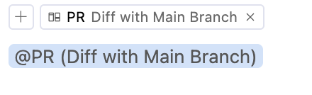

- #Learned
	-
- #Discovered
	- [[AI/Workflow/Merge Request]]
	  collapsed:: true
		- [Cursor Looking at Git PR - Discussion - Cursor - Community Forum](https://forum.cursor.com/t/cursor-looking-at-git-pr/7783) [[CursorAI/Forum]]
			- > I was looking for the same thing and was bout to build a pipeline for PR review, but that is actually not necessary. In Cursor Chat, you can use @PR to reference it and add some instructions that serve your needs.
			  Here’s how I do it:
				- ```
				  @PR (Diff with Main Branch) 
				  Please analyze the code changes and provide the following information:
				  
				  1. **Intent and Purpose**: Summarize the goal of the changes. Explain what functionality or behavior the changes aim to introduce, modify, or fix.
				  
				  2. **Potential Issues**: Identify any possible problems the changes might introduce, such as:
				     - Bugs or unintended side effects.
				     - Performance concerns.
				     - Code quality issues (e.g., readability, maintainability, scalability).
				     - Violations of best practices or standards.
				  
				  3. **Suggestions for Improvement**: Recommend any improvements or alternative approaches that could enhance the code.
				  ```
			- [[CursorAI/@/PR]] does a diff with the main branch
				- 
	- [[CursorAI/Settings/Bug Finder]]
	  collapsed:: true
		- in the Bug Finder tab next to chat, one can "run a bug finder on your current git diff to find bugs". Cool!
	- [[CursorAI/Settings/Features/MCP Servers]]
	  collapsed:: true
		- This has to do with [[Model Context Protocol]]
			- [Introduction - Model Context Protocol](https://modelcontextprotocol.io/introduction)
		- [MCP servers, how can they improve the experience in Cursor? : r/cursor](https://www.reddit.com/r/cursor/comments/1idsxey/mcp_servers_how_can_they_improve_the_experience/) [[Reddit/cursor]] [[2025/01]]
		  collapsed:: true
			- https://www.mcp.run/
				- > Host, discover, publish, and manage [Model Context Protocol](https://spec.modelcontextprotocol.io/specification/) servlets for LLMs + agents.
			- Use Cases
				- comment by jvnk
					- > In the course of your prompting, you could ask for things like "look up the docs for ....", "query this sqlite db for...", "create this table..." so on and so forth. The sky is the limit really.
					- > The LLM should figure out it wants to call a tool, and format a response appropriately. Cursor(I believe) is providing the model a system prompt so it understands how to do this. The response is handed back to the LLM and then it decides how to present it to you, but the actual interactions should also be visible.
					- > For me, I can ask it to look at files I don't have open in Cursor using the `filesystem` server, or query the perplexity API to search the web for updated docs info using mcp-perplexity, etc etc.
				- comment by femio
					- > Kind of? The context length doesn't change but Cursor can more easily check files on your computer even if it's out of context.
					- > Just think of MCP servers as a library of tools that you can install. Cursor comes with tools for say, running CLI commands built in. You just have access to a collection of pre-built ones.
				- comment by badasimo
					- > It also has a security benefit. Cursor can already interact with things sort of... raw. You can let it SSH into a remote server for instance or run commands on your computer. An MCP will have a defined set of things it can and can't do and interact with and have it formatted better for interacting with an LLM.
					- > For instance many command line tools have styling and decoration, interactive features etc that an LLM doesn't need, it just needs output. Lately agent has struggled with things like that.
					- > I believe that we will have other agents/models inside MCPs doing their own special things. For instance operating browsers and things like that.
	- [[VSCode/Diffs/Accessible Diff Viewer]]
	  collapsed:: true
		- [[VSCode/Keymap]]
			- ```json
			  {
			    "key": "f7",
			    "command": "editor.action.accessibleDiffViewer.next",
			    "when": "isInDiffEditor"
			  }
			  ```
			- ```
			  {
			    "key": "shift+f7",
			    "command": "editor.action.accessibleDiffViewer.prev",
			    "when": "isInDiffEditor"
			  }
			  ```
	- [[PDF/Tool]]
	  collapsed:: true
		- What's a CLI tool to join PDFs? #Question
			- *no memory of where this came from, but on [[MacOS]] I have right click > Quick Actions > Create PDF which works great*
		- [[Reddit/learnpython]] [PyPDF vs PyPDF2 vs PyPDF3 vs PyPDF4 vs others : r/learnpython](https://www.reddit.com/r/learnpython/comments/117cekd/pypdf_vs_pypdf2_vs_pypdf3_vs_pypdf4_vs_others/) [[2023/02]]
		  collapsed:: true
			- recommends [[PyMuPDF]] [[Python/Library]]
				- Apparently the [[pypdf]] [[Python/Library]] is compatible
					- [History of pypdf — pypdf 5.2.0 documentation](https://pypdf.readthedocs.io/en/latest/meta/history.html)
						- In order to make things simpler for beginners, `PyPDF2` was merged back into `pypdf`. Now all lowercase, without a number. We hope that the folks who develop `PyPDF3` and `PyPDF4` also join us.
						- Text extraction improvements, e.g. for math content. [pypdf is now comparable with Tika, pypdfium2, and PyMuPDF](https://github.com/py-pdf/benchmarks) [[GitHub/py-pdf/benchmarks]] [[2023/10]]
		- [[Reddit/LangChain]] [What’s the Best Python Library for Extracting Text from PDFs? : r/LangChain](https://www.reddit.com/r/LangChain/comments/1e7cntq/whats_the_best_python_library_for_extracting_text/) [[2024/07]]
		  collapsed:: true
			- *so many recs*
			- [[PyMuPDF]] highly recommended
			- [deepdoctection/deepdoctection: A Repo For Document AI](https://github.com/deepdoctection/deepdoctection)
				- deepdoctection is a Python library that orchestrates document extraction and document layout analysis tasks using deep learning models. It does not implement models but enables you to build pipelines using highly acknowledged libraries for object detection, OCR and selected NLP tasks and provides an integrated framework for fine-tuning, evaluating and running models. For more specific text processing tasks use one of the many other great NLP libraries.
				- deepdoctection focuses on applications and is made for those who want to solve real world problems related to document extraction from PDFs or scans in various image formats.
			- [VikParuchuri/marker: Convert PDF to markdown + JSON quickly with high accuracy](https://github.com/VikParuchuri/marker/) [[GitHub/VikParuchuri/marker]]
				- via [[Reddit/User/polymorfi]]
					- > Marker running as a container using CUDA where available [https://github.com/VikParuchuri/marker/](https://github.com/VikParuchuri/marker/)
			- [VikParuchuri/marker: Convert PDF to markdown + JSON quickly with high accuracy](https://github.com/VikParuchuri/marker/) [[GitHub/VikParuchuri/marker]]
				- recently updated (9 hours ago)
				- Marker converts PDFs and images to markdown, JSON, and HTML quickly and accurately.
				- Marker is a pipeline of deep learning models:
					- Extract text, OCR if necessary (heuristics, [surya](https://github.com/VikParuchuri/surya))
					- Detect page layout and find reading order ([surya](https://github.com/VikParuchuri/surya))
					- Clean and format each block (heuristics, [texify](https://github.com/VikParuchuri/texify), [surya](https://github.com/VikParuchuri/surya))
					- Optionally use an LLM to improve quality
					- Combine blocks and postprocess complete text
				- It only uses models where necessary, which improves speed and accuracy.
	- [[GitHub/Desktop]]
	- [[AI/Workflow/Chat with Codebase]]
		- [[CursorAI/Chat with Codebase]]
			- I just opened up cursor on the [[GitHub/langchain-ai/langgraph]] repo ()[langchain-ai/langgraph: Build resilient language agents as graphs.](https://github.com/langchain-ai/langgraph)), it was indexed basically instantaneously.
			- Then I hit Cmd+L, asked
			  > Can you help me understand if there's a way I can search for an assistant by name?
			- and got some great answers, including links to citations highlighting the parts of the markdown files that are relevant.
			- I will definitely be using this feature a lot to explore codebases!
- #Filed
	- [[CursorAI/Project Rules/markdown-output]]
	  collapsed:: true
		- ### Description
			- Formatting markdown output
		- ### Globs
			- `*.md`
		- ### Rule
			- **# Be careful when nesting markdown fenced code blocks**
			- Wrap the beginning and end of your answer in backticks.
			- If there are code snippets, do not wrap the beginning and end of your answers inside backticks. Instead, wrap the code snippet in a fenced code block that is delimited with three tilde characters.
	- [[VSCode/How To/Go To Next and Previous Changes When Reviewing Github Pull Requests]]
	- [[VSCode/How To/Filter Keyboard Shortcuts by Source]]
	  collapsed:: true
		- I filed a [[GitHub/Issue]]: [Support Keyword or Exact Search for `@source` filter in Keyboard Shortcuts view · Issue #239309 · microsoft/vscode](https://github.com/microsoft/vscode/issues/239309)
	- [[VSCode/How To/Go To Python Class by Name]]
- #Decision
	- For annotating things that are likely part of #VSCode, not #CursorAI specifically, I'll take notes as part of the VSCode namespace
-