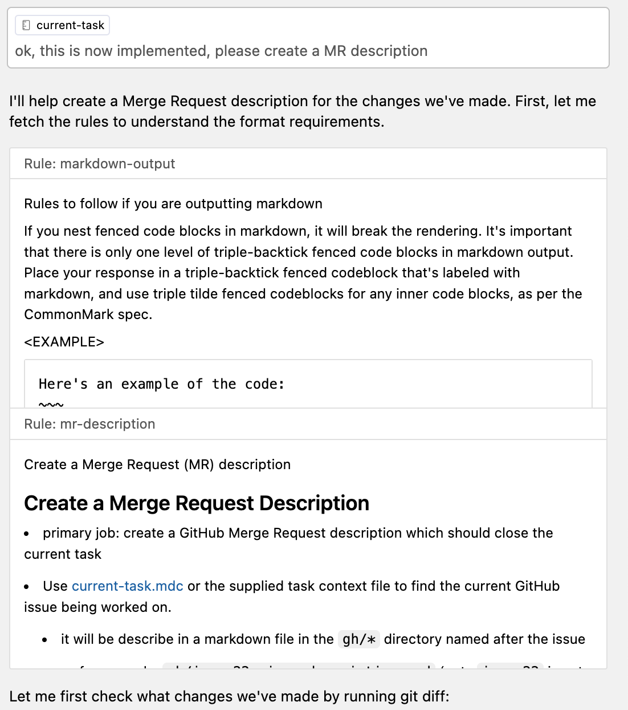
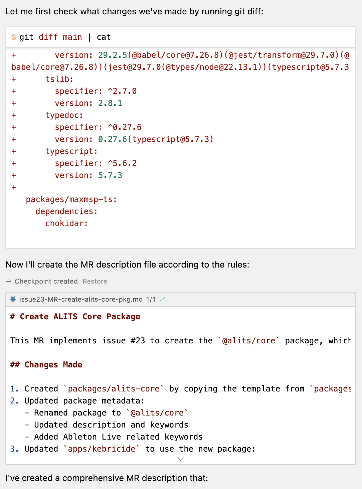
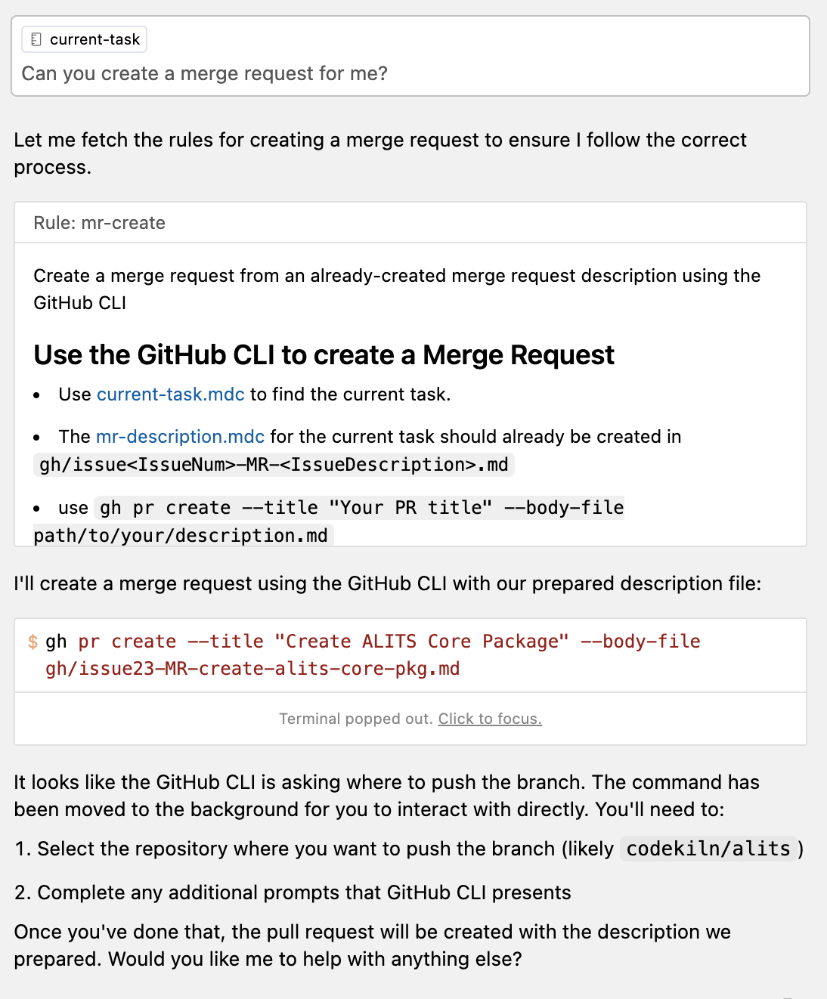

- #Work
	- [[GitHub/codekiln/alits]]
		- Developed a [[CursorAI]] workflow for submitting merge requests with cursor
			- see [mr-create.mdc and other adjacent files in this MR](https://github.com/codekiln/alits/pull/25/files#diff-87f5af818d499e3ec23296d99f7346c0c7736f8aec91fb504f45d964299dd939)
			- 
			- 
			- 
				- at this point, I had to pop out the terminal and **answer the interactive prompt**
				- ```
				  ? Where should we push the 'codekiln/issue23-create-`alits-core`-package' branch?  [Use arrows to move, type to filter]
				  > codekiln/alits
				    Skip pushing the branch
				  ? Where should we push the 'codekiln/issue23-create-`alits-core`-package' branch? codekiln/alits
				  
				  Creating pull request for codekiln/issue23-create-`alits-core`-package into main in codekiln/alits
				  
				  remote: 
				  remote: 
				  To https://github.com/codekiln/alits.git
				   * [new branch]      HEAD -> codekiln/issue23-create-`alits-core`-package
				  branch 'codekiln/issue23-create-`alits-core`-package' set up to track 'origin/codekiln/issue23-create-`alits-core`-package'.
				  https://github.com/codekiln/alits/pull/25
				  ```
			- [2025-02-12 06:48 - 9d2c6767 - docs: create a MR description for create `alits-core` package #23](https://github.com/codekiln/alits/commit/9d2c6767) #git/commit
- #Filed
	- [[VSCode/Docs/Editor/Code Basics/Find and Replace]]
	- #Discovered
		- [[Person/David Zhang]], co-founder of [[Aoomni]]
		- [[JIRA/CLI]]
			- could be really powerful with [[CursorAI]] for providing context
			- I wonder if someone has made a [[Dev Container]] feature for this
	- #Learned
		- Cursor
			- [[CursorAI/Project Rules/Bug/Not Able to Find and Replace in Project Rule]]
			- [[CursorAI/Project Rules/How To/Create new Project Rule from Keyboard]]
			- [[CursorAI/How To/Give Instructions to Agent to Execute a VSCode Command]]
		- Github CLI
			- [[GitHub/CLI/How to/Create a Gist on GitHub from the command line]]
				- created [[GitHub/Gist]] from [[CursorAI/Project Rules/markdown-output]]
				- ```
				  gh gist create --public .cursor/rules/markdown-output.mdc -d "How to correct markdown output with cursor"
				  - Creating gist markdown-output.mdc
				  ✓ Created public gist markdown-output.mdc
				  https://gist.github.com/codekiln/71f9497eaece99ba4d1c95b89d40b315
				  ```
		- [[GitHub/CLI/How to/Update an Issue from a local markdown file]]
			- #Example
				- ```
				  gh issue edit 23 --body-file gh/issue23-create-alits-core-pkg.md 
				  https://github.com/codekiln/alits/issues/23
				  ```
		- Linux
			- [[dotfiles/.netrc]]
		- Zsh
			- [[Zsh/How To/Remove History Entry and Reload History on All Terminals]]