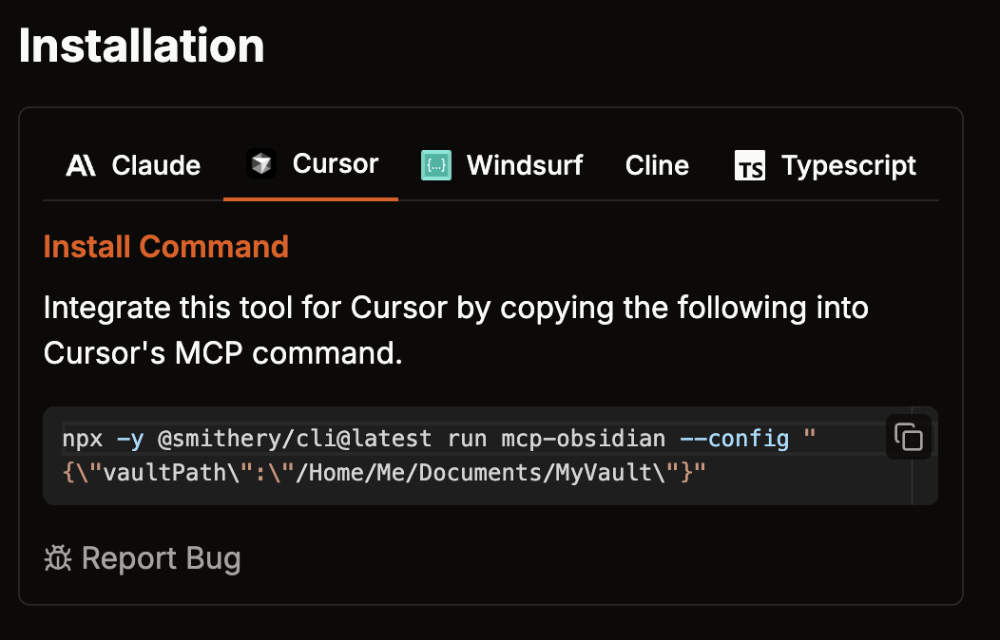

- #AI
	- People
		- #Filed
			- [[Person/Sebastian Raschka]]
- #[[AI/Coding]]
	- #CursorAI
		- #Idea
			- #Updated
				- [[CursorAI/Idea/Proj Rules GitHub CLI AI SLDC/MCP]]
		- #Video
			- #Updated
				- [[Person/Kevin Leneway/YouTube/Build Cursor on Steroids in 20 Minutes with MCP]]
			- #Filed
				- [[Person/Kevin Leneway/YouTube/You HAVE to Try Cursor + o3 + Storybook]]
		- #Forum/post
			- [[CursorAI/Forum/24/02/How to use MCP Server]]
	- #MCP
		- #GitHub
			- #Filed
				- [[Person/Stephen Akinyemi/GitHub/awesome-mcp-servers]]
				- [[MCP/GitHub]] and child pages; list of repos
		- People
			- #Filed
				- [[Person/Tim Rogers]]
		- #Website
			- [[smithery.ai]] [Smithery - Model Context Protocol Registry](https://smithery.ai/)
				- has a "generator" for cursor
				- #Example - [[smithery.ai/smithery.ai/server/mcp-obsidian]] [Obsidian Reader | Smithery](https://smithery.ai/server/mcp-obsidian)
					- 
- #Py
	- Sebastian Raschka started recommending [[uv]] in setup guide - #Tip
		- via [[Person/Sebastian Raschka/TwitX]] here:
			- {{tweet https://x.com/rasbt/status/1890842082756935853}}
			- [[Person/Sebastian Raschka/GitHub/LLMs-from-scratch]]
				- [LLMs-from-scratch/setup/01_optional-python-setup-preferences at main · rasbt/LLMs-from-scratch](https://github.com/rasbt/LLMs-from-scratch/tree/main/setup/01_optional-python-setup-preferences)
	-