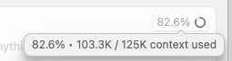

## [[OpenAI]]
	- [Introducing gpt-realtime and Realtime API updates for production voice agents | OpenAI](https://openai.com/index/introducing-gpt-realtime/)
- ## [[1Password]]
	- If you use [[op]] a lot with the [[1Password/Dev/CLI/Shell Plugin/GitHub]], you may find that `gh auth login` doesn't work. #Workaround is to put `alias gh="env -u GITHUB_TOKEN -u GH_TOKEN gh $1"` in ~/.zshrc. https://github.com/cli/cli/issues/3799
- ## [[AI Coding]]
	- ### Measuring [[AI/Context/Rot]]
		- ["RAG is Dead, Context Engineering is King" — with Jeff Huber of Chroma](https://www.latent.space/p/chroma)
		  Paper: [[Chroma/Paper/25/07/Context Rot - Increasing Input Tokens Impacts LLM Performance]]
		  Video:  [Context Rot: How Increasing Input Tokens Impacts LLM Performance - YouTube](https://www.youtube.com/watch?v=TUjQuC4ugak)
		- The concept of context rot has really come to shape my thoughts about AI assisted dev recently. It's given me a word to apply to that all-too-familiar feeling of when, after the LLM has started to work on a coding task for a while, ingesting the context of the codebase and the back-and forth, it stops adhering to prompting guidelines ([[CursorAI/.cursor/rules]], [[Anthropic/App/Claude Code/Claude.md]] files, etc). As a result, it's really important to have an alert respect for the context window of various models, and know where you're at relative to those context windows.Model providers use benchmarks like needle in a haystack to make it seem like the entire 200k or 500k context window is equally effective, but as this Chroma paper shows, what actually happens is that as the context window fills up, the ability of the model looses its ability to do complex reasoning, and stops adhering to instructions.My current mental model is that ***at the first token, the models have 100% of their "brain" available to predict the next token***. As you add tokens, it gradually fills up the "short term memory" in such a way that decreases the amount of "attention" it can spend on a task. By the time you get to 50% of the context window, the amount of "space" the LLM has to reason is often too small for the level of accuracy needed in coding.This is why it's ***not currently a viable technique to just say "go do this" when working on AI coding***. Instead, one should break the task into a plan and then into steps that can each be achieved with a certain margin of error, what I'll call the "context buffer," the unused context which is like "space" that allows the model to actually "think." [[Person/Dexter Horthy]], CEO of [[humanlayer]] said in [[YC/YouTube/25/08/Advanced Context Engineering for Agents]] that their agent design "aims to keep context use at under 40%; see ((68aed1f2-88ef-4d4e-9e71-e6822d6be819)).
		- This is why [[CursorAI]] ships a meter showing the context percent.
			- 
		-
- ## [[Programming/Language/History]]
	- [[Py/YouTube/Python The Documentary]]
- ## [[Innovation/Disruptive]]
	- [[Person/Scott Anthony/Book/Epic Disruptions]]