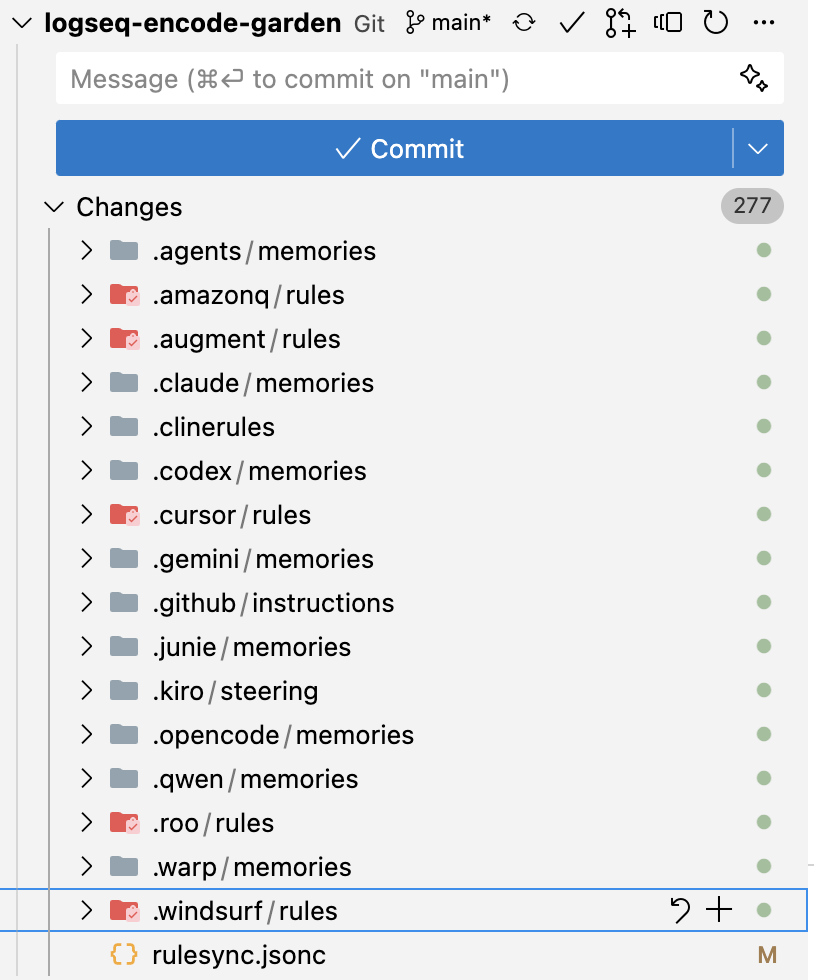

- [[EdTech]]
	- [[Co/EduBase]]
		- [Launching our Educational MCP - Collaborate with AI to solve real problems](https://edubase.blog/launching-edubase-mcp/)
- [[Atlassian/Forge]]
- [[Atlassian/RovoAI]]
	- today I learned that rovo agents can take actions on GitHub.
- [[AI/Coding/Tool]]
	- [[AI Context Engineering]] #Ideas
		- Today I had a thought that it's a shame that most of the [[AI Coding]] tools that are out there are oriented toward static tool registration. For example, you typically either add or do not add an MCP server to a [[Claude Code]] or [[CursorAI]], but there's no way to dynamically register an MCP server based on when a given problem has revealed that use of that MCP server is needed. As a result, AI coding tools tend to run with a lot more bloated context than they need.
	- [[rulesync]] claims to be a tool to enable syncing rules and other features across [[Claude Code]], [[CursorAI]], etc. - See [[rulesync/log/25/09/29 Mon - First time with rulesync]]
		- 
- [[Person/Alex Reibman]]
	- [areibman/bottleneck: Native Electron app for reviewing pull requests dramatically faster than Github web. Specialized for handling reviews for background agents working on multiple concurrent threads](https://github.com/areibman/bottleneck)
- [[Claude Code/GitHub/claude-code-docs]]
	- [ericbuess/claude-code-docs](https://github.com/ericbuess/claude-code-docs)
		- Local mirror of Claude Code documentation files from [https://docs.anthropic.com/en/docs/claude-code/](https://docs.anthropic.com/en/docs/claude-code/), updated every 3 hours.
- [[json/jsonc]] - Created page for JSONC (JSON with Comments) specification, related to [[json/5]]