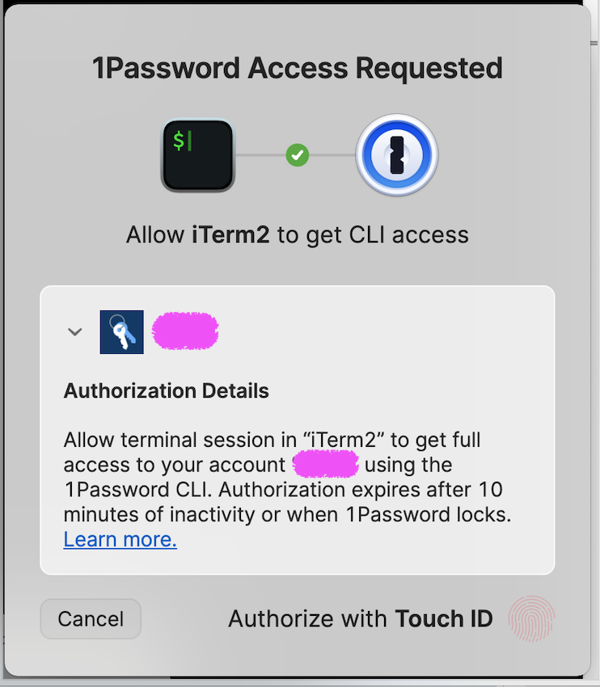

# 1Password Access requested PopUp
	- {:height 313, :width 264}
	  id:: 68061317-c68a-49e9-9b3a-06bc81c7ab05
		- ## [[My Notes]]
			- [[2025-04-21 Mon]] - like [[MacOS App Popup Access Data from Other Apps]], this pop-up doesn't reveal what is trying to be asked. IMO it would be preferable to have an ability to see the vault, item and field name - or the [[1Password Secret Reference]] - inside of the disclosure box, so we could verify that whatever process was requesting access was only getting access to specific items.
			  id:: 68061478-e91c-46ef-ae95-511fb881c678
	- ### **1Password Access Request – iTerm2 CLI Authorization**
	  
	  ```
	  1Password Access Requested
	  
	  Allow iTerm2 to get CLI access
	  
	  Authorization Details
	  
	  Allow terminal session in “iTerm2” to get full access to your account [REDACTED] using the 1Password CLI. Authorization expires after 10 minutes of inactivity or when 1Password locks.
	  ```
	- Buttons:
		- Cancel
		- Authorize with Touch ID
	- 🔐 This prompt ensures secure CLI access to your 1Password vault from a trusted terminal session using the [1Password CLI (op)](https://developer.1password.com/docs/cli/).
	- 📚 Documentation:
		- [1Password CLI – Authorize access with biometric approval](https://developer.1password.com/docs/cli/get-started/#sign-in)