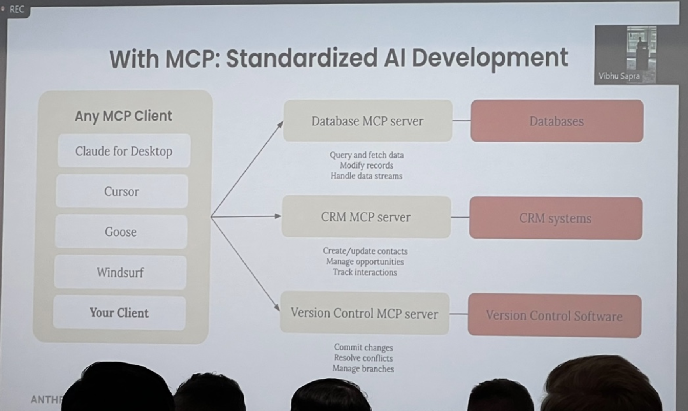
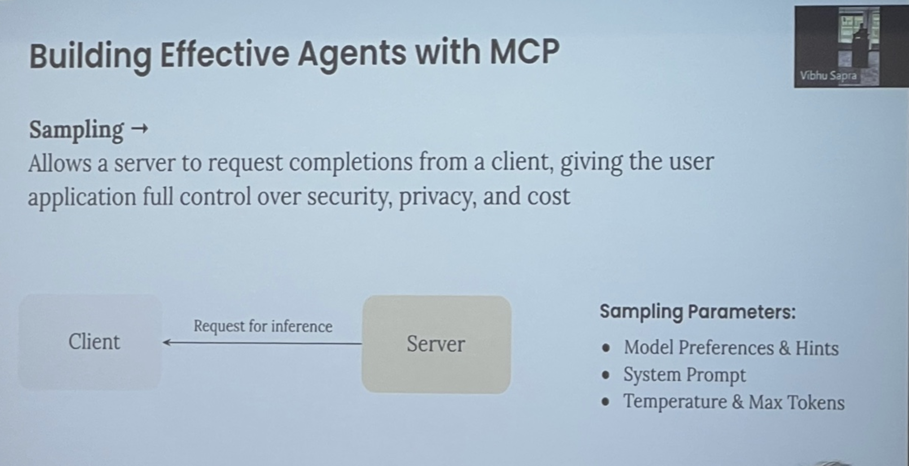
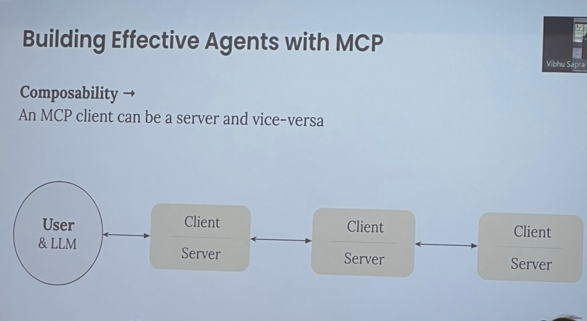
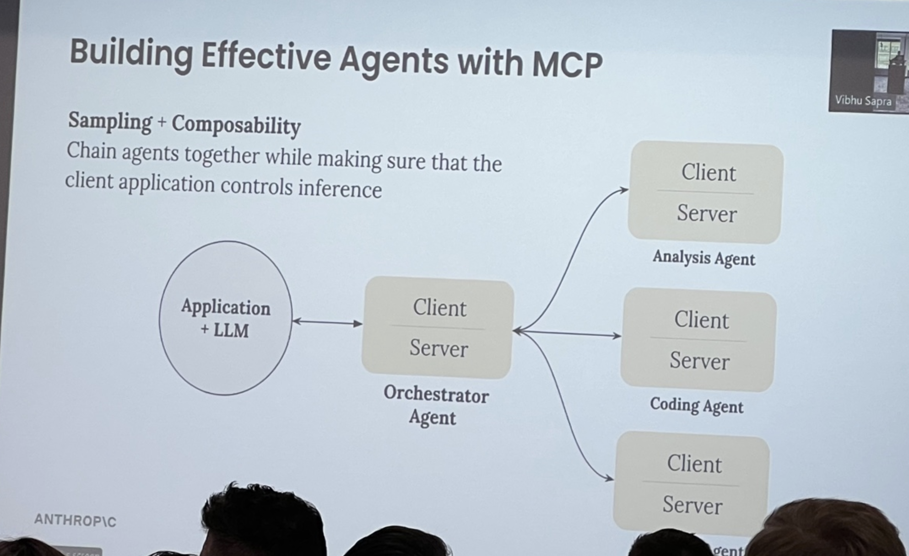
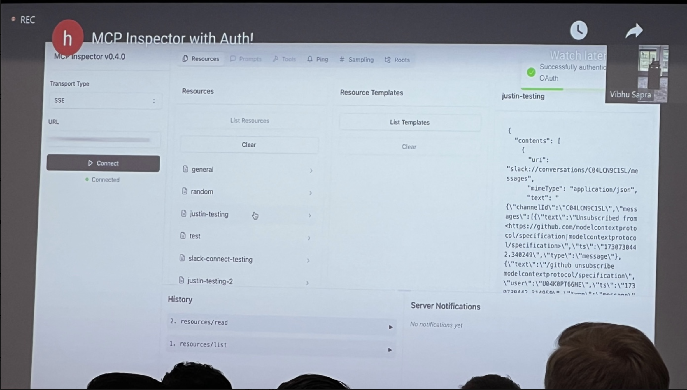
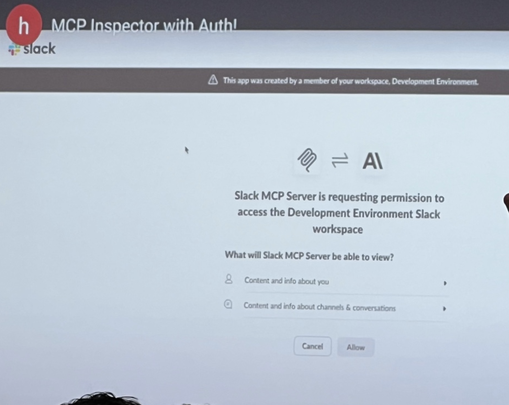
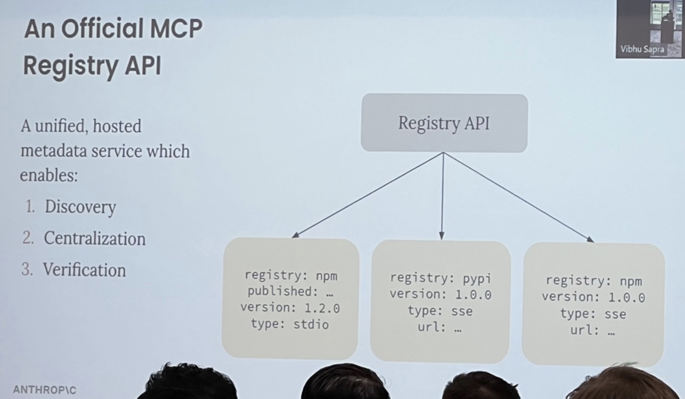
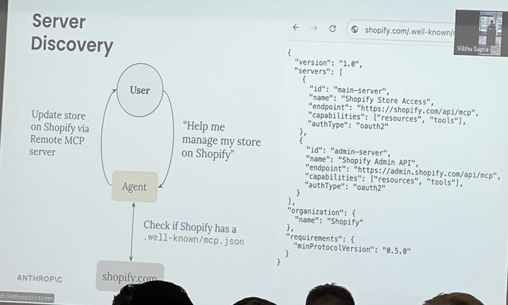
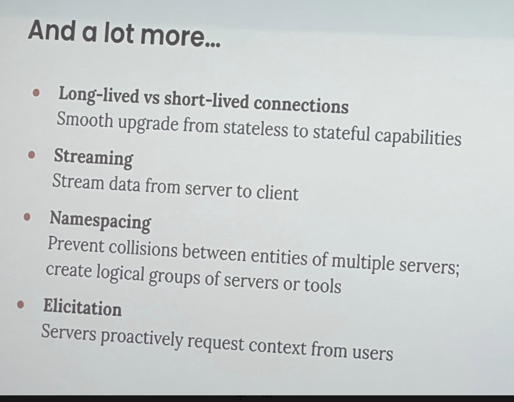

created-by:: [[People/Mahesh Murag]]
tags:: [[Anthropic/Model Context Protocol]], [[MCP]]
alias:: [[AIES 25 WS 1 - Building Agents with MCP - Mahesh Murag]]

- # [Building (Agents) with Model Context Protocol](https://www.ai.engineer/summit/2025/schedule/anthropic-mcp)
	- ## About
		- > This workshop, from the creators of MCP, talks about the philosophy behind MCP, its impact on the broader ecosystem since launch, and how developers can use it to build context-rich AI apps and agentic experiences.
		- ### Video and [[Transcript]]
			- [[AI/ES/25/ws/1/Building Agents with Model Context Protocol/YouTube]]
		- ### Pics
			- [[AI/ES/25/ws/1/Building Agents with Model Context Protocol/Pics]]
	- ## Before ((67d04b34-b6c8-4ed5-a63f-aee1d3d57a69))
		- {:height 172, :width 275}
		  id:: 67d04b42-b317-4f6b-8d87-8c6b0fd0ae4d
		  [[My Notes]]
			- On my left was [[Person/Mike Christensen]], **VP Engineering** at [[Fundrise]], with quite a bit of experience in Real Estate. Was using [[IDE/Cline]] (or was it [[Windsurf]]?) to do some [[Vibe Coding]] a bit. We talked about MCP and the importance of #Security in [[Agentic Systems]].
			  id:: 67da7fc2-1c1f-46e9-84b0-dee824e45395
			- On my right was [[Person/Hayden Harrow]], **Co-Founder** at [[Headless Agents]] ([headlessagents.ai](https://headlessagents.ai/)). Mike and I got a demo of his product, which allows deploying any type of agent and allowing inter-agent communication. Right now the product is has developers as its target audience.
			  id:: 67da7fbe-0f7f-45f0-bac4-27dc498b0387
	- ## intro
		- what is MCP
			- APIs
				- web applications interact with backend
			- LSP - language server protocol
				- specifies how IDEs to interact with **language-specific tools**
			- MSP
				- standardize how Ai apps interact with external systems
		- without mcp - fragmented AI development
			- EACH AI app -> custom implementation custom prompt logic -> custom tool calls -> custom data access
			- if different teams in company are doing this
		- ### MCP - standardized AI development ((67d04b34-7503-42a8-ac65-932b6a9da14c))
			- 
			- #### [[AI Notes]]
				- Any MCP Client:
				  •	Claude for Desktop
				  •	Cursor
				  •	Goose
				  •	Windsurf
				  •	Your Client
				- MCP Servers and Their Functions:
				- Database MCP server
				  •	Query and fetch data
				  •	Modify records
				  •	Handle data streams
				  → Databases
				- CRM MCP server
				  •	Create/update contacts
				  •	Manage opportunities
				  •	Track interactions
				  → CRM systems
				- Version Control MCP server
				  •	Commit changes
				  •	Resolve conflicts
				  •	Manage branches
				  → Version Control Software
			- #### [[My Notes]] with mcp - you build it once and get adoption everywhere
				- for AI app devs
					- connect your app to any mcp server with
				- for tool or API devs
					- build mcp server once, see adoption everywhere
				- for end users
					- more powerful and context-rich ai applications
				- for enterprises
					- clear separation of concerns between teams
						- #Insight
							- you can have **one team that owns the relationship to the vector database**
		- ### fast adoption ((67d04b34-f75a-4091-bb9f-310b327e2a51))
			- 
			- #### [[AI Notes]] fast adoption
				- ### Companies & Projects:
					- **Cloudflare**
					- **Replit**
					- **Shopify**
					- **IBM**
					- **GitHub**
					- **Block**
					- **Grafana**
					- **Sourcegraph**
					- **Cursor**
					- **Docker**
					- **Codeium**
			- #### [[My Notes]]
				- 1100 community built servers
				- [[Person/Jack Dorsey]] mentioned it yesterday
				- **we think this is going to be industry-standard**
		- ### MCP deep dive ((67d04b34-addb-4bb0-8dd1-b1f7a3f56984))
			- 
			- #### [[My Notes]]
				- MCP Client
					- invokes tools
					- queries for
				- server can interpolate
				- ##### resources
					- manifest as attachments
					- attached to the chat
			- #### [[AI Notes]]
				- ##### MCP Client
				  •	Invokes Tools
				  •	Queries for Resources
				  •	Interpolates Prompts
				- ##### MCP Server
				  •	Exposes Tools
				  •	Exposes Resources
				  •	Exposes Prompts
				- Components:
				- ##### Tools (Model-controlled)
				  id:: 67b9ecfb-1191-4550-8f61-f821b0bfa21f
				  •	Functions invoked by the model:
				  •	Retrieve / search
				  •	Send a message
				  •	Update DB records
				- ##### Resources (Application-controlled)
				  id:: 67b9ecfb-e989-4dbb-bf88-cca12c5cc9bb
				  •	Data exposed to the application:
				  •	Files
				  •	Database Records
				  •	API Responses
				- ##### Prompts (User-controlled)
				  id:: 67b9ecfb-92e0-4b19-b0f9-4d4dbd542917
					- Pre-defined templates for AI interactions:
					- Document Q&A
					- Transcript Summary
					- Output as JSON
			- #### [[My Notes]]
				- #### #Example [[IDE/Zed]] [[AI/Coding]] [[Slash Command]]
				- Q - why aren't resources modeled as tools
					- A - it's not about making model better but defining ways for application to interact with the server
					- we need separation between model-controlled and not model-controlled
					- contract for the client builder and server builder for what should be invoked where
				- [[langgraph]] just made adapters to connect to [[MCP]]
					- if it has this connection to mcp servers you can connect it to your agent
					- we don't think mcp is going to replace agent frameworks
				- a few questions are about "why isn't it a tool"
				- a few questions about "why do we need agent frameworks if we need this"
				- #### #Q - why do resources and prompts exist, because you can do it with tools
					- a - there are more capabilities with tools and resources
					- in reality, resources and prompts can be *dynamic* and interpolated with context from the user or the aplication and the server can return a customized resource or prompt for the task at hand
					- client can subscribe to resource, and server can notify the client and tell the client that you need to update the state of your system
					- you can do a lot with tools, but MCP isn't just about giving the model more context, it's about getting richer ways to give the application
		- ### MCP in Action Demo ((67d04b34-1f90-4c50-bdab-4edae4a5d343))
		  collapsed:: true
			- 
			- #### [[My Notes]]
				- [[Claude/Desktop]]
					- give url of github repository
					- the model, claude, does the invoke issues tool, and pulls those into context, summarizing them
					- it's personalizing to you based on your history with claude and what it knows you want
						- who you are,
						- what you are working on
						- how you like to interact with it
					- "can you triage the top 3 priority issues and add it to my asana project"
						- doesn't give name of asana
						- has installed asana server
							- 30 tools
						- finds the projects
							- starts adding these issues as tasks
					- callouts
						- I didn't build the github or asana server
						- each are a couple hundred lines of code
							- it's not a ton of additional work to build though
						- they are all playing together with claude for desktop
					- (video)
			- #### [[AI Notes]]
				- ## MCP in Action
					- ### Left:  **Claude AI Ticket Prioritization**
						- Lists various technical issues:
							- **Prompt Caching Support for Vertex/Bedrock (#774, #653)**
								- Multiple requests for prompt caching support
								- Parity gap between direct API and cloud provider integrations
								- Could improve performance and reduce costs
							- **PDF File Support Issues (#725)**
								- Problems with PDF document handling on Bedrock
								- Impacts users leveraging Claude's document understanding
							- **Testing Framework Updates (#647)**
								- Test suite failures with `pytest 8`
								- Maintaining test reliability is important for development
								  
								  **Prompt in UI:**
								  *"Can you triage the top 3 highest priority issues and add them to my Asana project for SDK Fixes?"*
					- ### Right:  **GitHub Issues Page (Anthropic SDK)**
						- Open issues list:
							- **Some API error codes don’t appear to be supported in SDK (#853)**
							- **OpenAI Compatibility using Claude API Key (#851)**
							- **Feature request: `tool_choice="none"` to prevent unintended tool calls (#849)**
							- **Caching seems to be enabled by default (#837)**
							  
							  **Speaker:** Vibhu Sapra
							  **Presented by Anthropic**
		- ### JSON Task Plan in VS Code ((67d04b34-41f8-41c3-81e1-42d322ea03df))-
		  collapsed:: true
			- 
			- #### [[My Note]]
				- Why is this JSON format *in a markdown file*?
			- #### [[AI Notes]]
				- ### File:  `plan.md`
				- **Description:** Verify and validate collected information
					- **Tasks:**
						- Cross-reference technical claims about quantum computing capabilities and encryption threats
							- **Agent:** `fact_checker`
						- Verify timeline predictions and industry statistics for consistency across sources
							- **Agent:** `fact_checker`
						- Validate technical details of proposed quantum-resistant solutions
							- **Agent:** `fact_checker`
		- ### MCP-Agent: Orchestrator Setup in Python ((67d04b34-ff2e-42f5-8647-e7df572a0018))
			- 
			- #### [[AI Notes]]
				- ### Sidebar - **Project Structure**  (VS Code project explorer on left)
					- ```
					  mcp-agent
					  ├── output/
					  ├── sources/
					  │   ├── kyber_research.txt
					  │   ├── nist_pqc_standard.txt
					  │   ├── nist_quantum_cr.txt
					  │   ├── palo_alto_quantum.txt
					  │   ├── quantum_security.txt
					  ├── main.py
					  ├── mcp_agent.config.yaml
					  ├── mcp_agent.secrets.yaml
					  ├── plan.md
					  ├── README.md
					  ├── requirements.txt
					  ├── task.md
					  ```
				- ### Code: `main.py` (on right)
					- ```python
					  async def example_usage():
					    server_names = ["filesystem", "fetch"]
					  
					    # Read the research task
					    task_path = Path("task.md")
					    with open(task_path, "r") as f:
					        task = f.read()
					  
					    # Create orchestrator with all agents
					    orchestrator = Orchestrator(
					        llm_factory=AnthropicAugmentedLLM,
					        available_agents=[
					            search_agent,
					            fact_checker,
					            report_writer,
					        ],
					        plan_type="full",
					        plan_output_path=Path("output/execution_plan.md"),
					        max_iterations=5
					    )
					  
					    # Execute the research task
					    result = await orchestrator.generate_str(
					        message=task,
					        request_id="20241022"
					    )
					  ```
				- ### **Key Features**
					- Uses **AnthropicAugmentedLLM** as the **LLM factory**
					- Agents involved:
						- **search_agent**
						- **fact_checker**
						- **report_writer**
					- Reads tasks from `task.md`
					- Outputs execution plan to `"output/execution_plan.md"`
					- Runs up to **5 iterations**
			- #### [[My Notes]]
				- ### Here's [[Windsurf]]
					- they have their own ui inside of their agent
					- other applications don't call them tools (one calls them extensions)
						- -> which IDE is that? booz?
				- ### his claim: #MCP will be "the foundational protocol for agents"
					- the models are becoming better and they use the data that you bring to them in better ways.
		- ### [[Anthropic/Blog/24/12/Building Effective Agents]] with #MCP 1 - ((67d04b34-097b-489e-a9cd-c203d335f5a2))
		  id:: 67b9effa-2d46-4913-8e22-c96a7ba2344f
			- 
			- #### [[My Notes]]
				- now, *with MCP*
				- the idea of an augmented LLM
				- takes inputs and outputs
				- LLM
					- query and results with retrieval systems
					- call and response with tools
					- read and write with memory
				- one of the key points of MCP is that the system can **discover new capabilities after the agent system is built**
				- agent is an "augmented LLM" running in a loop
					- working towards
				- you can let users of the agent system connect to their data and you as the developer can focus on **the core loop**
					- the agent can be focused with the interaction with the llm as it's core
			- #### [[AI Notes]]
				- ### **Sampling →**
					- Allows a server to request completions from a client, giving the user application full control over security, privacy, and cost.
				- ### **Client-Server Interaction**
					- ```
					  Client  ←→  Server
					  (Request for inference)
					  ```
				- ### **Sampling Parameters:**
					- **Model Preferences & Hints**
					- **System Prompt**
					- **Temperature & Max Tokens**
		- ## what does this look like in practice - [[MCP/mcp-agent]]
			- `mcp-agent` is a framework built by lastmile.ai
				- [[MCP/mcp-agent]]
					- perhaps - [lastmile-ai/mcp-agent: Build effective agents using Model Context Protocol and simple workflow patterns](https://github.com/lastmile-ai/mcp-agent)
			- case study -> research task -> quantum computing impact on cybersecurity
			- sub-agents
				- research agent
					- look up urls
				- fact checker agent
					- verify info coming in
						- brave, fetch, filesystem tools
							- each are mcp servers that it has access to
				- research writer
			- we get a `plan.md` and a `task.md` - ((67d04b34-41f8-41c3-81e1-42d322ea03df))
				- 
				- ### Screenshot 2:  **GitHub Issues Page (Anthropic SDK)**
					- Open issues list:
						- **Some API error codes don’t appear to be supported in SDK (#853)**
						- **OpenAI Compatibility using Claude API Key (#851)**
						- **Feature request: `tool_choice="none"` to prevent unintended tool calls (#849)**
						- **Caching seems to be enabled by default (#837)**
			- #### [[My Notes]]
				- to close out this part of **demo**
					- it starts doing some research
					- invoking the fact checking agent
				- [lastmile-ai/mcp-agent: Build effective agents using Model Context Protocol and simple workflow patterns](https://github.com/lastmile-ai)
					- someone asks about this and what's adapted
				- question - how do resources and prompts fit in in this case
					- resources and prompts come in when the user is in the loop
					- what if you had a nice loop in an extended chat interface
						- the chat interface application could take this plan and surface it to you
						- aplpication could have nice UI on top that shows the plan beautifully in the UI
					- prompts example
						- slash command - slash summarize (predefined prompt in server to give the user a summary)
				- questions - how does #MCP fit into evaluations
					- largely this is the same as it is right now
					- this could be a standard layer inside of evals themselves
					- there could be an MCP server that has the same 5 tools
				- question - I'm missing the infrastructure side of this
					- are these servers exposed globally, or only locally?
					- comment: line between client and server not clear to one person
						- how do you do authentication, retry logic, etc
					- q - what is the separation between the logic, retry logic, authentication
						- for retry logic, personal opinion is that it should happen on the server side
				- [[Q/My]] how do we do versioning well with MCP servers
				- #Q is there a best practice or a limit to the number of servers you can expose to an LLM?
					- today, they are good up to 50 or 100
						- [[Claude]] is good up to 100 in my opinion
					- but how do you avoid overloading context
					- "a tool to search tools" is exciting
						- RAG over tools
						- the entire library of tools that are
					- hierarchical systems of tools
					- #Observation *this reminds me of that [[LangChain/Blog/25/02/Benchmarking Single Agent Performance]]*
				- #Q - they have an entire page on how to make mcp server with claude or llms
					- he wrote all of those with claude
					- it's really easy to approach it
					- start with tool type
				- #Q - if these are simple, can lLms gerentate
					- if you've heard of cline, they have an mcp auto generator tool
						- if you want to start talking to gitlab
							- that works for simple servers
						- but if you want logging or data traan
				- #Q are you talking to the owners of the services and the data
					- a lot of th servers are public already
				- [[Q/My]] - how do you handle versioning of tool descriptions and tools available
					- typescript servers have semvar version
					- no best practice yet
		- ## Building Effective Agents with MCP 1 - cont'd - ((67d04b34-097b-489e-a9cd-c203d335f5a2))
			- 
			- #### [[My Notes]]
				- in typical applications, client invokes a server, but a class of server exists where the server will
				- server **asks the user** for **more information** so you **want the server to get intelligence**
				- federate these requests
				- client doesn't have to listen to it
					- has control over cost or privacy
					- limit certain # of requests
				- one of the design principles
			- #### [[AI Notes]]
				- ## **Building Effective Agents with MCP**
				- ### **Sampling →**
				  
				  Allows a server to request completions from a client, giving the user application full control over security, privacy, and cost.
				- ### **Client-Server Interaction**
				  
				  ```
				  arduino
				  
				  CopyEdit
				  
				  Client  ←→  Server
				  (Request for inference)
				  ```
				- ### **Sampling Parameters:**
					- **Model Preferences & Hints**
					- **System Prompt**
					- **Temperature & Max Tokens**
		- ### Building effective Agents with MCP - 2 - ((67d04b34-635a-41f9-b8c3-20542c517b6d))
			- 
			- #### [[AI Notes]]
				- ## **Building Effective Agents with MCP**
				- ### **Composability →**
					- [[Key Insight]] An [[MCP/Server]] can be a server and vice-versa.
				- ### **Client-Server Chain**
				  
				  ```
				  User & LLM  ←→  Client/Server  ←→  Client/Server  ←→  Client/Server
				  ```
				- The architecture allows for **recursive composition** where MCP clients can also act as servers.
				- Enables **modular AI workflows** by chaining multiple MCP instances.
			- #### [[My Notes]]
				- microservices and chaining
				- #### [[Q]] - how do you deal with compounding errors if the system itself is complex and multi-layered
					- same dynamic as with multi-layer agents
					- it's up to each successive layer to deal with controlling data as it's structured
					- the third node up there should collect data and fan in data from all the other ones and make sure it's
				- #### #Q - How do you do observability and how does the first client/server know about the results of the 3rd hop client/server?
					- it's you don't exactly know what's behind the hood
					- it's kind of a black box
				- #### #Q - how do you make #MCP able to be #Debuggable
					- it's up to the devs right now
				- #### #Q this is similar to [[Microservices]]
					- best practices from there should apply
				- #### #Q what if client wants control over the tool call
					- one suggestion is doing that via a prompt
					- they are thinking about something called [[MCP/Tool/Annotations]] to limit the number of tools to 5
				- #### #Q - what #Debugging patterns have you seen
					- they have something called [[MCP/Inspector]]
					- he's seen servers
				- #### #Q - how are you thinking about #Security #[[Good Question]]
					- we're going to bake in [[Auth]]
- ## what's coming next
	- ### Building effective agents with #MCP - 3 - ((67d04b34-8b13-40db-b5e2-0a173079868c))
		- 
			- Notes from Hayden - *the tool specs are sent back, LLM is only called on client*
		- #### [[AI Notes]]
			- ## **Building Effective Agents with MCP**
			- ### **Sampling + Composability**
			  
			  Chain agents together while ensuring that the client application controls inference.
			- ### **Architecture**
			  
			  ```
			  arduino
			  
			  CopyEdit
			  
			  Application + LLM  →  Client/Server (Orchestrator Agent)
			                       ├── Client/Server (Analysis Agent)
			                       ├── Client/Server (Coding Agent)
			                       ├── Client/Server (Additional Agent)
			  ```
			- The **Orchestrator Agent** acts as the central hub, distributing tasks to specialized agents.
			- Each agent functions as both a **client and server**, supporting **modular and scalable AI workflows**.
			- Enables **controlled inference** with **hierarchical delegation**.
		- #### [[My Notes]]
			- orchestrator agent communicates with and fans out to analysis, coding, and research agents
			- we need guarantees about connectivity
		- ### [[MCP/Inspector]] with #Auth ((67d04b34-a7f4-4cc8-a2c5-ebbb738cbf0c))
			- 
			- #### [[AI Notes]]
				- ## **MCP Inspector with Auth!**
					- ### **MCP Inspector v0.4.0**
						- **Transport Type:** SSE
						- **URL:** *(Redacted)*
						- **Connection Status:** ✅ Connected
					- ### **Resources Panel**
						- List of resources:
							- **general**
							- **random**
							- **justin-testing**
							- **test**
							- **slack-connect-testing**
							- **justin-testing-2**
					- **Resource Templates Panel** (Empty)
					- ### **Displayed JSON Response (Slack Message)**
						- ```json
						  {
						  "contents": [
						    {
						      "uri": "slack://conversations/C04LN9C1SL/messages",
						      "mimeType": "application/json",
						      "text": "{\"channelId\":\"C04LN9C1SL\",\"messages\":[{\"text\":\"Unsubscribed from <https://github.com/modelcontextproto>\"}]}"
						    }
						  ]
						  }
						  ```
		- ### MCP Inspector with Slack OAuth Authentication - Example [[OAuth]] flow
			- 
			- #### [[My Notes]]
				- [[SSE]] is the "best way" to do [[MCP/Server]]s that are remote
				- #Example
					- #Slack auth
						- the highlight here
						- num 1 thing -> remotely hosted servers
						- discoverable
						- you don't have to mess with stdio
						- you can
						- this is going to be a big explosion in the number of servers
							- you as a user don't need to know how to build it or host it
						- #### #Q what about elevating permissions
						- #### #Q the server then holds the token -> isn't that a bad thing?
							- if you think about the server being the one that's closest to slack
							- let's say slack builds that and then slack will want to control that
						- #### #Q does MCP replace [[REST]] in the long term?
							- LLMs need data in a different way than the server
							- RESTful is for stateless interactions
						- #### #Q - when we wrap our tools with MCP, how do we deal with evals, how do we think about when tools change and regressions happen
							- we are going to talk about the registry
							- this doesn't change too much about the eval system around tools
							- fixtures and diffs in the evals
						- #### #Q how far away in the spec is it
							- days away
			- #### [[AI Notes]]
				- ## **MCP Inspector with Slack OAuth Authentication**
				- ### **Slack OAuth Prompt**
				- **Slack MCP Server** is requesting permission to access the **Development Environment Slack workspace**
				- Requested Permissions:
					- **Content and info about you**
					- **Content and info about channels & conversations**
				- Options:
					- **[Cancel]**
					- **[Allow]**
	- ### [[MCP/Registry/API]] #API - 1 - ((67d04b34-c943-40c8-abec-9aac2678d7c4))
		- 
		- #### [[My Notes]]
			- this lets us have something like npm, pypi, [[Package/Manager]]s for mcp
			- how do you determine whether it's sse or stdio
			- who built it, is it verified, did [[Shopify]] bless this server?
			- "this is coming, it's going to be great" - #Quote from [[Person/Mahesh Murag]]
			- #### #Q can you give more examples of the server calling the client?
				- they don't yet have the ability to do server side "sampling" [[MCP/Sampling]]
					- [[Q/My]] what is sampling again here?
			- #### #Q does the model have to be in the loop with the LLM
				- someone asks this ... didn't hear response
	- ## **An Official MCP Registry API** - ((67d04b34-a435-4479-a5b7-38591421d79e))
		- 
		- #### [[My Notes]]
			- agents can do their own discovery - agent will find out what it's capable of
		- #### [[AI Notes]]
			- An MCP server registry helps make agents **self-evolving** by letting them discover and choose their own tools.
			- ### **Workflow Example: Debugging with Grafana**
			  
			  ```
			  pgsql
			  
			  CopyEdit
			  
			  User → "Fix the bug based on my Grafana logs"
			  ↓
			  Agent → Queries Grafana logs & suggests a fix
			  ↓
			  Agent → Searches for official Grafana server
			  ↓
			  Agent → Installs & invokes Grafana server
			  ↓
			  Registry API
			  ```
			- **Key Idea:** Agents can **autonomously** locate and use the necessary tools by querying the **MCP Registry API**.
			- Enables **adaptive AI workflows** where agents **evolve** based on available tools.
	- ### Server discovery - ((67d04b34-d3cc-4121-8e34-f5f67d88385c))
		- 
		- #### [[My Notes]]
			- #Example - #Shopify
			- registry is focused on discovery and ability to find tools from scratch
			- if you know you want to talk to shopify, it can check this [[MCP/.well-known]] - really nice complement to [[AI/Computer Use]].
			- what if you could have that PLUS MCP json (?)
				- didn't quite get this point
		- #### [[AI Notes]]
			- ## **Server Discovery with MCP**
			- ### **Workflow Example: Managing a Shopify Store**
				- ```
				  User → "Help me manage my store on Shopify"
				  ↓
				  Agent → Checks if Shopify has a `.well-known/mcp.json`
				  ↓
				  Agent → Updates store on Shopify via Remote MCP server
				  ```
			- ### **Shopify MCP Server Metadata**
				- ```json
				  {
				  "version": "1.0",
				  "servers": [
				    {
				      "id": "main-server",
				      "name": "Shopify Store Access",
				      "endpoint": "https://shopify.com/api/mcp",
				      "capabilities": ["resources", "tools"],
				      "authType": "oauth2"
				    },
				    {
				      "id": "admin-server",
				      "name": "Shopify Admin API",
				      "endpoint": "https://admin.shopify.com/api/mcp",
				      "capabilities": ["resources", "tools"],
				      "authType": "oauth2"
				    }
				  ],
				  "organization": {
				    "name": "Shopify"
				  },
				  "requirements": {
				    "minProtocolVersion": "0.5.0"
				  }
				  }
				  ```
			- ### **Key Features**
				- Uses **`.well-known/mcp.json`** for automatic **service discovery**.
				- Supports **OAuth2 authentication**.
				- Defines **multiple MCP endpoints** (`Store Access`, `Admin API`).
				- Ensures compatibility using **minProtocolVersion**.
	- ## And a lot more - ((67d04b34-b1a6-4c2f-8735-407fe6600574))
		- 
		- #### [[My Notes]]
			- in order of immediacy
			- they are using something like SSE
				- streaming -> stream data from server to client
			- elicitation -> "proctive" event behavior
				- better patterns for that.
		- #### [[AI Notes]]
			- ## **And a lot more...**
			- **Long-lived vs short-lived connections**
			  Smooth upgrade from stateless to stateful capabilities
			- **Streaming**
			  Stream data from server to client
			- **Namespacing**
			  Prevent collisions between entities of multiple servers; create logical groups of servers or tools
			- **Elicitation**
			  Servers proactively request context from users
- ## [[Q/My]]
	- how exactly do permission boundaries work with #MCP ? he mentions [[OAuth]] which has some concept of permission boundaries ...
	-