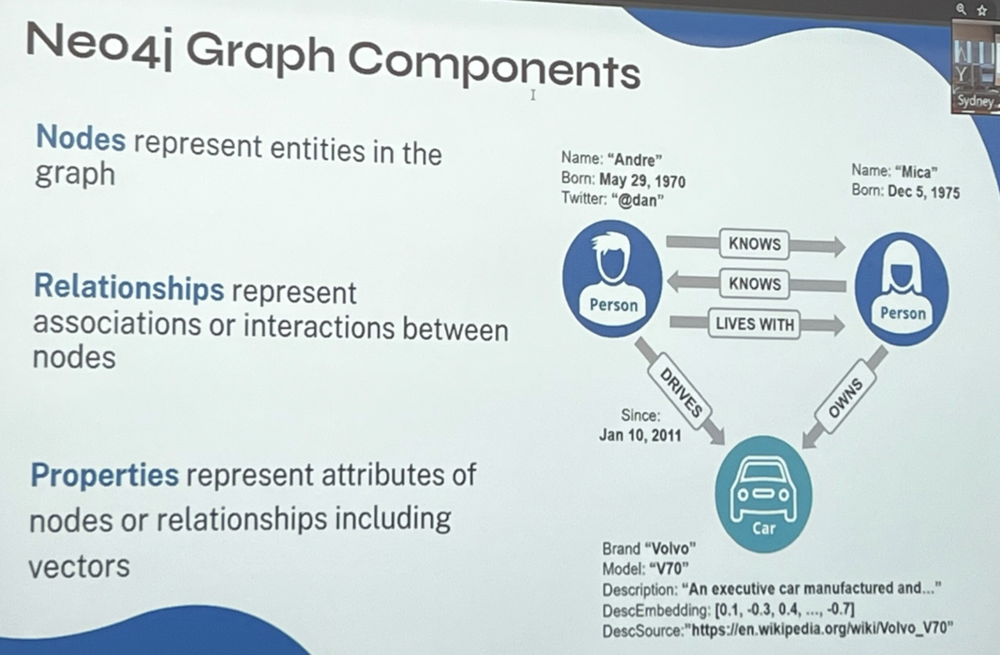
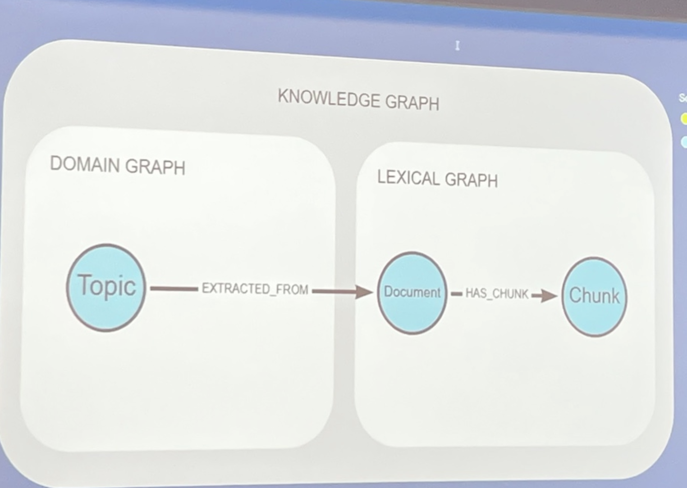
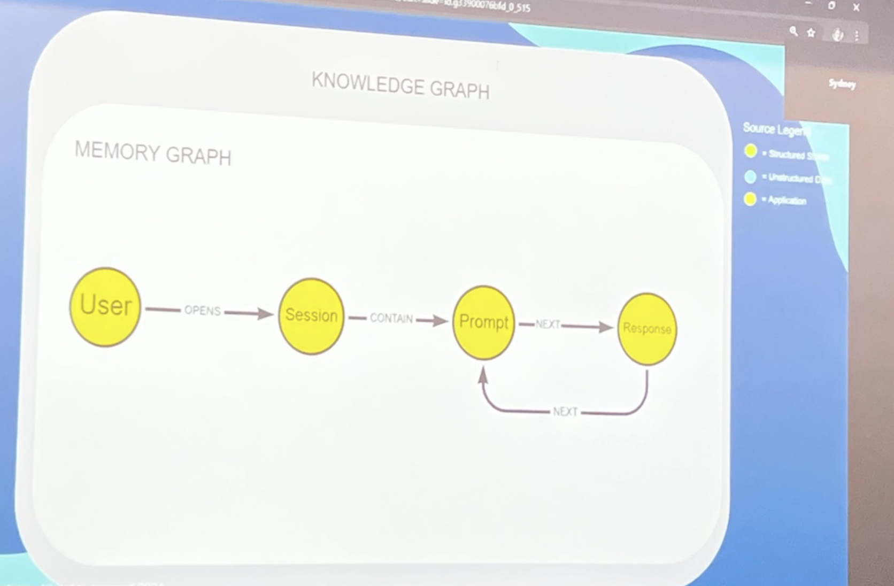
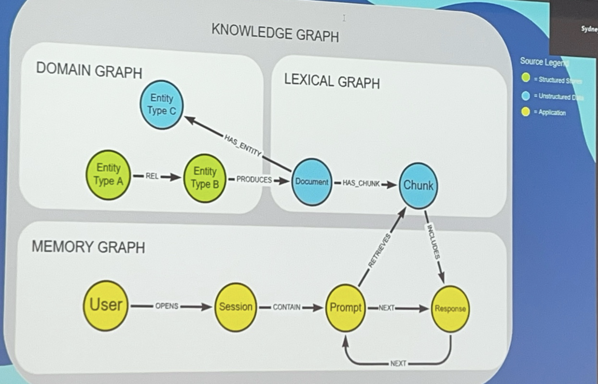
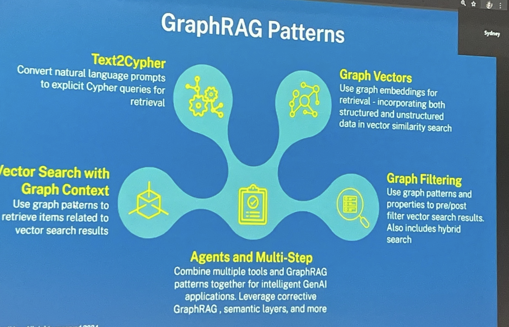
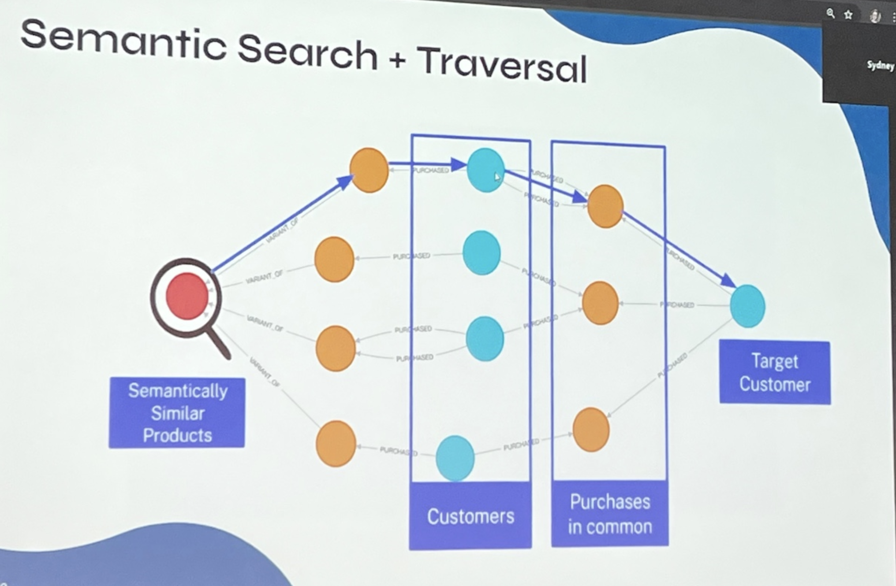
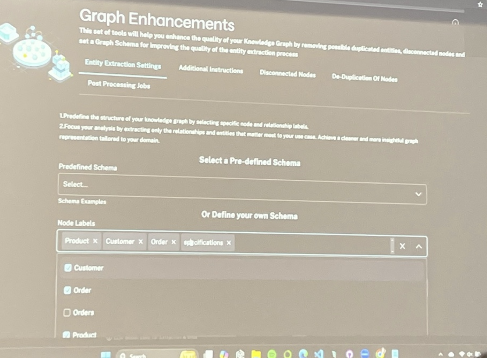
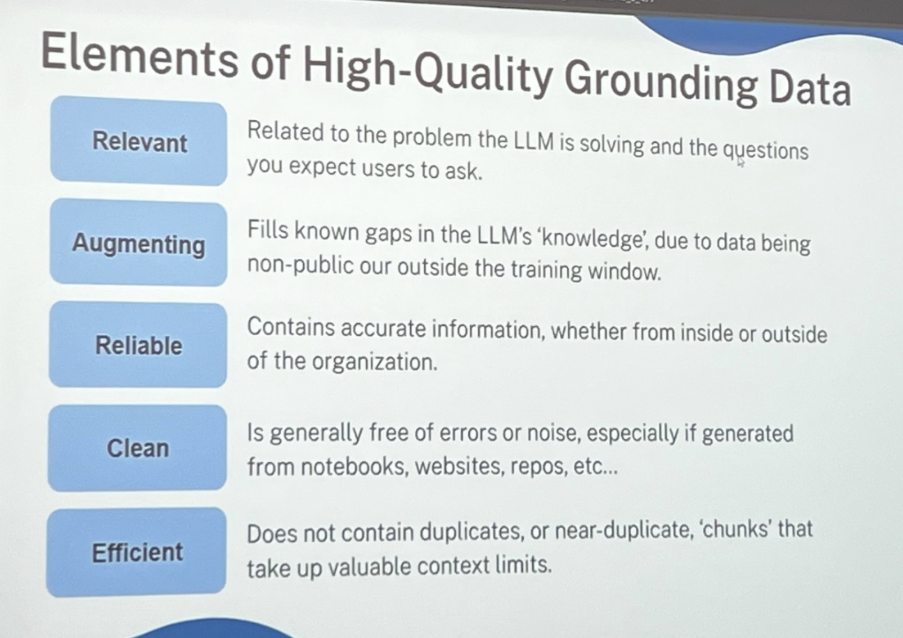

tags:: [[Neo4j]]
created-by:: [[Person/Alison Cossette]]

- # [Smarter AI with GraphRAG – Connecting Structured & Unstructured Data for Better Retrieval](https://www.ai.engineer/summit/2025/schedule/smarter-ai-with-graphrag-connecting-structured-and-unstructured-data-for-better-retrieval)
	- Summary
	  collapsed:: true
		- **Date**: February 22, 2025
		- **Time**: 12:30 PM
		- [[AI/Generative]] is only as good as the data it retrieves—but traditional RAG (Retrieval-Augmented Generation) is limited by flat, disconnected search. AI models struggle to connect structured data (databases, APIs) with unstructured data (docs, PDFs, chat logs), leading to incomplete answers and hallucinations.
		- Enter GraphRAG—a next-generation retrieval approach powered by Neo4j. This workshop will show you how graphs unlock deeper context, better reasoning, and enterprise-ready AI applications. No graph experience needed!
		- You’ll learn how to:
		- Integrate structured and unstructured data into a unified retrieval system.
		  Use GraphRAG to improve accuracy, explainability, and trust in AI-generated answers.
		  Leverage graph-native retrieval, embeddings, and hybrid search for better responses.
		  Apply GraphRAG to real-world use cases, from enterprise AI copilots to knowledge-driven automation.
		  Whether you’re building AI-powered search, chatbots, or intelligent assistants—GraphRAG makes AI retrieval smarter. Join us to learn how Neo4j can take your Generative AI applications to the next level.
		- [[Person/Alison Cossette]]
			- Alison Cossette is a dynamic Data Science Strategist, Educator, and Podcast Host. As a Developer Advocate at Neo4j specializing in Graph Data Science, she brings a wealth of expertise to the field. With her strong technical background and exceptional communication skills, Alison bridges the gap between complex data science concepts and practical applications. Alison’s passion for responsible AI shines through in her work. She actively promotes ethical and transparent AI practices and believes in the transformative potential of responsible AI for industries and society. Through her engagements with industry professionals, policymakers, and the public, she advocates for the responsible development and deployment of AI technologies. She is currently a Volunteer Member of the US Department of Commerce - National Institute of Standards and Technology’s Generative AI Public Working Group Alison’s academic journey includes Masters of Science in Data Science studies, specializing in Artificial Intelligence, at Northwestern University and research with Stanford University Human-Computer Interaction Crowd Research Collective. Alison combines academic knowledge with real-world experience. She leverages this expertise to educate and empower individuals and organizations in the field of data science. Overall, Alison Cossette’s multifaceted background, commitment to responsible AI, and expertise in data science make her a respected figure in the field. Through her role as a Developer Advocate at Neo4j and her podcast, she continues to drive innovation, education, and responsible practices in the exciting realm of data science and AI.
		- Alison Cossette, Data Science Strategist, Advocate, Educator
		  LinkedIn
		  Twitter
	- workshop form: https://docs.google.com/forms/d/e/1FAIpQLScKDk4bwnHLBKhTZXJ4XP-YBkGLgUh3B1C7-mc38jC7r0BAUQ/viewform
		- see also
		- https://graphacademy.neo4j.com/courses/genai-workshop/
	- init summary
		- Generative AI is only as good as the data it retrieves—but traditional RAG (Retrieval-Augmented Generation) is limited by flat, disconnected search. AI models struggle to connect structured data (databases, APIs) with unstructured data (docs, PDFs, chat logs), leading to incomplete answers and hallucinations.
		  
		  Enter GraphRAG—a next-generation retrieval approach powered by Neo4j. This workshop will show you how graphs unlock deeper context, better reasoning, and enterprise-ready AI applications. No graph experience needed!
		  
		  You’ll learn how to:
		- Integrate structured and unstructured data into a unified retrieval system.
		- Use GraphRAG to improve accuracy, explainability, and trust in AI-generated answers.
		- Leverage graph-native retrieval, embeddings, and hybrid search for better responses.
		- Apply GraphRAG to real-world use cases, from enterprise AI copilots to knowledge-driven automation.
		  
		  Whether you’re building AI-powered search, chatbots, or intelligent assistants—GraphRAG makes AI retrieval smarter. Join us to learn how Neo4j can take your Generative AI applications to the next level.
	- ## Intro
		- problems with #RAG
			- how do I handle
				- relative information
				- temporal information
			- you can ground chunks in relevant context
			- try to find ways that you can connect the types of storage you have
				- vector dbs
				- unstructured data, structured data
			- the info you need to get back is rarely just the chunk
			- we want chains of thought
			- we want to give insight into how we cnn connect the pieces of data into one thing
		- we are considering #MCP to feed *into* a knowledge graph
	- ## Graph db theory - Neo4j Graph Components
		- 
			- This slide explains **Neo4j Graph Components**, breaking them down into:
			- **Nodes**: Represent entities in the graph (e.g., a person or a car).
			- **Relationships**: Represent associations or interactions between nodes (e.g., "KNOWS," "LIVES WITH," "OWNS").
			- **Properties**: Attributes of nodes or relationships, including metadata like names, birthdates, or embeddings.
			- ### Example from the slide:
				- **Person ("Andre")** knows **Person ("Mica")**.
				- **Andre lives with Mica** and has a Twitter handle `@dan`.
				- **Andre drives a Volvo V70**, which has properties like brand, model, and description embedding.
				- This structure highlights how **Neo4j stores interconnected data efficiently**—a key advantage of graph databases over relational models.
		- terms
			- nodes
				- the nouns
			- relationships
				- interactions
			- properties
				- of nodes or relationships
			- *the vector is a FEATURE of the relationship*
			- in the image above, notice the `DescEmbedding`
		- ### [[graphrag.com]] is their recommendation for learning
			- ### Terms
			- #### Domain Graph
				- it could be that domain structured knowledge is extracted from unstructured
			- #### Lexical Graph
				- unstructured data
		- 
			- This slide illustrates how a **Knowledge Graph** can be structured, separating it into two main components:
			- ### **1. Domain Graph**
			- Represents **topics** in a structured way.
			- Shows how **topics are extracted** from documents.
			- ### **2. Lexical Graph**
			- Represents **documents** and their granular components.
			- Documents are broken into **chunks** (e.g., paragraphs, sections).
			- A relationship (`HAS_CHUNK`) connects a document to its respective chunks.
			- ### **Key Takeaways**
			- **Knowledge Graphs** integrate domain-specific relationships (topics) with textual content (documents and chunks).
			- This structure enables **contextual linking** between extracted knowledge and text sources, useful for **Retrieval-Augmented Generation (RAG)**.
		- ### knowledge graph -> memory graph
			- 
		- ### knowledge graph with domain, lexical and memory graph
			- 
				- cgpt-notes
					- This slide presents a **comprehensive Knowledge Graph structure**, integrating **Domain Graph, Lexical Graph, and Memory Graph**.
					- ### **1. Domain Graph (Structured Knowledge)**
					- Represents **entities and relationships**.
					- Example:
						- **Entity Type A** → relates to → **Entity Type B**.
						- **Entity Type B** → PRODUCES → **Document**.
						- **Entity Type C** → HAS_ENTITY → **Document**.
					- ### **2. Lexical Graph (Unstructured Knowledge)**
					- Links **documents** to their **chunks** (smaller text segments).
					- Example:
						- **Document** → HAS_CHUNK → **Chunk**.
					- ### **3. Memory Graph (Application-Level Interactions)**
					- Represents user interactions within a system.
					- Example:
						- **User** → OPENS → **Session**.
						- **Session** → CONTAIN → **Prompt**.
						- **Prompt** → NEXT → **Response**.
						- **Prompt** → RETRIEVES → **Chunk**.
						- **Response** → INCLUDES → **Chunk**.
					- ### **Key Takeaways**
					- This model **bridges structured and unstructured data**, making it ideal for **LLM-powered Retrieval-Augmented Generation (RAG)**.
					- **Memory Graph** ensures **context retention** by linking user prompts to relevant knowledge chunks.
					- **Lexical and Domain Graphs** provide structured and unstructured content retrieval for AI applications.
					  
					  This setup is well-suited for **AI-driven search, chatbots, or recommendation systems**.
			- #### example
				- which companies are susceptible to a lithium shortage
					- which *asset managers* are vulnerable to a lithium shortage
						- who are the managers that own those companies
				- getting the answer you need will cross the traversal from the lexical into the domain
				- *this is how humans answer questions*
				- what we haven't had an ability to do so far, and what we are challenged by is how do we provide that meta moment where we get the EXACT retrievals that we need
			- #### example
				- data science in rag apps
				- what are the subjects that people are communicating on
				- what are the areas of knowledge that they are interacting on
				- they came in asking about this and they left asking about that
				- having this understanding ... as a builder itmmight not be important to you, but to product owner, highly relevant
	- ## GraphRAG
		- ### #GraphRAG Patterns
			- 
			- cgpt notes
				- This slide outlines **GraphRAG Patterns**, which integrate **graph databases with retrieval-augmented generation (RAG)** for AI applications.
				- ### **Key GraphRAG Patterns:**
					- #### [[Neo4j/Text2Cypher]]
						- Converts natural language prompts into **Cypher queries** for graph-based retrieval.
						- Enhances interpretability and structured querying of knowledge graphs.
					- #### [[GraphRAG/Graph Vector]]s
						- Uses **graph embeddings** for retrieval, combining **structured and unstructured data**.
						- Improves **vector similarity search** by adding semantic relationships.
					- **Vector Search with Graph Context**
						- Uses **graph patterns** to retrieve additional **context** for vector search results.
						- Enhances retrieval accuracy by **linking relevant entities**.
					- **Graph Filtering**
						- Applies **graph relationships and metadata** to **filter** vector search results.
						- Supports **hybrid search**, combining **semantic retrieval and structured filtering**.
					- **Agents and Multi-Step**
						- Combines multiple **GraphRAG patterns** into an intelligent **GenAI workflow**.
						- Enables **corrective retrieval, semantic layers, and multi-step reasoning**.
				- ### **Why This Matters?**
					- **Brings structure to retrieval**: Enhances AI-driven search by **combining vector-based retrieval with graph context**.
					- **More precise and explainable AI responses**: Graphs add reasoning to **why** an answer is retrieved.
					- **Scalable for enterprise AI**: Helps in **chatbots, knowledge management, and recommendation systems**.
			- ### my #notes
				- it's going to run [[Cosine/Similarity]] in the graph
					- give me top *k* back
				- ##### text2cypher
					- convert natural language prompts to explicit "[[Neo4j/Cypher Query Language]]" queries for retrieval
					- we are querying just the domain portion
				- #### the embdding lives on the node in that chunk
					- you've even got sonnet 3.5 embedding and gpt
					- the vectors live as a property of the node
				- #### #Q how good is text to cypher if text to SQL is not that great
					- internally they use it and it's good
				- #### #Q how can you use external vector stores if you want to?
					- #MCP
					- data doesn't *need* to move, but you can have a "temporal holding"
					- you can create a "relevant graph for the moment"
						- they've seen people do that
					- what does that look like?
						- they will store it in neo4j because they want to connect it for the memory graph
				- #### #Q what is a [[GraphRAG/Graph Vector]]
					- is it graph to vector vs vector to graph
					- if I have a million rows of information about a client
					- if I have a categorical with 5 elements and it exists a million tiems
					- sparse matrix, anyone?
						- it helps with the sparse matrix problem
						- there's no need to hold empty space, it's not there
							- #Oracle
					- you want to start with the node that's the most exclusive in your query
						- sort of like [[TF-IDF]]
				- #### #Q how does indexing work for this?
					- based on which embedding you are using
					- it will go across all the nodes that are using that column
					- 13:14 they are at neo4j > User Guide: RAG > Create a Vector Index in the docs
						- this is the python library for neo4j
				- #### #Q question about filtering
					- more and less efficient way to do it
					- create an index per customer
	- ## Semantic Search + Traversal
		- pic
			- 
		- cgpt notes
			- This slide illustrates **Semantic Search + Traversal** using a **graph-based recommendation approach**.
			- ### **Key Components:**
			- **Semantically Similar Products**
				- Products are linked based on **semantic similarity** (e.g., embeddings, categories, or features).
				- **"VARIANT_OF"** relationships connect product variations.
			- **Customers**
				- Customers who have purchased similar products are **clustered** in the graph.
				- **Edges represent purchase history** (e.g., "PURCHASED" relationships).
			- **Purchases in Common**
				- Identifies shared purchasing behavior among customers.
				- Allows **pattern detection** to find products likely to be bought together.
			- **Target Customer**
				- Graph traversal extends recommendations by **finding customers with similar purchase patterns**.
				- Helps predict what a customer might purchase next based on **graph proximity and semantic similarity**.
			- ### **Why This Matters?**
			- **Combines Vector Similarity + Graph Search**
				- Uses **semantic search** to match products while leveraging **graph traversal** to infer relationships.
			- **Better Personalization**
				- Helps in **recommendation systems** by finding similar products based on prior purchases.
			- **Graph-Based Collaborative Filtering**
				- Unlike traditional **matrix-based recommendation systems**, this approach dynamically **adapts to new data**.
			- ### **Potential Use Cases:**
			- **E-commerce recommendations**
			- **Personalized content suggestions**
			- **Customer behavior analysis**
		- my #notes
		- let's see some actual things
	- ## Demo
		- llm-graph-builder.neo4jlabs. ...
		- ### drag and drop in some product descriptions
			- we could ask it to tell us what the entities are
			- i just want to know
				- is there a product in there
				- how do i tie across to the domain
				- how to tie it to the rest of my data
		- ### graph enhancements schema builder
			- #### image
				- 
			- #### cgpt notes
				- This slide illustrates **Semantic Search + Traversal** using a **graph-based recommendation approach**.
				- ### **Key Components:**
				- **Semantically Similar Products**
					- Products are linked based on **semantic similarity** (e.g., embeddings, categories, or features).
					- **"VARIANT_OF"** relationships connect product variations.
				- **Customers**
					- Customers who have purchased similar products are **clustered** in the graph.
					- **Edges represent purchase history** (e.g., "PURCHASED" relationships).
				- **Purchases in Common**
					- Identifies shared purchasing behavior among customers.
					- Allows **pattern detection** to find products likely to be bought together.
				- **Target Customer**
					- Graph traversal extends recommendations by **finding customers with similar purchase patterns**.
					- Helps predict what a customer might purchase next based on **graph proximity and semantic similarity**.
				- ### **Why This Matters?**
				- **Combines Vector Similarity + Graph Search**
					- Uses **semantic search** to match products while leveraging **graph traversal** to infer relationships.
				- **Better Personalization**
					- Helps in **recommendation systems** by finding similar products based on prior purchases.
				- **Graph-Based Collaborative Filtering**
					- Unlike traditional **matrix-based recommendation systems**, this approach dynamically **adapts to new data**.
				- ### **Potential Use Cases:**
				- **E-commerce recommendations**
				- **Personalized content suggestions**
				- **Customer behavior analysis**
			- #### my notes
				- it's looking for product name
					- 1 entity recognition in unstructure
					- 2 - some other step
		- ### The job of [[Ontologies]] is never done
			- The "Going Meta" podcast, hosted by Jesús Barrasa, Neo4j's Global Director of Sales Engineering, features an episode titled **"One Ontology to Rule Them All: Building Knowledge Graphs from Mixed Data."** This is **Season 2, Episode 5**, released on December 27, 2024
			- In this episode, Barrasa delves into the integration of structured and unstructured data using ontologies to construct comprehensive knowledge graphs. The session includes demonstrations on creating and applying ontologies, importing structured data, and managing unstructured data with GraphRAG.
			  
			  For further exploration:
			- **Watch the Episode**:
				- **Access Resources and Code**: [Going Meta GitHub Repository](https://github.com/jbarrasa/goingmeta)
			- #### there's a way this can help us answer - is there something we know that we don't know?
				- TODO didn't quite catch this part, check up later - what was it? maybe you can actually ask it what it doesn't know or what holes there are [in the ontology?]
				- "it becomes an interesting tool in that development" -> in the development of the ontology?
	- ## Flatfiles Demo
		- ### image
			-
		- ### cgpt notes
			-
		- ### my #notes
			- this user interface is querying customers.csv, orders.csv, products.csv
			- three graph nodes
	- ## EDA with Graphs and GDS - [[AI/Grounding]]
		- image
			- 
		- cgpt notes
			- This slide outlines the **Elements of High-Quality Grounding Data**, which are crucial for improving **LLM (Large Language Model) performance** in **retrieval-augmented generation (RAG)**.
			- ### **Key Elements:**
			- **Relevant**
				- Data should directly relate to the problem the **LLM is solving** and the expected **user queries**.
			- **Augmenting**
				- Helps **fill gaps** in the LLM’s knowledge, especially for **non-public or out-of-training-window** data.
			- **Reliable**
				- Must be **accurate**, whether sourced internally or externally.
			- **Clean**
				- Should be **free of errors, formatting issues, and noise**, especially when extracted from **notebooks, websites, and repositories**.
			- **Efficient**
				- Avoids **duplicates or near-duplicates** to prevent wasting valuable **context space**.
			- ### **Why This Matters?**
			- Ensuring **high-quality grounding data** improves **LLM accuracy and relevance**.
			- **Prevents hallucinations** by **augmenting model knowledge with trustworthy sources**.
			- **Optimizes token efficiency**, reducing unnecessary redundancy.
		- my notes
			- ADVICE: Connect -> Cluster -> Curate
		- KNN-similar text chunks
			- if you've got 17 different chunks that they are nearly identical, they can be removed
			- collapsing duplicate nodes
				- into a single instance
				- maintain relationship to original source document
					- through original URL
	- ## Graphs enable explainable AI in LLMs
		- by having "logging and memory graph" we can dive into it
		- this evaluation piece is about the connection between the memory program and the rest
		- "most frequently used" grounding text
		- centrality algorithm -> chatbot for data science documentation
			- most used algo by their customers
		- how do I get data into neo4j and how do I run the algo
		- sometimes you want "most frequent document" *communities*
			- of course, the first most used is the docs then the 2nd is the community
		- but what's the visualization of the logging
	- ## Logging and visualizing document usage
		- image
			- 
		- cgpt
			- This slide explains how **Neo4j can be used to log and visualize LLM conversations**, integrating them with **context documents** in a structured graph.
			- ### **Key Concepts:**
			- **Graph-Based Conversation Logging**
				- LLM conversations are stored in **Neo4j** with structured relationships.
				- Messages from the **user** and **assistant** are linked sequentially (`NEXT` relationship).
				- Context documents (`HAS_CONTEXT`) are associated with messages.
			- **Graph Structure Example**
				- **User and Assistant Messages**:
					- "User" initiates the conversation.
					- "Assistant" provides responses.
				- **Relationships in the Graph**:
					- `HAS_CONVERSATION`: Links a session to an LLM (e.g., GPT-4).
					- `NEXT`: Orders the conversation flow.
					- `HAS_CONTEXT`: Associates messages with relevant context documents.
			- **Why This Matters?**
				- **Retrieval-Augmented Generation (RAG)**:
					- Context documents are **retrievable** based on conversation history.
				- **LLM Debugging & Insights**:
					- Helps **analyze patterns** in chatbot interactions.
				- **Fine-Tuning Data Collection**:
					- Logs **real user queries** for **model improvement**.
					  
					  Would you like help **querying LLM conversations in Neo4j** using Cypher?
		- *inspect communities of llm responses* to detect if people are getting responses
			- there's something important here, but I didn't quite catch it
			- it has to do with [[AI/Eval]]s
			- TODO 13:54 come back and check this technique out
		- [[Key Insight]] it's not going to be obvious
			- if you get a bad response in an agent, agents aren't complaining yet
			- we need to understand *the physics of the systems and how they are moving*
		- Recommendation - the woman from ARIZE -
			- [Ensure AI Agents Work: Evaluation Frameworks for Scaling Success](https://www.ai.engineer/summit/2025/schedule/ensure-ai-agents-work-evaluation-frameworks-for-scaling-success)
	-