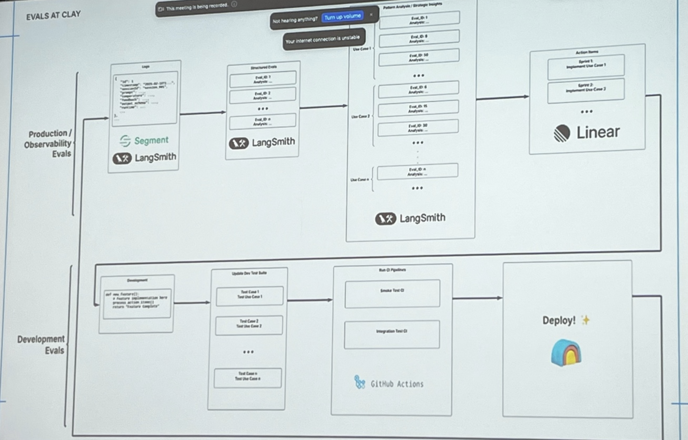
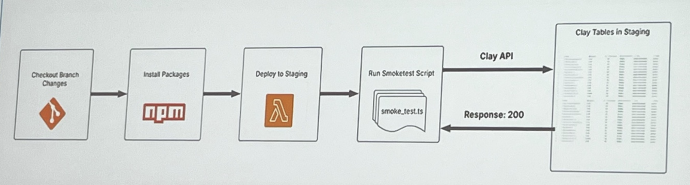
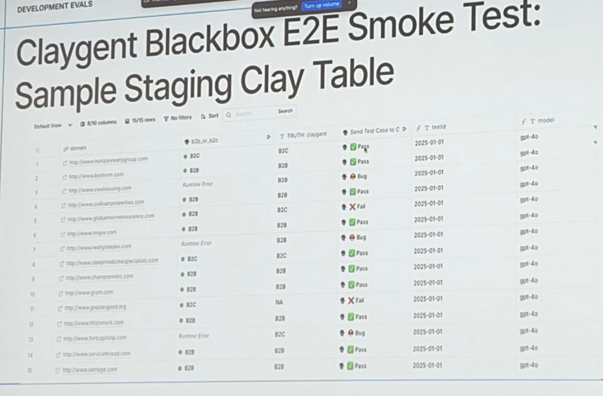
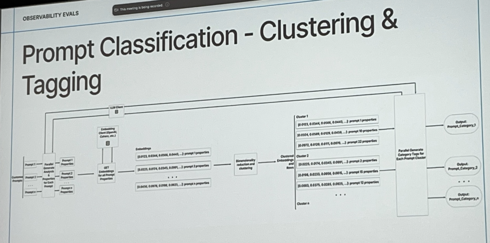
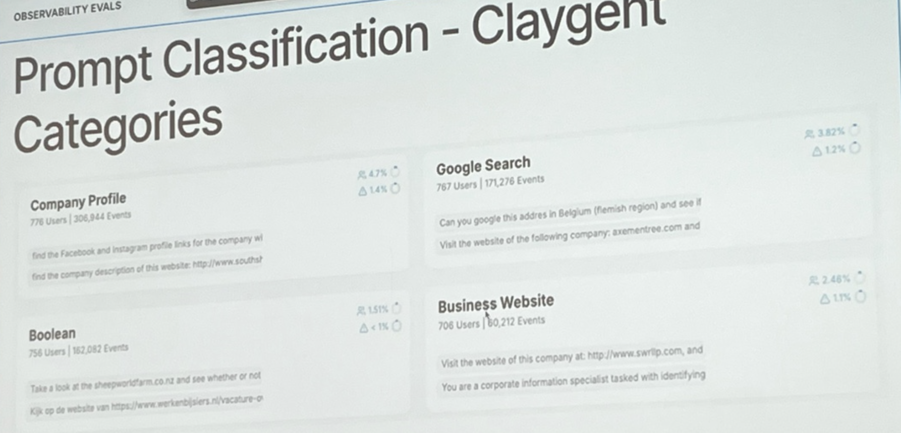

date-created:: [[2025-02-22 Sat]]
tags:: [[AI/Agent]], [[LangChain]], [[Workshop]], [[Tutorial]]

- # [How Clay Performs Agent Evaluation](https://www.ai.engineer/summit/2025/schedule/clay-evals)
	- meta info
		- **Date**: February 22, 2025
		- **Time**: 2:30 PM - 3:50 PM
		- **Presenters**: [[Person/Nick Huang]] and [[Person/Ratch Sujithan]]
		- **Room**: AWS JFK27 (12 W 39th St) 300/301 - entrance 39th St & 5th Ave, large gold doors, bring ID
		- **Description**: In this workshop, Nick Huang from #LangChain will explain agent evaluation concepts. [[Person/Jeff Barg]] or [[Person/Ratch Sujithan]] 
		  will then demonstrate how Clay performs end-to-end agent tests for Claygent across various prompt categories against a ground truth dataset, and discuss how Clay conducts prompt-level evaluations.
	- ## intro to evals - [[Person/Nick Huang]] from [[LangChain]]
		- ### Intro slide - 01
			- 
		- ### Intro to chain vs agent and issues that lead to evals
			- [[My Notes]]
				- ### chain vs agent
					- agents typically use [[AI/Tool/Calling]]
						- agends determine what order to call them in
				- ### issues with agents
					- poor reliability
					- task ambiguity and missing context
					- too many tools
					- ambiguous tools
					- failing to reason
					- relying to heavily on internal
				- ### mitigations
					- express control flow with both deterministic and agentic logic
					- #### vibe check
						- not gooed enough for prod
						- a lot of people **stayed away from sensitive applications** since this was what most were able to do
		- ### how can we be sure that our performance is getting better over time?
			- 
			- [[AI Notes]]
				- ## General Evaluation Principles
					- **How do we know that our application is actually getting better over time?**
					- **Version Progression:**
						- v1 → v2: *new prompts* (blue)
						- v2 → v3: *different model* (purple)
						- v3 → v4: *new architecture* (green)
					- **LangChain logo present in the bottom-left corner**
					- **Slide number:** 17
					- **Zoom overlay visible at the top**
						- "This meeting is being recorded."
						- "You are screen sharing."
						- "Not hearing anything? Turn up volume"
						- "Talking: Sydney"
			- [[My Notes]]
				- as we go from #o1 to #o3-mini how can we know what changes?
				- as we go to a supervisor  model
		- ### test versions of your application against full datasets of examples - 02
			- #### Pics
				- 
			- #### [[AI Notes]]
				- ## General Evaluation Principles
					- **Test versions of your application against full datasets of examples**
					- **Diagram Structure:**
						- **Application**
							- v1 → Dataset (red arrow)
							- v2 → Dataset (blue arrow)
								- *new architecture, new prompt, or new model*
						- **Dataset** (diamond shape) → Evaluators
						- **Evaluators** (green box)
							- 65% Accuracy, 40% Hallucination (red)
							- ...
							- 80% Accuracy, 25% Hallucination (blue)
							- ...
					- **LangChain logo present at the bottom-left corner**
					- **Slide number:** 2
					- **Zoom overlay visible at the top**
						- "This meeting is being recorded."
						- "Not hearing anything? Turn up volume"
		- ### how to define evaluators to calculate useful metrics from your experiments - 03
			- 
			- #### [[AI Notes]]
				- ## General Evaluation Principles
					- **Test versions of your application against full datasets of examples**
					- **Diagram Structure:**
						- **Application**
							- v1 → Dataset (red arrow)
							- v2 → Dataset (blue arrow)
								- *new architecture, new prompt, or new model*
						- **Dataset** (diamond shape) → Evaluators
						- **Evaluators** (green box)
							- 65% Accuracy, 40% Hallucination (red)
							- ...
							- 80% Accuracy, 25% Hallucination (blue)
							- ...
					- **Slide number:** 2
		- ### **Define evaluators to calculate useful metrics from your experiments** - 04
			- ((67d01741-549f-4b8a-911a-9d838defc11e))
				- 
			- [[AI Notes]]
				- **Define evaluators to calculate useful metrics from your experiments**
				- **Diagram Structure:**
					- **Example (Blue Box)**
						- Input = x1
						- Reference Output = y1
					- **Run (Red Box)**
						- v1 processes Input = x1
						- Produces Output = y_run
					- **Evaluator (Green Box)**
						- Takes:
							- Input
							- Reference Output
							- Output (from Run)
						- **Calculates metrics!**
				- **LangChain logo present at the bottom-left corner**
				- **Slide number:** 21
			- #### [[My Notes]]
				- ### #Q - is [[LangSmith/Evaluator/Offline]] preferred if you have ground truth labels?
					- kinda, yeah. online tends to be "sketchy"
					- you want to do this
		- ### **Pairwise evaluators directly compare different versions of your application** - ((67d01741-c2af-4f20-b8ef-4fb7a3a68f90))
			- 
			- #### [[AI Notes]]
				- **Pairwise evaluators directly compare different versions of your application**
				- **Diagram Structure:**
					- **Application**
						- v1 → Dataset A (red arrow)
						- v2 → Dataset A (blue arrow)
							- *new prompt: provide more detail*
					- **Pairwise Evaluator (Green Box)**
						- **Experiment Output:**
							- "Pikachu is a pokemon."
								- preferred = 0
							- vs
							- "Pikachu is an electric type pokemon that evolves from Pichu and into Raichu"
								- preferred = 1
					- **LLM-as-judge Evaluator**
						- is_correct = True
						- is_correct = True
				- **Slide number:** 24
		- ### **Performing experiments as you iterate on your application is crucial** ((67d01741-17bc-4231-9481-6d559ac3be6e))
			- 
			- #### [[AI Notes]]
				- **Diagram Structure:**
					- **Application**
						- v1 → Dataset A (red arrow)
						- v2 → Dataset A (blue arrow)
							- *new prompt*
						- v3 → Dataset A (purple arrow)
							- *different model*
						- v4 → Dataset A (green arrow)
							- *new architecture*
					- **Evaluators**
						- v1: 65% Accuracy, 40% Hallucination (red)
						- v2: 80% Accuracy, 25% Hallucination (blue)
						- v3: 85% Accuracy, 25% Hallucination (purple)
						- v4: 95% Accuracy, 10% Hallucination (green)
				- **Slide number:** 25
			-
		- ### **Feedback from "online" evaluators can help you set up useful automations** ((67d01741-a923-4650-a6ef-215638de56a7))
			- 
			- #### [[AI Notes]]
				- **Diagram Structure:**
					- **Filter Condition (Yellow Box - "When")**
						- accuracy > 50%
						- AND
						- hallucination = false
					- **Actions (Triggered if Condition is Met - "Then")**
						- Add to Dataset (Red Box)
						- Add to Annotation Queue (Red Box)
						- More Online Evals (Green Box)
						- Trigger Webhook (Purple Box)
						- etc.
				- **Slide number:** 31
		- ### **Agents need to be evaluated at different levels of granularity** ((67d01741-c6e8-47e5-b8e7-9e450bdc4652))
			- 
			- #### [[AI Notes]]
				- **Diagram Structure:**
					- **Question → Query Optimization (Purple Box)**
					- **Retrieve Documents (Blue Box)**
						- Multiple documents retrieved
					- **Grade Documents (Yellow Diamond)**
						- Determines if any document is relevant
					- **If relevant → Generate Answer (Blue Circle)**
						- If no relevant document → Human in the Loop (Stick Figure)
					- **Check for Hallucinations (Green Diamond)**
						- If no hallucinations → Answer
						- If hallucinations → Review Needed
				- **Slide number:** 33
		- ### Expected trajectory can be ordered ((67d01741-c5c4-4035-a19c-d22ad5fc36c2))
			- 
				- #### [[AI Notes]]
					- **v1 Trajectory (Red Box)**
						- `get_calendar(time="5pm")`
						- `get_calendar(time="7pm")` *(green)*
						- `get_calendar(time="6pm")` *(red)*
						- `schedule_meeting(time="7pm")`
					- **Expected Trajectory (Green Box)**
						- `get_calendar(time="5pm")`
						- `get_calendar(time="6pm")` *(red)*
						- `get_calendar(time="7pm")`
						- `schedule_meeting(time="7pm")`
					- **Key takeaway:**
						- The v1 trajectory executes `get_calendar(time="7pm")` before `get_calendar(time="6pm")`, which is incorrect compared to the expected ordering.
					- **Slide number:** 41
		- ### **Multi-turn conversations can be tested individually, or in series** ((67d01741-9809-4d48-a77b-31fa1d1d196d))
			- 
			- #### [[My Notes]]
				- The structure of how one tests is also determined by the structure of the conversation
				- if your conversation has phases, and you need to make assertions against phases, individual tests for phases may make sense
				- The structure of the golden datasets match the expected structure of how one tests
			- #### [[AI Notes]]
				- **Comparison of Testing Approaches:**
					- **One Conversation (Green Box)**
					  collapsed:: true
						- Human: A
							- AI: B
						- Human: C
							- AI: D
						- Human: E
							- AI: F
					- **Each Turn can be tested individually (Red Boxes)**
					  collapsed:: true
						- **First box:**
						  collapsed:: true
							- Human: A
								- AI: ?
						- **Second box:**
						  collapsed:: true
							- Human: A
								- AI: B
							- Human: C
								- AI: ?
						- **Third box:**
						  collapsed:: true
							- Human: A
								- AI: B
							- Human: C
								- AI: D
							- Human: E
								- AI: ?
				- **Slide number:** 46
		- ### **Regression Testing: Does performance actually improve with a change?** ((67d01741-fcbb-4e05-9948-5ff373ea6d1f))
			- 
			- #### [[My Notes]]
				- *[[Insight/Key]] here was that we can test different versions of the application against the same version of the dataset with the same evaluator*
					- *there's possibly a more subtle point here that sometimes latency might be related to accuracy?*
			- #### [[AI Notes]]
			  collapsed:: true
				- **Diagram Structure:**
					- **Application Versions**
						- v1 → Dataset A (red arrow)
						- v2 → Dataset A (blue arrow)
							- *new prompt*
						- v3 → Dataset A (purple arrow)
							- *different model*
						- v4 → Dataset A (green arrow)
							- *new architecture*
					- **Evaluators**
						- v1: 65% Accuracy, 40% Hallucination
						- v2: 80% Accuracy, 25% Hallucination
						- v3: 85% Accuracy, 25% Hallucination
						- v4: 70% Accuracy, 10% Hallucination
					- **Latency Measurements**
						- v1: 5s
						- v2: 10s
						- v3: 20s
						- v4: 5s
				- **Slide number:** 52
	- ## [[Person/Ratch Sujithan]] from [[ClayCo]]
		- ### Clay
			- "data marketplace for go to markplace"
			- external providers - ocean.io
			- they are going to focus on "claygent" an agent reserach interface
				- it can augment your dataset
			- go to clay.com and see what they have to offer
			- trusted by 300k gtm teams - openai, airbnb, [[Anthropic]], [[CursorAI]], notion, dropbox
		- ### demo that "took 5-7 min to create"
			- ### LangChain Demo: LinkedIn Profile Finder ((67d01741-16df-4b04-b056-48c4385aa9d1))
				- **Workspace:** Langchain demo
				- 
				- #### [[My Notes]]
					- > "Given a person's full name, GitHub username, and GitHub profile link, find their LinkedIn profile URL. Follow these steps to ensure accuracy:"
					- use "stargazers" on github integration
					- put langchain github url in there
					- get back stargazers in a spareadsheet
					- extract usernames and github urla
					- use github integration to get names and contributions and number of repos they created
					- i'm a recruiter to find out about them and find their backgrounds
					- there's a linkedin profile finder
					- now you can extract person from linkedin profile
					- now you have country profile, email
					- write personalized messages to them
					- very small snapshot of what clay can do
				- #### [[AI Notes]]
				  collapsed:: true
					- **Data Table View:**
						- **Columns:**
							- "Find stargazers on" (GitHub user list)
							- "Num Contributions"
							- "Repos Contributed"
							- "LinkedIn Profile Find"
							- "Response"
						- **Example Users:**
							- `allsayar` (160+ contributions)
							- `JohnShahawy` (3481 contributions, `backstage`, `cotmaker`)
							- `davidtsong`, `salomartin`, `sjwithmore`, etc.
					- **Model:** Claygent -> Argon
					- **Configuration:**
						- **Prompt:**  
						  "Given a person's full name, GitHub username, and GitHub profile link, find their LinkedIn profile URL. Follow these steps to ensure accuracy:"
						- **Inputs:**
							- Name (`T Name`)
							- GitHub Username (`T Username`)
							- GitHub URL (`URL`)
						- **Steps to Execute:**  
						  1. Check the GitHub Profile Directly
					- **Additional UI Elements:**
						- "Compare models" button
						- "Save" button
		- ### Logs to Action
			- #### [[My Notes]]
				- logs here could be json logs
				- analysis
					- clustering
					- regression
		- ### **Evals: Steering AI Strategy** ((67d01741-c334-430b-b498-d63dd1a7072d))
			- **Evals: Steering AI Strategy**
			- 
				- [[AI Notes]]
					- **Key Points:**
						- Data-driven feedback loop
						- Continuous Feedback
						- Customer-Centric Insights
						- Strategic Alignment
						- Evolutionary Foundation
		- ### Core Elements of Our Evaluation Framework ((67d01741-6528-4c5d-a2f7-7d453f0f2f59))
			- 
			- #### [[AI Notes]]
				- **Development Evaluations**
					- Validate Functionality
					- Test Integration
					- Support New Use Cases
				- **Observability Evaluations**
					- Monitor Usage Patterns
					- Performance Analysis
					- Driving Strategic Decisions
				- **Key Insight:**
					- Observability insights continuously refine development evaluations in a feedback loop.
		- ### Evals at Clay - **Evaluation Pipeline Overview** ((67d01741-ddb3-485e-9fad-aa57b23897ba))
			- Pic
				- 
			- #### [[My Notes]]
				- DOING study this a bit more to decipher the evals
				- **Production / Observability Evals**
					- uses [[LangSmith]]
				- **Development Evals**
					- MR-time checks
			- #### [[AI Notes]]
				- **Production / Observability Evals**
					- **Tools Used:**
						- [[Twilio/Segment]] - a [[Customer Data Platform]]
						- LangSmith
					- **Process:** (top half)
						- **Logs** are collected and processed in LangSmith and [[Twilio/Segment]]
						- Structured events analyzed (Eval_IDs assigned)
						- Pattern analysis and broader insights derived from multiple evaluations
						- Insights linked to Linear for tracking action items
							- Example: Sprint 1 - Implement Use Case 1
							- Example: Sprint 2 - Implement Use Case 2
				- **Development Evals**
					- **Process:**
						- New functionality added and simulated in development
						- Update test suite:
							- Test Case 1 → Test Use Case 1
							- Test Case 2 → Test Use Case 2
							- Test Case N → Test Use Case N
						- Run CI Pipelines:
							- Smoke Test CI
							- Integration Test CI
						- **GitHub Actions handles CI runs**
						- **Final step: Deploy! 🚀**
		- ### Development Evals – Ensuring Quality & Stability ((67d01741-84d9-4609-a384-2c7bdaf8b6c5))
		  id:: 67ba6d93-e02a-4189-8bb2-8630bc00c790
			- 
			- #### [[AI Notes]]
				- **Blackbox E2E Smoke Testing**
					- Environment parity
					- Early problem detection
					- Confidence in real-world conditions
				- **Integration Testing**
					- Performance tracking on key use cases
					- Regression prevention
					- Comprehensive coverage
		- ### **"Claygent" Blackbox E2E Smoke Test CI Workflow** ((67d01741-64d5-42b9-a3cd-7a038bdb62a2))
			- 
			- #### [[AI Notes]]
				- **Workflow Steps:**
				  1. **Checkout Branch Changes** (Git icon)
				  2. **Install Packages** (npm icon)
				  3. **Deploy to Staging** (AWS Lambda icon)
				  4. **Run Smoketest Script** (`smoke_test.ts` file)
				  5. **Clay API**
					- Response: `200`
					  6. **Clay Tables in Staging**
		- ## **Claygent Blackbox E2E Smoke Test: Sample Staging Clay Table** ((67d01741-966b-48c5-a2bc-eecc1265d75d))
			- 
				- #### [[My Notes]]
					-
				- #### [[AI Notes]]
					- **Table Overview:**
						- **Columns:**
							- `domain`
							- `b2b_or_b2c`
							- `TRUTH: claygent`
							- `Send Test Case to C`
							- `testid`
							- `model`
						- **Example Entries:**
							- `horizonvalleygroup.com` → `B2C` → `Pass` → `gpt-4o`
							- `bostrom.com` → `B2B` → `Pass` → `gpt-4o`
							- `owshousing.com` → `B2B` → `Bug` → `gpt-4o`
							- `culinaryproperties.com` → `B2B` → `Pass` → `gpt-4o`
							- `globalmarininsurance.com` → `B2B` → `Fail` → `gpt-4o`
							- `greatgood.org` → `B2C` → `Pass` → `gpt-4o`
							- `fortcapitalp.com` → `B2B` → `Bug` → `gpt-4o`
							- `servicethread.com` → `B2B` → `Pass` → `gpt-4o`
					- **Key Status Indicators:**
						- ✅ Pass
						- ❌ Fail
						- 🐞 Bug
		- ## **Claygent Integration Testing: Types of Evals** ((67d01741-6154-4394-bc0c-272532320cbf))
			- 
			- #### [[AI Notes]]
				- **Key Points:**
					- Check your agent’s performance in development to ensure high-quality output in production.
					- Comparing Agent Output to Ground Truth.
					- **Comparison Methods – [The Langchain Openevals Framework](https://github.com/langchain-ai/openevals) Approach:**
						- Exact Match
						- Levenshtein Distance
						- Embedding Similarity
						- LLM as a Judge
		- ## **Claygent Integration Test Example 1** ((67d01741-c3db-497a-a780-38c42ec1a5c8))
			- 
			- #### [[AI Notes]]
				- **Exact Matching**
					- Integration Test
					- LangSmith integration with Vitest
				- **Code Example (JavaScript)**
					- **Test Definition**
					  ```javascript
					  ls.test(
					   'horizonrealtygroup',
					   {
					     inputs: {
					       mission: createTestActionInputs('http://www.horizonrealtygroup.com').mission,
					     },
					     referenceOutputs: {
					       answer: 'B2C',
					     },
					   }
					  );
					  ```
					- **Execute Test**
					  ```javascript
					  async ({ referenceOutputs }) => {
					   // call claygent action code
					   const actionInputs = createTestActionInputs('http://www.horizonrealtygroup.com');
					   const response = await runClaygentActionCode(actionInputs, testContext);
					   ls.logOutputs({ response: response.data.result });
					  ```
					- **Assert Exact Match**
					  ```javascript
					   const exactMatchResult = await exactMatch({
					     outputs: response.data.result,
					     referenceOutputs: referenceOutputs?.answer,
					   });
					   expect(exactMatchResult.score).toBe(true);
					  }
					  ```
		- ## LangSmith Debugging: Inspecting Model Discrepancies ((67d01741-0df6-4860-9357-ee43333568d6))
			- #### Transcript
				- > We can use the C bucket, we can pass, array, but in our Ideal Candidate bucket, oh no, meta failed, but OpenAI passed. So we can use LightSmith to actually go and inspect why. Cool, and so this is the Datasets and Experiments page on LightSmith. I see my two buckets here. Let's click into Ideal Candidate, and then we'll click on our latest run. And lo and behold, we have our error here. If I click on this, I can see what the inputs and the reference outputs were. So I can see that the input was, give me an Ideal Candidate for the job at this particular link, at company meta. And then we see our reference output here, which seems to be about some iOS job. And then we can see that the error was thrown. Now what we can do is take a look at the thought process of the judge. We can see that our input was, give me the Ideal Candidate for this profile. It seems that they should scrape this job and add something to Mechanical Engineering. And our reference output is an iOS job. So let's read what the judge had to say. Upon analyzing what the reference and model outputs under the given rubric, it is evident that they describe candidates for entirely different roles. Amazing.
			- #### [[AI Notes]]
				- **Bucket Overview:**
					- C Bucket: ✅ Passed
					- Ideal Candidate Bucket: ❌ Meta failed, ✅ OpenAI passed
				- **Using LangSmith for Debugging**
					- Navigate to the **Datasets and Experiments** page on LangSmith.
					- Identify and select the **Ideal Candidate** bucket.
					- Click on the **latest run** to inspect errors.
				- **Error Inspection Process**
					- **Input:** "Give me an Ideal Candidate for the job at this particular link, at company Meta."
					- **Reference Output:** Seems to be related to an iOS job.
					- **Model Error:** Discrepancy detected.
				- **Analyzing the Judge's Thought Process**
					- **Judge's Observation:**
						- Input suggests scraping a job for Mechanical Engineering.
						- Reference output describes an iOS job.
						- **Final Evaluation:**
							- "Upon analyzing the reference and model outputs under the given rubric, it is evident that they describe candidates for entirely different roles."
				- **Key Takeaway:**
					- LangSmith provides insight into model performance discrepancies by exposing errors in judgment and alignment with expected outputs.
		- ## Observability Evals – Real-Time Insights & Optimization ((67d01741-dd87-444e-a7d6-438a47cc0780))
			- 
			- #### [[AI Notes]]
				- **User Prompt Classification**
					- Capture user patterns and trends.
					- Sharpen evaluation for precise tuning.
					- **Methods:** Classifier training, LLM judging, clustering, semantic analysis.
				- **Realtime Agent Log Analysis**
					- Monitor responses live.
					- Receive immediate, context-aware feedback.
					- Detect anomalies as they occur.
					- Extract data for training and/or dev evals.
		- ## Extracting Value from Customer Usage Data
			- #### [[Transcript]]
				- > the actual sort of value comes from looking at how customers are using your platform. And depending on how these logs, you know, depending on whether your agent did well or poorly on a certain log, you can extract these for trading or debt deals. So upon classification, I'll sort of talk about the clustering and tagging technique.
			- #### [[AI Notes]]
				- **Importance of Customer Logs**
					- Understanding how customers interact with the platform provides the most valuable insights.
					- Logs help assess whether an agent performed well or poorly on specific interactions.
					- Extracting logs for training or development evaluations can refine model performance.
				- **Classification, Clustering, and Tagging**
					- Once logs are classified, clustering techniques can be applied.
					- Tagging strategies help organize and analyze data for targeted improvements.
				- **Key Takeaway:**
					- Observability-driven insights allow for continuous tuning and refinement of AI agents.
		- ## Prompt Classification - Clustering & Tagging ((67d01741-ff64-4447-a7fb-a3af82fcb8b6))
			- 
			- #### [[AI Notes]]
				- **Using Embeddings for Clustering**
					- Cohere has recently released embeddings tailored for clustering.
					- Obtain embeddings for prompt properties.
					- Perform clustering using methods such as:
						- Hack-rewarded clustering
						- K-means clustering
					- Experimentation is necessary to determine the most effective clustering approach.
				- **Generating Tags for Clusters**
					- Once clusters are formed, send a request to the LLM to generate category tags.
					- Results in well-defined buckets of prompt categories.
				- **Analyzing Prompt Categories**
					- Count the number of prompts in each category.
					- Identify the most common customer use cases.
					- Enables deeper insights into how customers are using the platform.
				- **Key Takeaway:**
					- Clustering prompts enables structured categorization and prioritization of real customer needs.
		- ## Prompt Classification - Claygent Categories ((67d01741-73f7-4e9c-b18a-7f73e907975d)), ((67d01741-6a53-465f-9aa0-83b890dfd5c8))
			- #### [[Transcript]]
				- > and tell me whether or not. And so whether or not probably implies a true or false value. Cool. So now let's dig into sort of real-time agent performance analysis. So like I said before, live data is the best data. And what you really want to do here is take in your incoming stream of data, take a subset of it, and analyze that to determine how your agent is doing. And so when you have examples of your agent doing a really good job, that can make excellent training data. You can export that in LightSmith, and we'll see that in the slides here, and then use that to train components of your agent. And the examples, when you have examples of logs where your agent can improve, it's probably best for you then to move that over to your development email set. So this kind of showcases the loop that I'm talking about between your production emails, your observability emails, and your development emails.
			- #### Pics
				- Pic24
					- 
				- Pic25
					- 
			- #### [[AI Notes]]
				- Pic 24
					- **Identified Prompt Categories:**
						- **Company Profile**
							- **Users:** 776
							- **Events:** 306,944
							- **Example Task:** Find the Facebook and Instagram profile links for a company.
						- **Google Search**
							- **Users:** 767
							- **Events:** 171,276
							- **Example Task:** Google an address and check if a company is listed.
						- **Boolean**
							- **Users:** 756
							- **Events:** 162,082
							- **Example Task:** Determine whether a statement is true or false.
						- **Business Website**
							- **Users:** 706
							- **Events:** 160,212
							- **Example Task:** Visit a company website and extract relevant details.
					- **Analysis & Insights:**
						- Understanding which categories are most commonly used helps prioritize improvements.
						- Some categories may be less popular but still provide valuable use cases.
				- ##### Realtime Agent Performance Analysis
					- **Live data is the best data!**
					- **Key Insights:**
						- Examples where the agent performs well → **Great training data**.
						- Examples where the agent needs improvement → **Useful for development evals**.
						- The feedback loop between **production evals, observability evals, and development evals** helps refine performance.
					- **Process:**
						- 1. Stream in live data.
						- 2. Identify examples where the agent succeeds.
						- 3. Export those cases to LangSmith for training.
						- 4. Identify failure cases and move them to development evals.
					- **Key Takeaway:**
						- Creating a structured evaluation pipeline ensures continuous improvements in agent performance.
		- ### Realtime Agent Performance Analysis Example ((67d01741-eb3b-4b31-8134-02ced70d8590)), ((67d01741-4d55-43bb-9562-d12bb3c8eadf))
			- #### [[Transcript]]
				- > Here are the parameters we gave to the judge to run on this 10% sample. Here we're giving it a model of GCC 4.0, and we're using one of the default language prompts that they provide. You are a teacher taking a quiz, you'll be given a question, a student answer, etc., etc. And then we're setting the answer to be the output response object from the plagiate, and the mission to be the input.mission from the plagiate.
			- \#### Pics
				- #### Pic 26
					- 
				- #### Pic 27
					- 
			- [[AI Notes]]
				- **LLM as a Judge**
					- **Rule Configuration Panel**
						- 10% of logs randomly sampled
						- Sampled logs analyzed by the judge
					- **Example Parameters Used:**
						- **Model:** GPT-4o (OpenAI)
						- **Temperature:** 0
						- **Variable Mapping:**
							- `answer` → `output.response`
							- `mission` → `input.mission`
						- **Prompt Template:**
							- "You are a teacher grading a quiz."
							- Given a question and a student answer, evaluate:
							  1. Ensure the **STUDENT ANSWER** is concise and relevant to the **QUESTION**.
							  2. Ensure the **STUDENT ANSWER** helps answer the **QUESTION**.
							- **Scoring:**
								- **10** → Meets all criteria
								- **Lower Scores** → Partial or incorrect responses
				- **Key Takeaways:**
					- Automated evaluation via LLM ensures unbiased grading of agent responses.
					- Allows for structured quality assessment of agent output.
					- Helps refine models by identifying discrepancies between expected and actual outputs.
		- ### LLM as a Judge - Example Evaluation ((67d01741-45be-4959-9f57-05767e42c8bc))
			- #### pics
				- 
			- [[AI Notes]]
				- **Input:**
					- **Answer:** `valid`
					- **Mission:**
						- **Context:** Validate if a given website landing page is operational.
						- **Objective:** Determine if the landing page at `kw-platinum.com` is connected.
						- **Instructions:**
						  1. Visit the website provided in the `kw-platinum.com` column.
						  2. Check the landing page for indications that it is associated with a business.
						  3. If the page appears to be improperly set up (e.g., showing a generic hosting page like `wix.com` default), mark it as `'broken'`.
						  4. If the page loads correctly and is associated with a company, mark it as `'valid'`.
						  5. Return **only** `'broken'` or `'valid'` based on the page status.
						  6. Do **not** include any additional commentary or information in the response.
						- **Examples:**
							- If a Wix default page appears → Respond `'broken'`.
							- If the landing page shows a functioning business site → Respond `'valid'`.
				- **Output Evaluation:**
					- **Reasoning:**
						- The student's answer (`valid`) is concise and correctly follows the instructions.
						- The response format adheres to the requirement to return **only** `'broken'` or `'valid'`.
						- The student has determined that the landing page is operational and associated with a business, aligning with the objective.
					- **Score:** 10 (Perfect response)
					- **Conclusion:** The answer is both relevant and helpful, fully meeting evaluation criteria.
		- ### Realtime Agent Performance Analysis Example ((67d01741-f909-4da5-81c3-3f7e172732a7))
			- #### Pic 29
				- 
			- #### [[AI Notes]]
				- **Creating a Dataset**
					- **Purpose:**
						- Logs collected here can be used for **Development Evals** or **Training**.
					- **Dataset Name:** `helpful_examples`
					- **Tabs in UI:**
						- **Experiments**
						- **Pairwise Experiments**
						- **Examples** (selected)
						- **Few-shot search**
					- **Example Entries in Dataset:**
					  1. **Input:** "Using the input site123..."
						- **Reference Output:** "Site123 is a comprehensive ..."
						- **Attachments:** No attachments found
						  2. **Input:** "#CONTEXT# You want t..."
						- **Reference Output:** "valid"
						- **Attachments:** No attachments found
					- **Total Examples in Dataset:** 2
				- **Key Takeaway:**
					- Structuring datasets from real-time logs enables efficient reuse for model **training** and **evaluation**.
		- ## Conclusion ((67d01741-c693-43c9-bbc8-94925bcacbbc))
			- #### Pic 30
				- 
			- #### [[AI Notes]]
				- **Closing Thoughts**
					- Our Evals framework is our strategic compass, aligning innovation with the real needs of our users.
					- It transforms raw data into meaningful insights that drive informed, agile decision-making.
					- Merging development and observability creates a self-sustaining loop of continuous validation and enhancement.
					- Every new feature marks a step forward in our journey toward a more resilient and adaptable system.
					- Have the confidence that every decision you make is impacting the user!