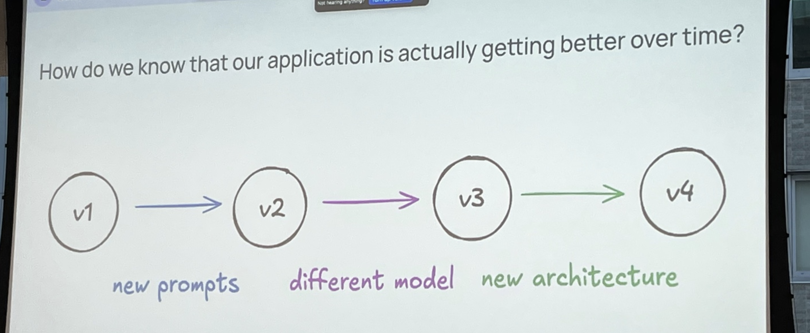
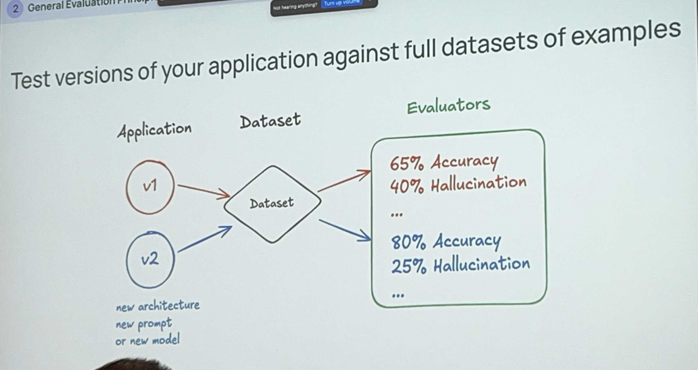
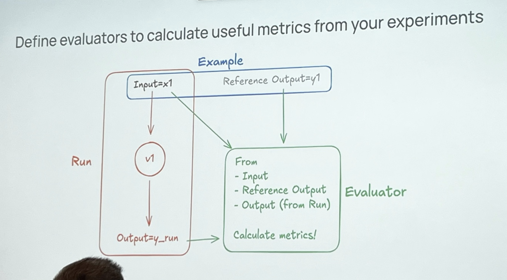
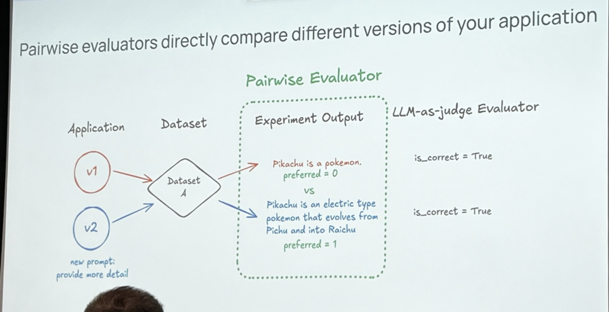
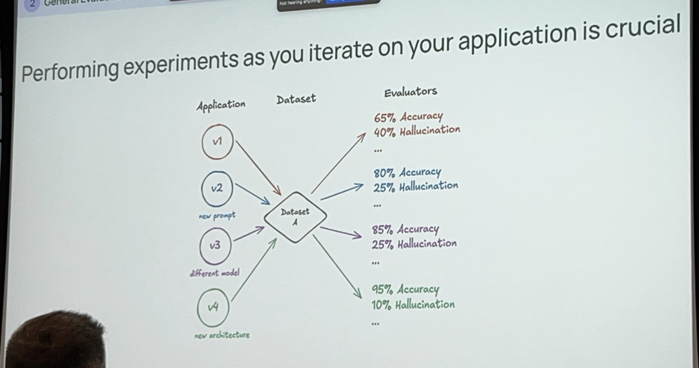
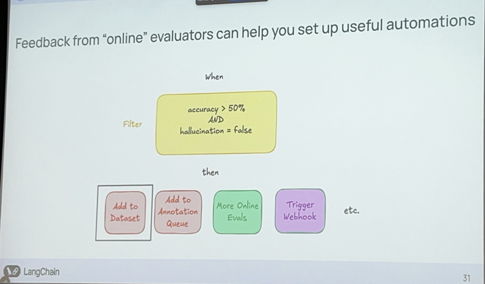
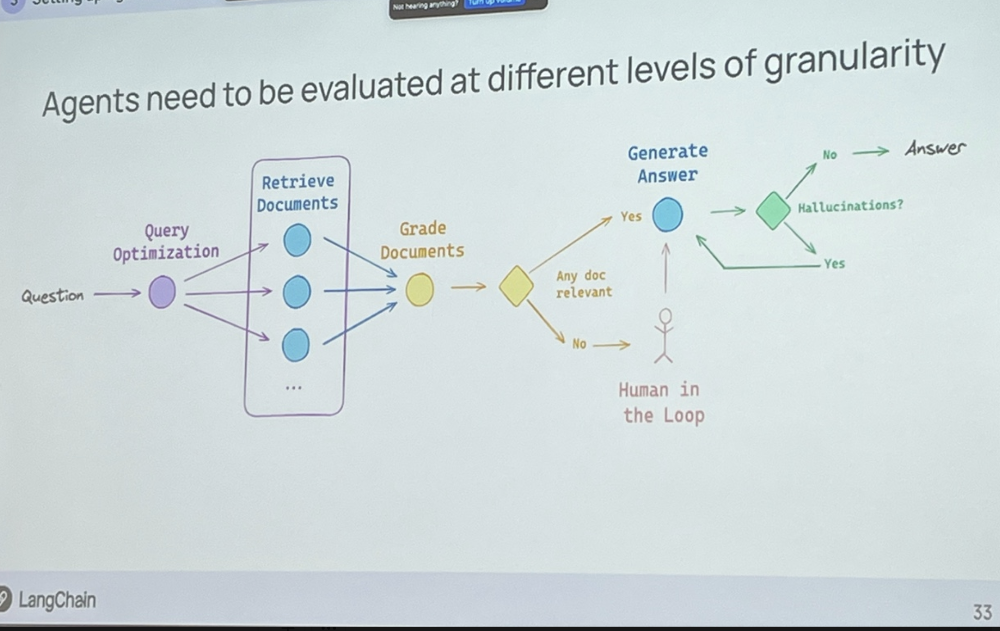
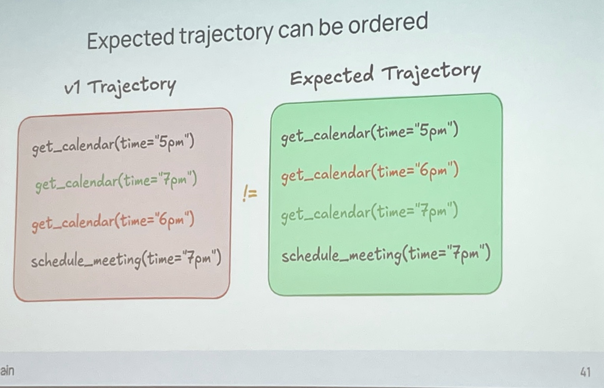
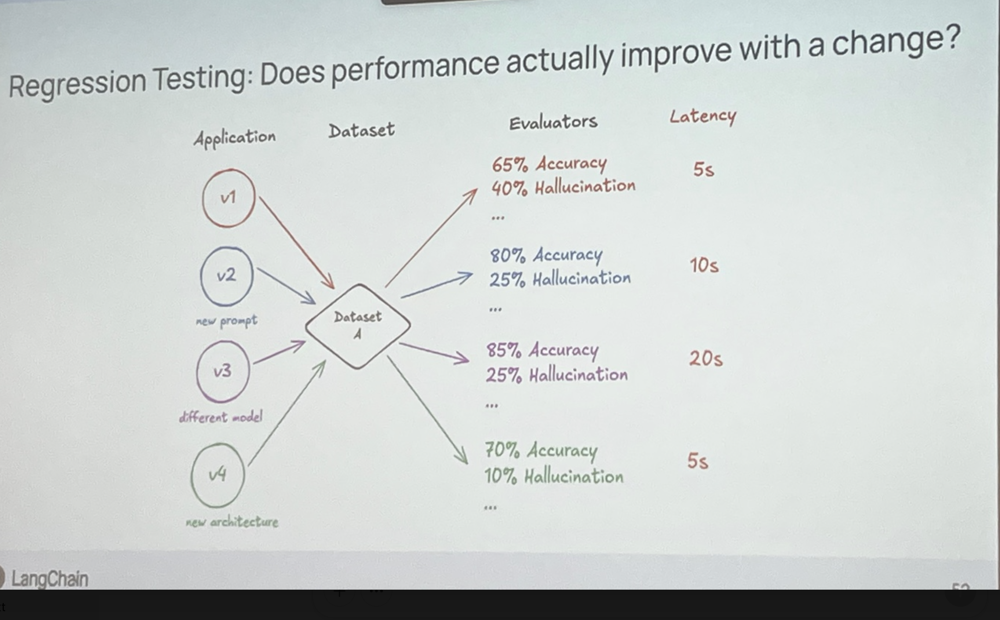
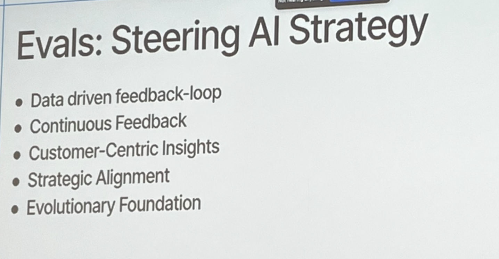

date-created:: [[2025-02-22 Sat]]
tags:: [[AI/Agent]], [[LangChain]], [[Workshop]], [[Tutorial]]

- # [How Clay Performs Agent Evaluation](https://www.ai.engineer/summit/2025/schedule/clay-evals)
	- meta info
		- **Date**: February 22, 2025
		- **Time**: 2:30 PM - 3:50 PM
		- **Presenters**: [[Person/Nick Huang]] and Ratch Sujithan
		- **Room**: AWS JFK27 (12 W 39th St) 300/301 - entrance 39th St & 5th Ave, large gold doors, bring ID
		- **Description**: In this workshop, Nick Huang from #LangChain will explain agent evaluation concepts. [[Person/Jeff Barg]] or [[Person/Ratch Sujithan]] 
		  will then demonstrate how Clay performs end-to-end agent tests for Claygent across various prompt categories against a ground truth dataset, and discuss how Clay conducts prompt-level evaluations.
	- ## intro
		- ### chain vs agent
			- agents typically use [[AI/Tool/Calling]]
				- agends determine what order to call them in
		- ### issues with agents
			- poor reliability
			- task ambiguity and missing context
			- too many tools
			- ambiguous tools
			- failing to reason
			- relying to heavily on internal
		- ### mitigations
			- express control flow with both deterministic and agentic logic
			- #### vibe check
				- not gooed enough for prod
				- a lot of people **stayed away from sensitive applications** since this was what most were able to do
		- ### how can we be sure that our performance is getting better over time?
			- 
			- cgpt
				- ## General Evaluation Principles
					- **How do we know that our application is actually getting better over time?**
					- **Version Progression:**
						- v1 → v2: *new prompts* (blue)
						- v2 → v3: *different model* (purple)
						- v3 → v4: *new architecture* (green)
					- **LangChain logo present in the bottom-left corner**
					- **Slide number:** 17
					- **Zoom overlay visible at the top**
						- "This meeting is being recorded."
						- "You are screen sharing."
						- "Not hearing anything? Turn up volume"
						- "Talking: Sydney"
			- as we go from #o1 to #o3-mini how can we know what changes?
			- as we go to a supervisor  model
		- ### test versions of your application against full datasets of examples
			- 
			- cgpt
				- ## General Evaluation Principles
					- **Test versions of your application against full datasets of examples**
					- **Diagram Structure:**
						- **Application**
							- v1 → Dataset (red arrow)
							- v2 → Dataset (blue arrow)
								- *new architecture, new prompt, or new model*
						- **Dataset** (diamond shape) → Evaluators
						- **Evaluators** (green box)
							- 65% Accuracy, 40% Hallucination (red)
							- ...
							- 80% Accuracy, 25% Hallucination (blue)
							- ...
					- **LangChain logo present at the bottom-left corner**
					- **Slide number:** 2
					- **Zoom overlay visible at the top**
						- "This meeting is being recorded."
						- "Not hearing anything? Turn up volume"
		- ### how to define evaluators to calculate useful metrics from your experiments
			- 
				- cgpt
					- ## General Evaluation Principles
						- **Test versions of your application against full datasets of examples**
						- **Diagram Structure:**
							- **Application**
								- v1 → Dataset (red arrow)
								- v2 → Dataset (blue arrow)
									- *new architecture, new prompt, or new model*
							- **Dataset** (diamond shape) → Evaluators
							- **Evaluators** (green box)
								- 65% Accuracy, 40% Hallucination (red)
								- ...
								- 80% Accuracy, 25% Hallucination (blue)
								- ...
						- **LangChain logo present at the bottom-left corner**
						- **Slide number:** 2
						- **Zoom overlay visible at the top**
							- "This meeting is being recorded."
							- "Not hearing anything? Turn up volume"
		- ## **Define evaluators to calculate useful metrics from your experiments**
			- 
			- **Define evaluators to calculate useful metrics from your experiments**
			- **Diagram Structure:**
				- **Example (Blue Box)**
					- Input = x1
					- Reference Output = y1
				- **Run (Red Box)**
					- v1 processes Input = x1
					- Produces Output = y_run
				- **Evaluator (Green Box)**
					- Takes:
						- Input
						- Reference Output
						- Output (from Run)
					- **Calculates metrics!**
			- **LangChain logo present at the bottom-left corner**
			- **Slide number:** 21
			- **Zoom overlay visible at the top**
				- "This meeting is being recorded."
		- ### #Q - is [[LangSmith/Evaluator/Offline]] preferred if you have ground truth labels?
			- kinda, yeah. online tends to be "sketchy"
			- you want to do this
		- Use case
		- ## **Pairwise evaluators directly compare different versions of your application**
			- 
			- **Pairwise evaluators directly compare different versions of your application**
			- **Diagram Structure:**
				- **Application**
					- v1 → Dataset A (red arrow)
					- v2 → Dataset A (blue arrow)
						- *new prompt: provide more detail*
				- **Pairwise Evaluator (Green Box)**
					- **Experiment Output:**
						- "Pikachu is a pokemon."
							- preferred = 0
						- vs
						- "Pikachu is an electric type pokemon that evolves from Pichu and into Raichu"
							- preferred = 1
				- **LLM-as-judge Evaluator**
					- is_correct = True
					- is_correct = True
			- **LangChain logo present at the bottom-left corner**
			- **Slide number:** 24
			- **Zoom overlay visible at the top**
				- "This meeting is being recorded."
		- ## **Performing experiments as you iterate on your application is crucial**
			- 
			- **Diagram Structure:**
				- **Application**
					- v1 → Dataset A (red arrow)
					- v2 → Dataset A (blue arrow)
						- *new prompt*
					- v3 → Dataset A (purple arrow)
						- *different model*
					- v4 → Dataset A (green arrow)
						- *new architecture*
				- **Evaluators**
					- v1: 65% Accuracy, 40% Hallucination (red)
					- v2: 80% Accuracy, 25% Hallucination (blue)
					- v3: 85% Accuracy, 25% Hallucination (purple)
					- v4: 95% Accuracy, 10% Hallucination (green)
			- **LangChain logo present at the bottom-left corner**
			- **Slide number:** 25
		- ## **Feedback from "online" evaluators can help you set up useful automations**
			- 
			- **Diagram Structure:**
				- **Filter Condition (Yellow Box - "When")**
					- accuracy > 50%
					- AND
					- hallucination = false
				- **Actions (Triggered if Condition is Met - "Then")**
					- Add to Dataset (Red Box)
					- Add to Annotation Queue (Red Box)
					- More Online Evals (Green Box)
					- Trigger Webhook (Purple Box)
					- etc.
			- **Slide number:** 31
		- ## **Agents need to be evaluated at different levels of granularity**
			- 
			- **Diagram Structure:**
				- **Question → Query Optimization (Purple Box)**
				- **Retrieve Documents (Blue Box)**
					- Multiple documents retrieved
				- **Grade Documents (Yellow Diamond)**
					- Determines if any document is relevant
				- **If relevant → Generate Answer (Blue Circle)**
					- If no relevant document → Human in the Loop (Stick Figure)
				- **Check for Hallucinations (Green Diamond)**
					- If no hallucinations → Answer
					- If hallucinations → Review Needed
			- **LangChain logo present at the bottom-left corner**
			- **Slide number:** 33
			- **Zoom overlay visible at the top**
				- "This meeting is being recorded."
				- "Not hearing anything? Turn up volume"
				- "Talking: Sydney"
	- ## Expected trajectory can be ordered
		- 
		- **v1 Trajectory (Red Box)**
			- `get_calendar(time="5pm")`
			- `get_calendar(time="7pm")` *(green)*
			- `get_calendar(time="6pm")` *(red)*
			- `schedule_meeting(time="7pm")`
		- **Expected Trajectory (Green Box)**
			- `get_calendar(time="5pm")`
			- `get_calendar(time="6pm")` *(red)*
			- `get_calendar(time="7pm")`
			- `schedule_meeting(time="7pm")`
		- **Key takeaway:**
			- The v1 trajectory executes `get_calendar(time="7pm")` before `get_calendar(time="6pm")`, which is incorrect compared to the expected ordering.
		- **LangChain logo present at the bottom-left corner**
		- **Slide number:** 41
	- ## Setting up Agentic Evals
		- 
		- **Multi-turn conversations can be tested individually, or in series**
		- **Comparison of Testing Approaches:**
			- **One Conversation (Green Box)**
				- Human: A
				- AI: B
				- Human: C
				- AI: D
				- Human: E
				- AI: F
			- **Each Turn can be tested individually (Red Boxes)**
				- **First box:**
					- Human: A
					- AI: ?
				- **Second box:**
					- Human: A
					- AI: B
					- Human: C
					- AI: ?
				- **Third box:**
					- Human: A
					- AI: B
					- Human: C
					- AI: D
					- Human: E
					- AI: ?
		- **LangChain logo present at the bottom-left corner**
		- **Slide number:** 46
		- **Zoom overlay visible at the top**
			- "This meeting is being recorded."
			- "Not hearing anything? Turn up volume"
			- "Talking: Sydney"
	- ## Improving your Application
		- 
		- **Regression Testing: Does performance actually improve with a change?**
		- **Diagram Structure:**
			- **Application Versions**
				- v1 → Dataset A (red arrow)
				- v2 → Dataset A (blue arrow)
					- *new prompt*
				- v3 → Dataset A (purple arrow)
					- *different model*
				- v4 → Dataset A (green arrow)
					- *new architecture*
			- **Evaluators**
				- v1: 65% Accuracy, 40% Hallucination
				- v2: 80% Accuracy, 25% Hallucination
				- v3: 85% Accuracy, 25% Hallucination
				- v4: 70% Accuracy, 10% Hallucination
			- **Latency Measurements**
				- v1: 5s
				- v2: 10s
				- v3: 20s
				- v4: 5s
		- **LangChain logo present at the bottom-left corner**
		- **Slide number:** 52
		- **Zoom overlay visible at the top**
			- "This meeting is being recorded."
			- "Not hearing anything? Turn up volume"
	- ## [[Person/Ratch Sujithan]]
		- ### Clay
			- "data marketplace for go to markplace"
			- external providers - ocean.io
			- they are going to focus on "claygent" an agent reserach interface
				- it can augment your dataset
			- go to clay.com and see what they have to offer
			- trusted by 300k gtm teams - openai, airbnb, [[Anthropic]], [[CursorAI]], notion, dropbox
		- ### demo that took 5-7 min to shut up
			- ## LangChain Demo: LinkedIn Profile Finder
				- **Workspace:** Langchain demo
				- 
				- **Data Table View:**
					- **Columns:**
						- "Find stargazers on" (GitHub user list)
						- "Num Contributions"
						- "Repos Contributed"
						- "LinkedIn Profile Find"
						- "Response"
					- **Example Users:**
						- `allsayar` (160+ contributions)
						- `JohnShahawy` (3481 contributions, `backstage`, `cotmaker`)
						- `davidtsong`, `salomartin`, `sjwithmore`, etc.
				- **Model:** Claygent -> Argon
				- **Configuration:**
					- **Prompt:**  
					  "Given a person's full name, GitHub username, and GitHub profile link, find their LinkedIn profile URL. Follow these steps to ensure accuracy:"
					- **Inputs:**
						- Name (`T Name`)
						- GitHub Username (`T Username`)
						- GitHub URL (`URL`)
					- **Steps to Execute:**  
					  1. Check the GitHub Profile Directly
				- **Additional UI Elements:**
					- "Compare models" button
					- "Save" button
				- **Zoom overlay visible at the top:**
					- "This meeting is being recorded."
					- "Not hearing anything? Turn up volume"
					- "Talking: Sydney"
				- **MacOS Dock visible at the bottom**
			- use "stargazers" on github integration
			- put langchain github url in there
			- get back stargazers in a spareadsheet
			- extract usernames and github urla
			- use github integration to get names and contributions and number of repos they created
			- i'm a recruiter to find out about them and find their backgrounds
			- there's a linkedin profile finder
			- now you can extract person from linkedin profile
			- now you have country profile, email
			- write personalized messages to them
			- very small snapshot of what clay can do
		- ### how we think of evals
		- ### Logs to Action
			- logs here could be json logs
			- analysis
				- clustering
				- regression
		- ## Evals at Clay
			- **Evals: Steering AI Strategy**
			- 
			- **Key Points:**
				- Data-driven feedback loop
				- Continuous Feedback
				- Customer-Centric Insights
				- Strategic Alignment
				- Evolutionary Foundation
			- **Clay logo present at the bottom-left corner**
			- **Zoom overlay visible at the top**
				- "This meeting is being recorded."
				- "Not hearing anything? Turn up volume"
				- "Talking: Sydney"
-