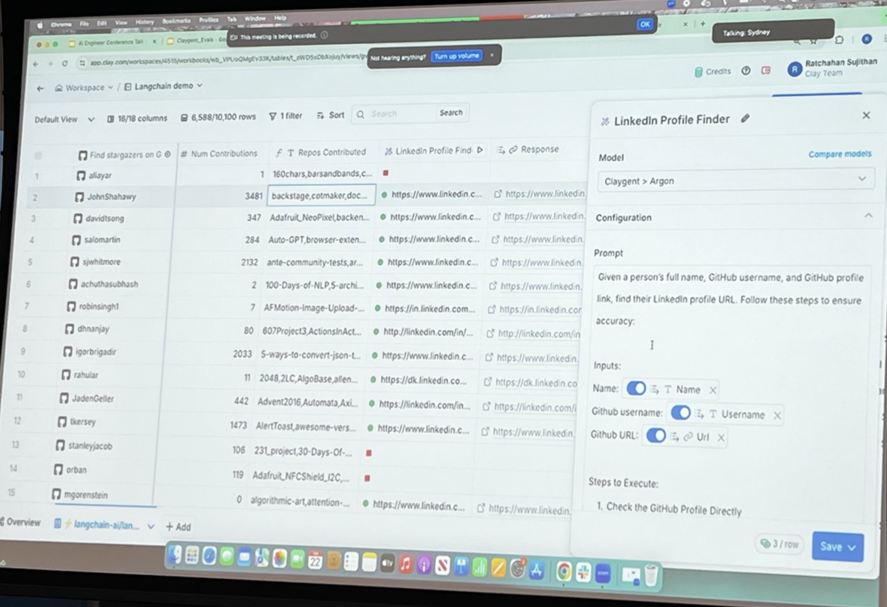

date-created:: [[2025-02-22 Sat]]
tags:: [[AI/Agent]], [[LangChain]], [[Workshop]], [[Tutorial]]

- # [How Clay Performs Agent Evaluation](https://www.ai.engineer/summit/2025/schedule/clay-evals)
	- meta info
		- **Date**: February 22, 2025
		- **Time**: 2:30 PM - 3:50 PM
		- **Presenters**: [[Person/Nick Huang]] and Ratch Sujithan
		- **Room**: AWS JFK27 (12 W 39th St) 300/301 - entrance 39th St & 5th Ave, large gold doors, bring ID
		- **Description**: In this workshop, Nick Huang from #LangChain will explain agent evaluation concepts. [[Person/Jeff Barg]] or [[Person/Ratch Sujithan]] 
		  will then demonstrate how Clay performs end-to-end agent tests for Claygent across various prompt categories against a ground truth dataset, and discuss how Clay conducts prompt-level evaluations.
	- ## intro
		- ### chain vs agent
			- agents typically use [[AI/Tool/Calling]]
				- agends determine what order to call them in
		- ### issues with agents
			- poor reliability
			- task ambiguity and missing context
			- too many tools
			- ambiguous tools
			- failing to reason
			- relying to heavily on internal
		- ### mitigations
			- express control flow with both deterministic and agentic logic
			- #### vibe check
				- not gooed enough for prod
				- a lot of people **stayed away from sensitive applications** since this was what most were able to do
		- ### how can we be sure that our performance is getting better over time?
			- 
			- cgpt
				- ## General Evaluation Principles
					- **How do we know that our application is actually getting better over time?**
					- **Version Progression:**
						- v1 → v2: *new prompts* (blue)
						- v2 → v3: *different model* (purple)
						- v3 → v4: *new architecture* (green)
					- **LangChain logo present in the bottom-left corner**
					- **Slide number:** 17
					- **Zoom overlay visible at the top**
						- "This meeting is being recorded."
						- "You are screen sharing."
						- "Not hearing anything? Turn up volume"
						- "Talking: Sydney"
			- as we go from #o1 to #o3-mini how can we know what changes?
			- as we go to a supervisor  model
		- ### test versions of your application against full datasets of examples
			- 
			- cgpt
				- ## General Evaluation Principles
					- **Test versions of your application against full datasets of examples**
					- **Diagram Structure:**
						- **Application**
							- v1 → Dataset (red arrow)
							- v2 → Dataset (blue arrow)
								- *new architecture, new prompt, or new model*
						- **Dataset** (diamond shape) → Evaluators
						- **Evaluators** (green box)
							- 65% Accuracy, 40% Hallucination (red)
							- ...
							- 80% Accuracy, 25% Hallucination (blue)
							- ...
					- **LangChain logo present at the bottom-left corner**
					- **Slide number:** 2
					- **Zoom overlay visible at the top**
						- "This meeting is being recorded."
						- "Not hearing anything? Turn up volume"
		- ### how to define evaluators to calculate useful metrics from your experiments
			- 
				- cgpt
					- ## General Evaluation Principles
						- **Test versions of your application against full datasets of examples**
						- **Diagram Structure:**
							- **Application**
								- v1 → Dataset (red arrow)
								- v2 → Dataset (blue arrow)
									- *new architecture, new prompt, or new model*
							- **Dataset** (diamond shape) → Evaluators
							- **Evaluators** (green box)
								- 65% Accuracy, 40% Hallucination (red)
								- ...
								- 80% Accuracy, 25% Hallucination (blue)
								- ...
						- **LangChain logo present at the bottom-left corner**
						- **Slide number:** 2
						- **Zoom overlay visible at the top**
							- "This meeting is being recorded."
							- "Not hearing anything? Turn up volume"
		- ## **Define evaluators to calculate useful metrics from your experiments**
			- 
			- **Define evaluators to calculate useful metrics from your experiments**
			- **Diagram Structure:**
				- **Example (Blue Box)**
					- Input = x1
					- Reference Output = y1
				- **Run (Red Box)**
					- v1 processes Input = x1
					- Produces Output = y_run
				- **Evaluator (Green Box)**
					- Takes:
						- Input
						- Reference Output
						- Output (from Run)
					- **Calculates metrics!**
			- **LangChain logo present at the bottom-left corner**
			- **Slide number:** 21
			- **Zoom overlay visible at the top**
				- "This meeting is being recorded."
		- ### #Q - is [[LangSmith/Evaluator/Offline]] preferred if you have ground truth labels?
			- kinda, yeah. online tends to be "sketchy"
			- you want to do this
		- Use case
		- ## **Pairwise evaluators directly compare different versions of your application**
			- 
			- **Pairwise evaluators directly compare different versions of your application**
			- **Diagram Structure:**
				- **Application**
					- v1 → Dataset A (red arrow)
					- v2 → Dataset A (blue arrow)
						- *new prompt: provide more detail*
				- **Pairwise Evaluator (Green Box)**
					- **Experiment Output:**
						- "Pikachu is a pokemon."
							- preferred = 0
						- vs
						- "Pikachu is an electric type pokemon that evolves from Pichu and into Raichu"
							- preferred = 1
				- **LLM-as-judge Evaluator**
					- is_correct = True
					- is_correct = True
			- **LangChain logo present at the bottom-left corner**
			- **Slide number:** 24
			- **Zoom overlay visible at the top**
				- "This meeting is being recorded."
		- ## **Performing experiments as you iterate on your application is crucial**
			- 
			- **Diagram Structure:**
				- **Application**
					- v1 → Dataset A (red arrow)
					- v2 → Dataset A (blue arrow)
						- *new prompt*
					- v3 → Dataset A (purple arrow)
						- *different model*
					- v4 → Dataset A (green arrow)
						- *new architecture*
				- **Evaluators**
					- v1: 65% Accuracy, 40% Hallucination (red)
					- v2: 80% Accuracy, 25% Hallucination (blue)
					- v3: 85% Accuracy, 25% Hallucination (purple)
					- v4: 95% Accuracy, 10% Hallucination (green)
			- **LangChain logo present at the bottom-left corner**
			- **Slide number:** 25
		- ## **Feedback from "online" evaluators can help you set up useful automations**
			- 
			- **Diagram Structure:**
				- **Filter Condition (Yellow Box - "When")**
					- accuracy > 50%
					- AND
					- hallucination = false
				- **Actions (Triggered if Condition is Met - "Then")**
					- Add to Dataset (Red Box)
					- Add to Annotation Queue (Red Box)
					- More Online Evals (Green Box)
					- Trigger Webhook (Purple Box)
					- etc.
			- **Slide number:** 31
		- ## **Agents need to be evaluated at different levels of granularity**
			- 
			- **Diagram Structure:**
				- **Question → Query Optimization (Purple Box)**
				- **Retrieve Documents (Blue Box)**
					- Multiple documents retrieved
				- **Grade Documents (Yellow Diamond)**
					- Determines if any document is relevant
				- **If relevant → Generate Answer (Blue Circle)**
					- If no relevant document → Human in the Loop (Stick Figure)
				- **Check for Hallucinations (Green Diamond)**
					- If no hallucinations → Answer
					- If hallucinations → Review Needed
			- **LangChain logo present at the bottom-left corner**
			- **Slide number:** 33
			- **Zoom overlay visible at the top**
				- "This meeting is being recorded."
				- "Not hearing anything? Turn up volume"
				- "Talking: Sydney"
	- ## Expected trajectory can be ordered
		- 
			- **v1 Trajectory (Red Box)**
				- `get_calendar(time="5pm")`
				- `get_calendar(time="7pm")` *(green)*
				- `get_calendar(time="6pm")` *(red)*
				- `schedule_meeting(time="7pm")`
			- **Expected Trajectory (Green Box)**
				- `get_calendar(time="5pm")`
				- `get_calendar(time="6pm")` *(red)*
				- `get_calendar(time="7pm")`
				- `schedule_meeting(time="7pm")`
			- **Key takeaway:**
				- The v1 trajectory executes `get_calendar(time="7pm")` before `get_calendar(time="6pm")`, which is incorrect compared to the expected ordering.
			- **LangChain logo present at the bottom-left corner**
			- **Slide number:** 41
	- ## **Multi-turn conversations can be tested individually, or in series**
		- 
		- **Comparison of Testing Approaches:**
			- **One Conversation (Green Box)**
				- Human: A
					- AI: B
				- Human: C
					- AI: D
				- Human: E
					- AI: F
			- **Each Turn can be tested individually (Red Boxes)**
				- **First box:**
					- Human: A
						- AI: ?
				- **Second box:**
					- Human: A
						- AI: B
					- Human: C
						- AI: ?
				- **Third box:**
					- Human: A
						- AI: B
					- Human: C
						- AI: D
					- Human: E
						- AI: ?
		- **Slide number:** 46
	- ## **Regression Testing: Does performance actually improve with a change?**
		- 
		- **Diagram Structure:**
			- **Application Versions**
				- v1 → Dataset A (red arrow)
				- v2 → Dataset A (blue arrow)
					- *new prompt*
				- v3 → Dataset A (purple arrow)
					- *different model*
				- v4 → Dataset A (green arrow)
					- *new architecture*
			- **Evaluators**
				- v1: 65% Accuracy, 40% Hallucination
				- v2: 80% Accuracy, 25% Hallucination
				- v3: 85% Accuracy, 25% Hallucination
				- v4: 70% Accuracy, 10% Hallucination
			- **Latency Measurements**
				- v1: 5s
				- v2: 10s
				- v3: 20s
				- v4: 5s
		- **Slide number:** 52
	- ## [[Person/Ratch Sujithan]]
		- ### Clay
			- "data marketplace for go to markplace"
			- external providers - ocean.io
			- they are going to focus on "claygent" an agent reserach interface
				- it can augment your dataset
			- go to clay.com and see what they have to offer
			- trusted by 300k gtm teams - openai, airbnb, [[Anthropic]], [[CursorAI]], notion, dropbox
		- ### demo that took 5-7 min to create
			- ## LangChain Demo: LinkedIn Profile Finder
				- **Workspace:** Langchain demo
				- 
				- cgpt
					- **Data Table View:**
						- **Columns:**
							- "Find stargazers on" (GitHub user list)
							- "Num Contributions"
							- "Repos Contributed"
							- "LinkedIn Profile Find"
							- "Response"
						- **Example Users:**
							- `allsayar` (160+ contributions)
							- `JohnShahawy` (3481 contributions, `backstage`, `cotmaker`)
							- `davidtsong`, `salomartin`, `sjwithmore`, etc.
					- **Model:** Claygent -> Argon
					- **Configuration:**
						- **Prompt:**  
						  "Given a person's full name, GitHub username, and GitHub profile link, find their LinkedIn profile URL. Follow these steps to ensure accuracy:"
						- **Inputs:**
							- Name (`T Name`)
							- GitHub Username (`T Username`)
							- GitHub URL (`URL`)
						- **Steps to Execute:**  
						  1. Check the GitHub Profile Directly
					- **Additional UI Elements:**
						- "Compare models" button
						- "Save" button
					- **Zoom overlay visible at the top:**
						- "This meeting is being recorded."
						- "Not hearing anything? Turn up volume"
						- "Talking: Sydney"
			- my #notes
				- use "stargazers" on github integration
				- put langchain github url in there
				- get back stargazers in a spareadsheet
				- extract usernames and github urla
				- use github integration to get names and contributions and number of repos they created
				- i'm a recruiter to find out about them and find their backgrounds
				- there's a linkedin profile finder
				- now you can extract person from linkedin profile
				- now you have country profile, email
				- write personalized messages to them
				- very small snapshot of what clay can do
		- ### how we think of evals
		- ### Logs to Action
			- logs here could be json logs
			- analysis
				- clustering
				- regression
		- ## **Evals: Steering AI Strategy**
			- **Evals: Steering AI Strategy**
			- 
				- **Key Points:**
					- Data-driven feedback loop
					- Continuous Feedback
					- Customer-Centric Insights
					- Strategic Alignment
					- Evolutionary Foundation
		- ## Core Elements of Our Evaluation Framework
			- **Development Evaluations**
				- Validate Functionality
				- Test Integration
				- Support New Use Cases
			- **Observability Evaluations**
				- Monitor Usage Patterns
				- Performance Analysis
				- Driving Strategic Decisions
			- **Key Insight:**
				- Observability insights continuously refine development evaluations in a feedback loop.
		- ## Evals at Clay - **Evaluation Pipeline Overview**
			- image here
				- 
			- **Production / Observability Evals**
				- **Tools Used:**
					- Segment
					- LangSmith
				- **Process:**
					- Logs are collected and processed in LangSmith
					- Structured events analyzed (Eval_IDs assigned)
					- Pattern analysis and broader insights derived from multiple evaluations
					- Insights linked to Linear for tracking action items
						- Example: Sprint 1 - Implement Use Case 1
						- Example: Sprint 2 - Implement Use Case 2
			- **Development Evals**
				- **Process:**
					- New functionality added and simulated in development
					- Update test suite:
						- Test Case 1 → Test Use Case 1
						- Test Case 2 → Test Use Case 2
						- Test Case N → Test Use Case N
					- Run CI Pipelines:
						- Smoke Test CI
						- Integration Test CI
					- **GitHub Actions handles CI runs**
					- **Final step: Deploy! 🚀**
		- ## Development Evals – Ensuring Quality & Stability
			- **Blackbox E2E Smoke Testing**
				- Environment parity
				- Early problem detection
				- Confidence in real-world conditions
			- **Integration Testing**
				- Performance tracking on key use cases
				- Regression prevention
				- Comprehensive coverage
		- ## **Claygent Blackbox E2E Smoke Test CI Workflow**
			- 
			- **Workflow Steps:**
			  1. **Checkout Branch Changes** (Git icon)
			  2. **Install Packages** (npm icon)
			  3. **Deploy to Staging** (AWS Lambda icon)
			  4. **Run Smoketest Script** (`smoke_test.ts` file)
			  5. **Clay API**
				- Response: `200`
				  6. **Clay Tables in Staging**
		- ## **Claygent Blackbox E2E Smoke Test: Sample Staging Clay Table**
			- 
				- **Table Overview:**
					- **Columns:**
						- `domain`
						- `b2b_or_b2c`
						- `TRUTH: claygent`
						- `Send Test Case to C`
						- `testid`
						- `model`
					- **Example Entries:**
						- `horizonvalleygroup.com` → `B2C` → `Pass` → `gpt-4o`
						- `bostrom.com` → `B2B` → `Pass` → `gpt-4o`
						- `owshousing.com` → `B2B` → `Bug` → `gpt-4o`
						- `culinaryproperties.com` → `B2B` → `Pass` → `gpt-4o`
						- `globalmarininsurance.com` → `B2B` → `Fail` → `gpt-4o`
						- `greatgood.org` → `B2C` → `Pass` → `gpt-4o`
						- `fortcapitalp.com` → `B2B` → `Bug` → `gpt-4o`
						- `servicethread.com` → `B2B` → `Pass` → `gpt-4o`
				- **Key Status Indicators:**
					- ✅ Pass
					- ❌ Fail
					- 🐞 Bug
		- ## **Claygent Integration Testing: Types of Evals**
			- **Key Points:**
				- Check your agent’s performance in development to ensure high-quality output in production.
				- Comparing Agent Output to Ground Truth.
				- **Comparison Methods – [The Langchain Openevals Framework](https://github.com/langchain-ai/openevals) Approach:**
					- Exact Match
					- Levenshtein Distance
					- Embedding Similarity
					- LLM as a Judge
		- ## **Claygent Integration Test Example 1**
			- **Exact Matching**
				- Integration Test
				- LangSmith integration with Vitest
			- **Code Example (JavaScript)**
				- **Test Definition**
				  ```javascript
				  ls.test(
				   'horizonrealtygroup',
				   {
				     inputs: {
				       mission: createTestActionInputs('http://www.horizonrealtygroup.com').mission,
				     },
				     referenceOutputs: {
				       answer: 'B2C',
				     },
				   }
				  );
				  ```
				- **Execute Test**
				  ```javascript
				  async ({ referenceOutputs }) => {
				   // call claygent action code
				   const actionInputs = createTestActionInputs('http://www.horizonrealtygroup.com');
				   const response = await runClaygentActionCode(actionInputs, testContext);
				   ls.logOutputs({ response: response.data.result });
				  ```
				- **Assert Exact Match**
				  ```javascript
				   const exactMatchResult = await exactMatch({
				     outputs: response.data.result,
				     referenceOutputs: referenceOutputs?.answer,
				   });
				   expect(exactMatchResult.score).toBe(true);
				  }
				  ```
		- ## LangSmith Debugging: Inspecting Model Discrepancies
			- **Bucket Overview:**
				- C Bucket: ✅ Passed
				- Ideal Candidate Bucket: ❌ Meta failed, ✅ OpenAI passed
			- **Using LangSmith for Debugging**
				- Navigate to the **Datasets and Experiments** page on LangSmith.
				- Identify and select the **Ideal Candidate** bucket.
				- Click on the **latest run** to inspect errors.
			- **Error Inspection Process**
				- **Input:** "Give me an Ideal Candidate for the job at this particular link, at company Meta."
				- **Reference Output:** Seems to be related to an iOS job.
				- **Model Error:** Discrepancy detected.
			- **Analyzing the Judge's Thought Process**
				- **Judge's Observation:**
					- Input suggests scraping a job for Mechanical Engineering.
					- Reference output describes an iOS job.
					- **Final Evaluation:**
						- "Upon analyzing the reference and model outputs under the given rubric, it is evident that they describe candidates for entirely different roles."
			- **Key Takeaway:**
				- LangSmith provides insight into model performance discrepancies by exposing errors in judgment and alignment with expected outputs.
		- ## Observability Evals – Real-Time Insights & Optimization
			- **User Prompt Classification**
				- Capture user patterns and trends.
				- Sharpen evaluation for precise tuning.
				- **Methods:** Classifier training, LLM judging, clustering, semantic analysis.
			- **Realtime Agent Log Analysis**
				- Monitor responses live.
				- Receive immediate, context-aware feedback.
				- Detect anomalies as they occur.
				- Extract data for training and/or dev evals.
		- ## Extracting Value from Customer Usage Data
			- **Importance of Customer Logs**
				- Understanding how customers interact with the platform provides the most valuable insights.
				- Logs help assess whether an agent performed well or poorly on specific interactions.
				- Extracting logs for training or development evaluations can refine model performance.
			- **Classification, Clustering, and Tagging**
				- Once logs are classified, clustering techniques can be applied.
				- Tagging strategies help organize and analyze data for targeted improvements.
			- **Key Takeaway:**
				- Observability-driven insights allow for continuous tuning and refinement of AI agents.
		- ## Prompt Classification - Clustering & Tagging
			- 
				- **Using Embeddings for Clustering**
					- Cohere has recently released embeddings tailored for clustering.
					- Obtain embeddings for prompt properties.
					- Perform clustering using methods such as:
						- Hack-rewarded clustering
						- K-means clustering
					- Experimentation is necessary to determine the most effective clustering approach.
				- **Generating Tags for Clusters**
					- Once clusters are formed, send a request to the LLM to generate category tags.
					- Results in well-defined buckets of prompt categories.
				- **Analyzing Prompt Categories**
					- Count the number of prompts in each category.
					- Identify the most common customer use cases.
					- Enables deeper insights into how customers are using the platform.
				- **Key Takeaway:**
					- Clustering prompts enables structured categorization and prioritization of real customer needs.
		- ## Prompt Classification - Claygent Categories
			- 
				- **Identified Prompt Categories:**
					- **Company Profile**
						- **Users:** 776
						- **Events:** 306,944
						- **Example Task:** Find the Facebook and Instagram profile links for a company.
					- **Google Search**
						- **Users:** 767
						- **Events:** 171,276
						- **Example Task:** Google an address and check if a company is listed.
					- **Boolean**
						- **Users:** 756
						- **Events:** 162,082
						- **Example Task:** Determine whether a statement is true or false.
					- **Business Website**
						- **Users:** 706
						- **Events:** 160,212
						- **Example Task:** Visit a company website and extract relevant details.
				- **Analysis & Insights:**
					- Understanding which categories are most commonly used helps prioritize improvements.
					- Some categories may be less popular but still provide valuable use cases.
		- ## Realtime Agent Performance Analysis
			- **Live data is the best data!**
			- **Key Insights:**
				- Examples where the agent performs well → **Great training data**.
				- Examples where the agent needs improvement → **Useful for development evals**.
				- The feedback loop between **production evals, observability evals, and development evals** helps refine performance.
			- **Process:**
				- 1. Stream in live data.
				- 2. Identify examples where the agent succeeds.
				- 3. Export those cases to LangSmith for training.
				- 4. Identify failure cases and move them to development evals.
			- **Key Takeaway:**
				- Creating a structured evaluation pipeline ensures continuous improvements in agent performance.
		- ## LLM as a Judge - Example Evaluation
			- **Input:**
				- **Answer:** `valid`
				- **Mission:**
					- **Context:** Validate if a given website landing page is operational.
					- **Objective:** Determine if the landing page at `kw-platinum.com` is connected.
					- **Instructions:**
					  1. Visit the website provided in the `kw-platinum.com` column.
					  2. Check the landing page for indications that it is associated with a business.
					  3. If the page appears to be improperly set up (e.g., showing a generic hosting page like `wix.com` default), mark it as `'broken'`.
					  4. If the page loads correctly and is associated with a company, mark it as `'valid'`.
					  5. Return **only** `'broken'` or `'valid'` based on the page status.
					  6. Do **not** include any additional commentary or information in the response.
					- **Examples:**
						- If a Wix default page appears → Respond `'broken'`.
						- If the landing page shows a functioning business site → Respond `'valid'`.
			- **Output Evaluation:**
				- **Reasoning:**
					- The student's answer (`valid`) is concise and correctly follows the instructions.
					- The response format adheres to the requirement to return **only** `'broken'` or `'valid'`.
					- The student has determined that the landing page is operational and associated with a business, aligning with the objective.
				- **Score:** 10 (Perfect response)
				- **Conclusion:** The answer is both relevant and helpful, fully meeting evaluation criteria.