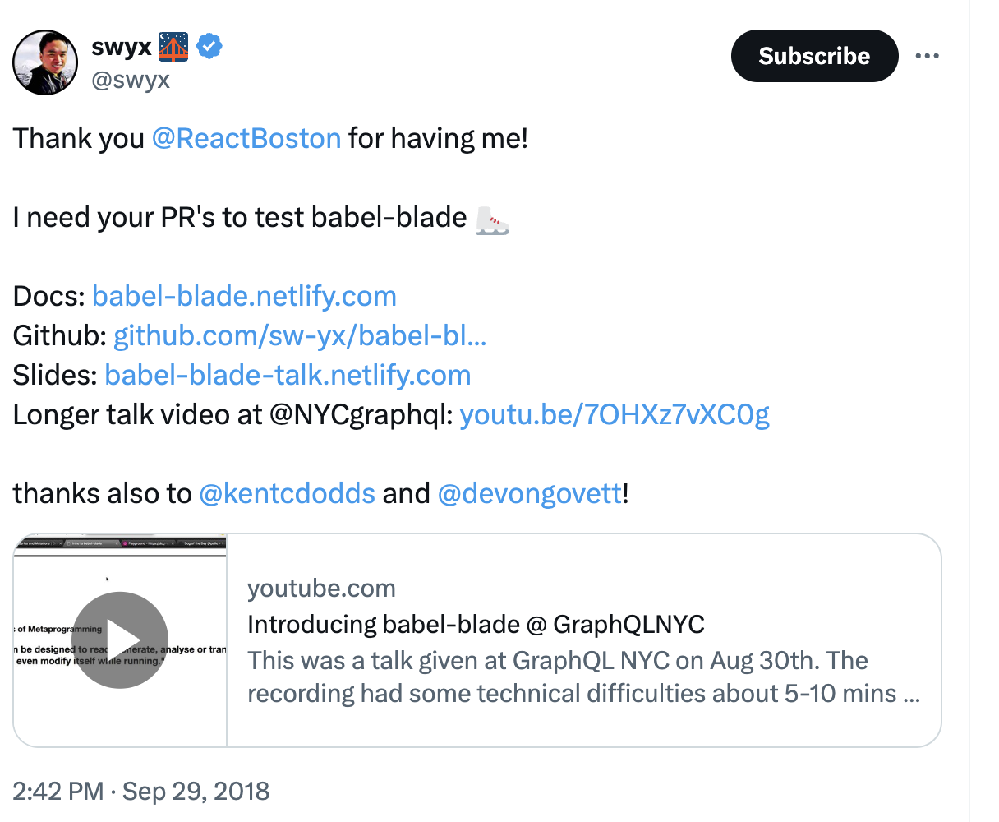

# What I learned at the 2025 AI Engineer Summit Workshops
	- ## What *is* the AI Engineer Summit?
		- ### How I *found out* about the AI Engineer Summit...
			- #### ⚡ flash back to [[@swyx]]'s [[GraphQL]] presentation at [[Conference/React Boston/2018]] ...
			  `babel-blade`: **solving the GraphQL double declaration Problem**
			  {:height 331, :width 397}
			  [swyx 🌉 on X - link](https://x.com/swyx/status/1046108066037583872)
			- [[Wayfair]] threw a great party. Got to know [[Person/Shawn @swyx Wang]], who at that time was working at [[Netlify]] as a DevRel.
			- ... Time Passes ...
			- Now my favorite AI podcast is ... [[The Latent Space Podcast]]
			- {{embed ((67d943c3-9827-4274-9daa-b2069d73d4b0))}}
			- {{embed ((67d9437f-1cc1-4fcd-ac88-d804c5ceb2d6))}}
			- {{embed ((67d947ef-69e5-4848-a652-658077c58cfc))}}
		- ### so, what is the AI Engineer Summit?
			- <!-- Here's a logo of the AI engineer summit -->
			   
			  background-image:: https://www.ai.engineer/_next/image?url=%2F_next%2Fstatic%2Fmedia%2Fhero-placeholder.db9b525d.jpg&w=3840&q=75
			- #### [[AI Engineer Summit NYC 2025]]
			  {{embed ((67d94f45-ee8f-42df-844b-c8a44d9a3cdd))}}
			-
- asdf
-