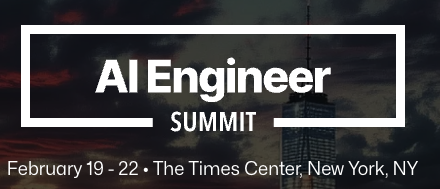
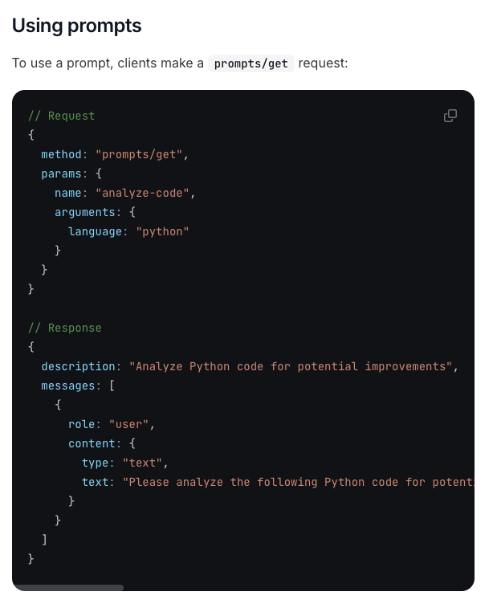
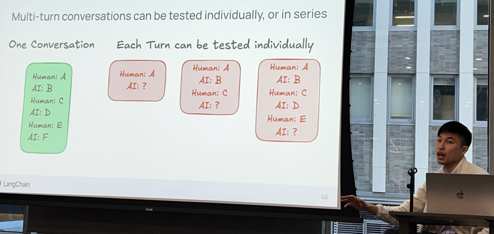
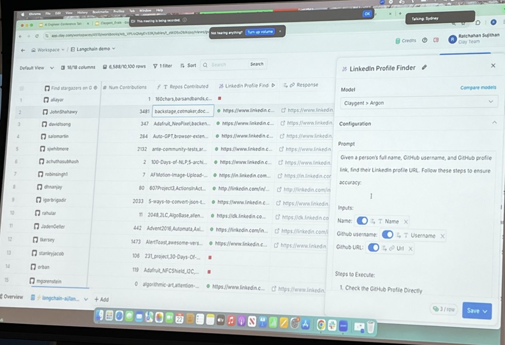

# What I learned at the [[AI Engineer Summit 2025 NYC Workshops]]
	- ## What *is* the [[AI Engineer Summit]]?
		- ### How I *found out* about the AI Engineer Summit...
			- #### ⚡ flash back to [[@swyx]]'s [[GraphQL]] presentation at [[Conference/React Boston/2018]] ...
			  `babel-blade`: **solving the GraphQL double declaration Problem**
			  {:height 331, :width 397}
			  [swyx 🌉 on X - link](https://x.com/swyx/status/1046108066037583872)
			- [[Wayfair]] threw a great party. Got to know [[Person/Shawn @swyx Wang]], who at that time was working at [[Netlify]] as a DevRel.
			- ... Time Passes ...
			- Now my favorite AI podcast is ... [[The Latent Space Podcast]]
			- {{embed ((67d943c3-9827-4274-9daa-b2069d73d4b0))}}
			- {{embed ((67d9437f-1cc1-4fcd-ac88-d804c5ceb2d6))}}
			- {{embed ((67d947ef-69e5-4848-a652-658077c58cfc))}}
		- ### so, *what* is the AI Engineer Summit?
			- 
			- #### [[AI Engineer Summit NYC 2025]]
			  {{embed ((67d94f45-ee8f-42df-844b-c8a44d9a3cdd))}}
			- #### This team also runs the [[AI Engineer World's Fair]] 
			  {:height 268, :width 543}
		- ### so, *when* was the AI Engineer Summit?
		  * Thu Feb 20 - **Leadership Track**
		  * Fri Feb 21 - **Engineering Track**
		  * Sat Feb 22 - **Workshops**
		      * *I only attended the workshops this year. Would love to attend the full event in the future*
		- ### *where* was the AI Engineer Summit?
		  *Downtown Manhattan, NYC*
		  {:height 309, :width 512}
		  * **Jay Conference Bryant Park** - 109 W 39th St 
		  * **AWS** -  JFK27 (12 W 39th St)
	- ## How I *got* to the AI engineer summit
	  *Many thanks to the leadership team and employer for sponsoring my attendance* 
	  {:height 382, :width 678}
	      * *Port Authority Bus Terminal*
- # Before [[AIES 25 WS 1 - Building Agents with MCP - Mahesh Murag]]
	- {:height 389, :width 747}
	- ## Discussions before the first workshop
		- ### 1/3 [[Person/Junrui (Tom) Hu]]
		  Getting coffee before the first workshop, I met Tom, **AI Lead** at [[HanoverPark]], where he's building **AI portfolio management**, **AI inbox analyzer**, real-time fund metrics, and an investor portal. $1.3 billion in assets under administration. Based out of NYC, he was at the AI Engineering track on Friday as well.
		- ### 2/3 - [[Person/Mike Christensen]]
		  {:height 125, :width 111} 
		  ((67da7fc2-1c1f-46e9-84b0-dee824e45395))
		- ### 3/3 - [[Person/Hayden Harrow]]
		  {:height 130, :width 120} 
		  ((67da7fbe-0f7f-45f0-bac4-27dc498b0387))
- # [[AIES 25 WS 1 - Building Agents with MCP - Mahesh Murag]] - #MCP Talk that went viral
	- ## Context - #MCP #Examples from [[David Ondrej - Build Anything with MCP Agents]]
		- ### #Example 1 - using [[GitHub/MCP]] enable [[CursorAI]] to take actions in GitHub
		  {{video https://www.youtube.com/watch?v=TQsP_PlCY1I&t=205s}}
		- ### #Example 2 - enabling [[CursorAI]] to interact with [[Chrome/DevTools]] with [[AgentDeskAI/GitHub/browser-tools-mcp]]
		  {{video https://www.youtube.com/watch?v=TQsP_PlCY1I&t=806s}}
	- ## What problem does [[Model Context Protocol]] solve?
	  {:height 395, :width 718}
		- ### What does this mean ... for [[AI Coding]]? AI Agents in Code editors can now ...
		  * develop technical plans using Jira, Confluence
		  * submit merge requests to GitHub, GitLab, etc
		  * check out a ticket and start working on it
		  * introspect into database, etc
	- ## Side-note - [[Latent Space/Blog/25/03/Why MCP Won]]
		- this talk possibly contributed to MCP going viral in [[2025/03]] 
		  > At current pace, **MCP will overtake OpenAPI in July**
		  
		- [[Person/Mahesh Murag]]'s talk likely contributed to MCP taking over AI social media feeds
		  {:height 551, :width 299}
	- ## The Problem MCP Solves
		- Before MCP, AI application development was fragmented:
		  * Each team developed custom logic (and prompts!) for integrating data, tools, and context into AI apps.
		  * Significant duplication and complexity within companies.
		  * Difficult to reuse components across AI projects.
	- ## Introducing Model Context Protocol (MCP)
		- MCP standardizes interactions between AI apps (clients) and external systems (servers).
		  {:height 358, :width 684}
		- Inspired by [[GraphQL]] and [[Language Server Protocol]].
		  
		- Three interaction types: Tools, Resources, Prompts.
		  
	- ## Rapid Adoption of MCP
		- Major companies quickly adopted MCP:
		  * Cloudflare, Shopify, IBM, GitHub, Docker, Replit, and more.
		  * Over **1,100** community-built MCP servers available.
		  * Industry leaders predicting MCP to become standard in AI integration.
		  {:height 225, :width 400}
	- ## MCP Components: Tools, Resources, and Prompts
		- ### **Tools** (*Model-controlled*)
		  * LLM knows about the tools it has access to, and uses that to **decide** when to invoke certain actions. These are tiny AI prompts made from a tool schema. Example from [[GitHub MCP]] [here](https://github.com/modelcontextprotocol/servers/blob/main/src/github/index.ts#L65)
			- #### declare the parameters the AI will use to call the `GetFileContents` tool in natural language
			  ```
			  const GetFileContentsSchema = z.object({
			    owner: z.string().describe("Repository owner (username or organization)"),
			    repo: z.string().describe("Repository name"),
			    path: z.string().describe("Path to the file or directory"),
			    branch: z.string().optional().describe("Branch to get contents from"),
			  });
			  ```
			- #### MCP server tools - a list of mappings between descriptions of tools and that tool's implementation in the API
			  ```
			  server.setRequestHandler(..., async () => { return { tools: [ ...{
			    name: "get_file_contents",
			    description: "Get the contents of a file or directory from a GitHub repository",
			    inputSchema: zodToJsonSchema(files.GetFileContentsSchema),
			  }, ...
			  ```
			- #### [[Key Insight]]
			  *AI tools are just a tiny LLM prompt that tells an LLM about something it can do*
			  * "get_file_contents" - supply "Repository owner (username or organization)" and "Repository name" to "Get the contents of a file or directory from a GitHub repository"
		- ### **Resources** (*Application-controlled*)
		  * **shared state** between the [[Agentic System]] and the client application
		    * #Example - in [[ChatGPT/Canvas]], this would be the canvas - both the user and the LLM know about the state of the canvas. 
		  * *NOTE: This is just an example, OpenAI doesn't use MCP for Canvas (yet?)*
		  {:height 155, :width 320}
		- ### **[Prompts](https://modelcontextprotocol.io/docs/concepts/prompts)** (User-controlled):
		  * Predefined, **user-controlled** interactions triggered by users (kinda like slash commands).
		  {:height 512, :width 414}
	- ## MCP in Action: Claude AI Integration Demo
		- Claude desktop autonomously:
		  * Identifies and summarizes GitHub issues.
		  * Adds top priority tasks into user's Asana.
		  {:height 297, :width 412}
	- [[Anthropic/Blog/24/12/Building Effective Agents]] with #MCP 
	  
	  * one of the key points of MCP is that the system can **discover new capabilities after the agent system is built**
	  * agent is an "augmented LLM" running in a loop
	  * you can let users of the agent system connect to their data and you as the developer can focus on **the core loop**
	- ## #Example [mcp-agent](https://github.com/lastmile-ai/mcp-agent) from  [[lastmileAI]]
	  * **`mcp-agent`** is a simple, composable framework to **build agents** using #MCP
		- Example: Agent system to do deep research on Quantum computing cybersecurity implications 
		  {:height 313, :width 538}
		  * Uses **sub-agents**: `search_agent`, `fact_checker`, `report_writer`
		  * side note - [[People/Mahesh Murag]] uses [[Windsurf]] here
	- ## MCP Composability & [Sampling](https://modelcontextprotocol.io/docs/concepts/sampling)
	  * Every MCP client can be an MCP Server.
	  * [[MCP/Sampling]] allows **servers to request inference** from clients, ensuring **control of privacy and cost**.
	  {:height 225, :width 400}
	- ## MCP Inspector & OAuth Authentication
	  * Inspector provides debugging for MCP connections.
	  * OAuth integration simplifies secure service authentication. Scoped permission boundaries can apply.
	  {:height 225, :width 400}
	- ## Autonomous Discovery
	  * Official MCP Registry provides centralized server discovery
	  * Enables agents to find and trust verified MCP servers
	  * Example: Automatic discovery of [[Grafana]] MCP for debugging tasks
	  {:height 225, :width 400}
	- ## Server Discovery
	  * Websites can expose MCP server capabilities via `.well-known/mcp.json`
	  * Enables instant discovery of service integrations
	  * Real example: [[Shopify/MCP]] integration auto-discovery
	  {:height 225, :width 400}
	- ## #MCP Key [[EdTech]] Takeaways
	  * Of course it helps [[AI Coding]] agents know more about the other systems ([[JIRA]], [[GitHub]], [[PostgreSQL]], etc)
	  * Each [[LMS/Course/Teaching Element]] could express actions AI could take on it as an [[MCP Server]]. Any AI application with permission could interact with that Teaching Element Type
	  * Each LMS could be an [[LMS/Course/Authoring]] MCP Server for AI-enhanced course development
- # [[AI/ES/25/ws/2/GraphRAG - Knowledge Graphs for Agents]]
	- ## Workshop Overview: GraphRAG with Neo4j
	  * Instructor: Alison Cossette, Neo4j Developer Advocate
	  * Goal: Improve AI accuracy using graph-based RAG
	  * Focus: Connecting structured and unstructured data
	  
	- ## Traditional RAG Limitations
	  * Struggles with context and temporal information
	  * Can't integrate structured and unstructured data well
	  * Lacks transparency in responses
	  
	- ## Neo4j Graph Building Blocks
	  * Nodes: Entities (Person, Car)
	  * Relationships: Interactions (KNOWS, LIVES_WITH)
	  * Properties: Node/relationship attributes
	  
	- ## GraphRAG Architecture
	  * Domain Graph: Structured knowledge base
	  * Lexical Graph: Document chunk relationships
	  * Memory Graph: User interaction history
	  
	- ## GraphRAG in Action
	  * Converts natural language to Cypher queries
	  * Uses graph embeddings for semantic search
	  * Combines structured and vector search
	  
	- ## Key #EdTech Takeaways for GraphRAG
	  * **one of the best ways** to have an AI gradually **develop a "mental model" of a student's abilities** relative to the learning goles; see also [[AI/Digital Twin]] 
	  * possible to take flatfile documents and do entity extraction into a knowledge graph; see also [[EdTech/Idea/LearnMark]] for topic extraction, pre-requisite identification, etc - this would help [[LMS/Course/Authoring]] for custom courses
- 
- # [[AI/ES/25/ws/3/How Clay Performs Agent Evaluation]]
	- ## Workshop Overview
	  * Presenters: [[Person/Nick Huang]] ([[LangChain]]), [[Person/Ratch Sujithan]] (ClayCo)
	  * Focus: Best practices in evaluating AI agents at various granularity levels
	  * Key takeaway: Comprehensive testing ensures continuous improvement and reliability
	- ## Part 1 - [[Person/Nick Huang]] from [[LangChain]] on Evaluation
	  * See also [[LangChain/Academy/LangSmith]] course
	  
		- ### Why Evaluate Agents?
		  * Task ambiguity
		  * Missing context
		  * Excessive or ambiguous tool usage
		  * Poor reasoning
		  * Solutions include combining deterministic logic with agentic logic for better control flow
		- ### Evaluating Application Versions Over Time
		  * Evaluations track progress through new prompts, models, and architectures
		  * Metrics help verify improvements
		  
		- ### Defining Effective Evaluators
		  * Test agent outputs against ground-truth datasets
		  * Evaluators calculate accuracy, hallucination rates, and other metrics
		  
		- {{embed ((67ba2c91-d8f5-423c-bb1c-1c0ba5bb07d3))}}
		- ### Pairwise Evaluations
		  * Directly compares two versions of an application side-by-side
		  * Clearly identifies improvements
		  
		- ### Feedback Loops from Online Evaluators
		  * Online evaluation enables real-time quality control
		  * Automations triggered by thresholds improve agent performance continuously
		  
		- {{embed ((67ba2c91-d8f5-423c-bb1c-1c0ba5bb07d3))}}
		- ### Granular Evaluations: Breaking Down Agent Tasks
		  * Evaluations performed at different task levels (queries, document retrieval, hallucination checks)
		  
		- ### **Multi-turn conversations can be tested individually, or in series**
		  
		- The structure of how one tests is also determined by the structure of the conversation
		- if your conversation has phases, and you need to make assertions against phases, individual tests for phases may make sense
		- The structure of the golden datasets match the expected structure of how one tests
	- ## Workshop 3, Part 2 [[Person/Ratch Sujithan]] from [[ClayCo]] on their AI Agent evaluation
		- ### ClayCo Demo: LinkedIn Profile Finder
		  {:height 354, :width 542}
		- ### My Notes on this application
		  {:height 354, :width 542}
		  * Sample recruiter app - Given a person's full name, GitHub username, and GitHub profile link, find their LinkedIn profile URL. Find the topics they are interested in using Stargazers on GitHub. Find their backgrounds, connect it to a [[LinkedIn]] profile finder, extract country profile and email, target companies with a certain size and profile, write personalized messages to them 
		  * > "very small snapshot of what clay can do"
		- ### Claygent Evaluation Pipeline
		  * Development Evals: Ensuring quality and stability through CI/CD pipelines
		  * Production/Observability Evals: Analyzing real-world logs to drive strategic decisions
		  
		- ### Development Evaluations: CI/CD Testing
		  * Blackbox E2E smoke tests ensure environmental parity
		  * Integration tests prevent regressions
		  
		- ### using [[LangSmith/Evaluator/Online/LLM as a Judge]]: Automated Quality Checks
		  * Judges evaluate responses on **relevance**, **correctness**, and **conciseness**
		  * **Structured scoring system** for clear assessment
		  
	- ## Workshop 3 - Key Takeaways for [[EdTech]]
	  * [[LangSmith/Evaluator/Offline]] are conducted from [[CICD]] as part of the pull request process
	    * they are powered by a ground truth collection of curated labels in a golden dataset
	  * [[LangSmith/Evaluator/Online]] evaluations are "good enough, quickly" for live-use cases
	  * For **phased conversations**, **each phase should be separately evaluated**
	  * Each part of the application should be tested in isolation
	  * In truly [[Agentic Systems]], you need to also evaluate the [[AI/Tool/Calling]]
- # [[AIES 25 WS 4 – Multi-Agent Workflows with MCP – Dan Mason]]
	- ### Why Multi-Agent Workflows?
		- **"Agents aren't really agents unless they can discover and act beyond the chatbox."**
		- MCP (**Model Context Protocol**) enables agents to interact dynamically with the environment.
		- Allows agents to:
		  * Discover external resources
		  * Interact beyond simple chat interfaces
		  * Execute complex, context-sensitive tasks
		- 
	- ### Building Custom MCP Clients
		- Not limited to Claude's built-in MCP client.
		- Hands-on session demonstrated custom MCP client creation.
		- Framework agnostic but strongly compatible with LangGraph, Autogen, Crew AI.
		- Enables workflows beyond simple code generation.
		- 
	- ### MCP Agentic Workflow Example: CodeAPI
		- CodeAPI: Lightweight FastAPI server for code manipulation.
		- Integrated with LangChain, MCP, and LangGraph.
		- Tools include reading, writing, and modifying files.
		- Used in automated dependency upgrades and refactoring tasks.
		- 
	- ### AI-Driven Code Upgrades with LangGraph Studio
		- Multi-agent coding workflows illustrated with practical example:
		  * Migrating Java project from JBoss to Spring Boot.
		  * AI autonomously handled dependencies and framework transitions.
		- Human interaction minimized, focused on final verification.
		- Demonstrated efficiency in automated software updates.
		- 
	- ### Automated Test Generation & Verification
		- Multi-agent orchestration to automate software test creation.
		- Agents collaboratively:
		  * Extract context from codebases
		  * Write and review unit tests
		  * Execute and verify tests autonomously
		- Significantly reduced manual testing efforts.
		- 
	- ### MCP-Enabled Real-Time Tool Discovery
		- Agents dynamically discover available MCP tools at runtime.
		- Example showcased dynamic integration:
		  * Agent performed web search via MCP
		  * Automatically adapted tool usage after an initial access error
		  * Demonstrated robust error-handling and recovery
		- 
	- ### Real-World Example: Automated PR Generation
		- AI autonomously generated GitHub PRs for feature requests.
		- Multi-agent system:
		  * Planner agent suggested multiple code implementations
		  * Coder agent implemented selected solutions
		  * Orchestrator managed workflow, ensuring safety and control
		- Increased development productivity significantly.
		- 
	- ### Safety & Security in MCP Multi-Agent Systems
		- Scoped API keys, Docker containers for secure deployments.
		- AI-generated code treated identically to human code for QA.
		- Final deployment always under human oversight.
		- Critical security and compliance safeguards integrated into MCP workflows.
		- 
	- ### Final Takeaways from the Workshop
		- MCP standardizes agent integration with diverse tools and services.
		- Multi-agent workflows amplify AI capabilities, enabling complex business logic automation.
		- Safety, security, and flexibility are central to effective multi-agent implementations.
		- Emphasizes human curation of AI-generated solutions rather than direct AI autonomy.
		- 
- 