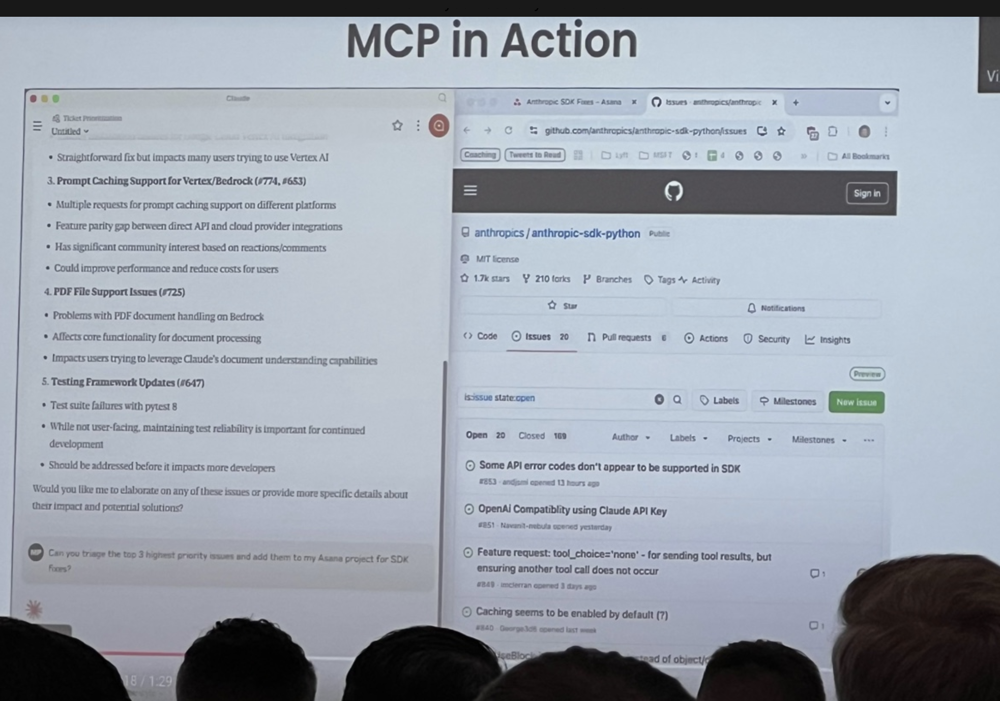

# What I learned at the [[AI Engineer Summit 2025 NYC Workshops]]
	- ## What *is* the [[AI Engineer Summit]]?
		- ### How I *found out* about the AI Engineer Summit...
			- #### ⚡ flash back to [[@swyx]]'s [[GraphQL]] presentation at [[Conference/React Boston/2018]] ...
			  `babel-blade`: **solving the GraphQL double declaration Problem**
			  {:height 331, :width 397}
			  [swyx 🌉 on X - link](https://x.com/swyx/status/1046108066037583872)
			- [[Wayfair]] threw a great party. Got to know [[Person/Shawn @swyx Wang]], who at that time was working at [[Netlify]] as a DevRel.
			- ... Time Passes ...
			- Now my favorite AI podcast is ... [[The Latent Space Podcast]]
			- {{embed ((67d943c3-9827-4274-9daa-b2069d73d4b0))}}
			- {{embed ((67d9437f-1cc1-4fcd-ac88-d804c5ceb2d6))}}
			- {{embed ((67d947ef-69e5-4848-a652-658077c58cfc))}}
		- ### so, *what* is the AI Engineer Summit?
			- 
			- #### [[AI Engineer Summit NYC 2025]]
			  {{embed ((67d94f45-ee8f-42df-844b-c8a44d9a3cdd))}}
			- #### This team also runs the [[AI Engineer World's Fair]] 
			  {:height 268, :width 543}
		- ### so, *when* was the AI Engineer Summit?
		  * Thu Feb 20 - **Leadership Track**
		  * Fri Feb 21 - **Engineering Track**
		  * Sat Feb 22 - **Workshops**
		      * *I only attended the workshops this year. Would love to attend the full event in the future*
		- ### *where* was the AI Engineer Summit?
		  *Downtown Manhattan, NYC*
		  {:height 309, :width 512}
		  * **Jay Conference Bryant Park** - 109 W 39th St 
		  * **AWS** -  JFK27 (12 W 39th St)
	- ## How I *got* to the AI engineer summit
	  *Many thanks to the leadership team and employer for sponsoring my attendance* 
	  {:height 382, :width 678}
	      * *Port Authority Bus Terminal*
- # Before [[AIES 25 WS 1 - Building Agents with MCP - Mahesh Murag]]
	- {:height 389, :width 747}
	- ## Discussions before the first workshop
		- ### 1/3 [[Person/Junrui (Tom) Hu]]
		  Getting coffee before the first workshop, I met Tom, **AI Lead** at [[HanoverPark]], where he's building **AI portfolio management**, **AI inbox analyzer**, real-time fund metrics, and an investor portal. $1.3 billion in assets under administration. Based out of NYC, he was at the AI Engineering track on Friday as well.
		- ### 2/3 - [[Person/Mike Christensen]]
		  {:height 125, :width 111} 
		  ((67da7fc2-1c1f-46e9-84b0-dee824e45395))
		- ### 3/3 - [[Person/Hayden Harrow]]
		  {:height 130, :width 120} 
		  ((67da7fbe-0f7f-45f0-bac4-27dc498b0387))
- # [[AIES 25 WS 1 - Building Agents with MCP - Mahesh Murag]] - #MCP Talk that went viral
	- ## Context - #MCP #Examples from [[David Ondrej - Build Anything with MCP Agents]]
		- ### #Example 1 - using [[GitHub/MCP]] enable [[CursorAI]] to take actions in GitHub
		  {{video https://www.youtube.com/watch?v=TQsP_PlCY1I&t=205s}}
		- ### #Example 2 - enabling [[CursorAI]] to interact with [[Chrome/DevTools]] with [[AgentDeskAI/GitHub/browser-tools-mcp]]
		  {{video https://www.youtube.com/watch?v=TQsP_PlCY1I&t=806s}}
	- ## What problem does [[Model Context Protocol]] solve?
	  {:height 395, :width 718}
		- ### What does this mean ... for [[AI Coding]]? AI Agents in Code editors can now ...
		  * develop technical plans using Jira, Confluence
		  * submit merge requests to GitHub, GitLab, etc
		  * check out a ticket and start working on it
		  * introspect into database, etc
	- ## Side-note - [[Latent Space/Blog/25/03/Why MCP Won]]
		- this talk possibly contributed to MCP going viral in [[2025/03]] 
		  > At current pace, **MCP will overtake OpenAPI in July**
		  
		- [[Person/Mahesh Murag]]'s talk likely contributed to MCP taking over AI social media feeds
		  {:height 551, :width 299}
	- ## The Problem MCP Solves
		- Before MCP, AI application development was fragmented:
		  * Each team developed custom logic (and prompts!) for integrating data, tools, and context into AI apps.
		  * Significant duplication and complexity within companies.
		  * Difficult to reuse components across AI projects.
	- ## Introducing Model Context Protocol (MCP)
		- MCP standardizes interactions between AI apps (clients) and external systems (servers).
		  {:height 358, :width 684}
		- Inspired by [[GraphQL]] and [[Language Server Protocol]].
		  
		- Three interaction types: Tools, Resources, Prompts.
		  {:height 330, :width 544}
		- A bit clearer
		  
	- ## Rapid Adoption of MCP
		- Major companies quickly adopted MCP:
		  * Cloudflare, Shopify, IBM, GitHub, Docker, Replit, and more.
		  * Over 1,100 community-built MCP servers available.
		  * Industry leaders predicting MCP to become standard in AI integration.
		  {:height 225, :width 400}
	- ## MCP Components: Tools, Resources, and Prompts
		- ### **Tools** (*Model-controlled*)
		  * LLM knows about the tools it has access to, and uses that to **decide** when to invoke certain actions. These are tiny AI prompts made from a tool schema. Example from [[GitHub MCP]] [here](https://github.com/modelcontextprotocol/servers/blob/main/src/github/index.ts#L65)
			- #### declare the parameters the AI will use to call the `GetFileContents` tool in natural language
			  ```
			  const GetFileContentsSchema = z.object({
			    owner: z.string().describe("Repository owner (username or organization)"),
			    repo: z.string().describe("Repository name"),
			    path: z.string().describe("Path to the file or directory"),
			    branch: z.string().optional().describe("Branch to get contents from"),
			  });
			  ```
			- #### MCP server tools - a list of mappings between descriptions of tools and that tool's implementation in the API
			  ```
			  server.setRequestHandler(..., async () => { return { tools: [ ...{
			    name: "get_file_contents",
			    description: "Get the contents of a file or directory from a GitHub repository",
			    inputSchema: zodToJsonSchema(files.GetFileContentsSchema),
			  }, ...
			  ```
			- #### [[Key Insight]]
			  *AI tools are just a tiny LLM prompt that tells an LLM about something it can do*
			  * "get_file_contents" - supply "Repository owner (username or organization)" and "Repository name" to "Get the contents of a file or directory from a GitHub repository"
		- ### **Resources** (*Application-controlled*)
		  * **shared state** between the [[Agentic System]] and the client application
		    * #Example - in [[ChatGPT/Canvas]], this would be the canvas - both the user and the LLM know about the state of the canvas. 
		  * *NOTE: This is just an example, OpenAI doesn't use MCP for Canvas (yet?)*
		  {:height 155, :width 320}
		- ### **[Prompts](https://modelcontextprotocol.io/docs/concepts/prompts)** (User-controlled):
		  * Predefined, **user-controlled** interactions triggered by users (kinda like slash commands).
		  {:height 512, :width 414}
	- ## MCP in Action: Claude AI Integration Demo
		- Claude desktop autonomously:
		  * Identifies and summarizes GitHub issues.
		  * Adds top priority tasks into user's Asana.
		  {:height 297, :width 412}
	- ## MCP-Agent Framework (Lastmile.ai)
		- Enables complex multi-agent workflows.
		- Example: Quantum computing cybersecurity research task. 
		  {:height 381, :width 657}
		  * Uses **sub-agents**: research, fact-checker, report writer
		  * side note - [[People/Mahesh Murag]] uses [[Windsurf]] here
	- ## MCP & Augmented LLM Concept
		- MCP enhances LLMs, allowing dynamic tool discovery.
		- Enables agents to evolve post-deployment without manual updates.
		  {:height 225, :width 400}
	- ## MCP Composability & Sampling
		- Supports hierarchical agent workflows:
		  * Agents act as both MCP clients and servers.
		  * Sampling allows servers to request inference from clients, ensuring control of privacy and cost.
		  {:height 225, :width 400}
	- ## MCP Inspector & OAuth Authentication
		- Inspector provides debugging for MCP connections.
		- OAuth integration simplifies secure service authentication.
		  {:height 225, :width 400}
	- ## MCP Registry API: Autonomous Discovery
		- Official MCP Registry simplifies finding and trusting servers.
		- Example: Agent autonomously finds Grafana MCP server for debugging tasks.
		  {:height 225, :width 400}
	- ## Server Discovery: `.well-known/mcp.json`
		- Websites expose MCP server info publicly.
		- Agents instantly discover services like Shopify MCP integration.
		  {:height 225, :width 400}
	- ## MCP Roadmap: Future Features
		- Upcoming improvements:
		  * Stateful vs. stateless connections
		  * Real-time data streaming
		  * Namespacing tools
		  * Proactive, event-driven servers
		  {:height 225, :width 400}
	- ## Key Takeaways
		- MCP is quickly becoming foundational for AI development.
		- Standardization boosts innovation and interoperability.
		- Strong and growing industry adoption.
-