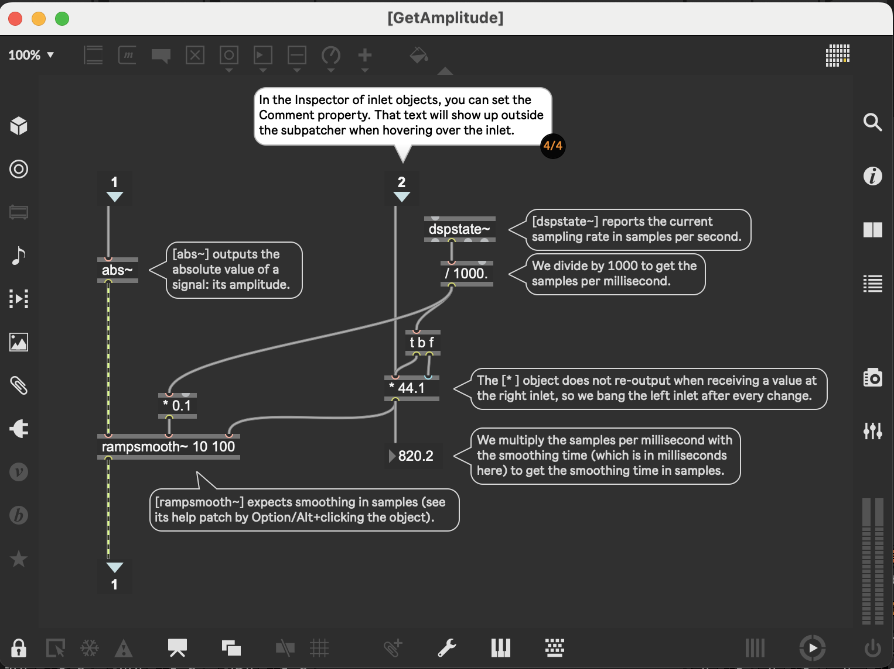

# Building Max Devices/Part 2 - Introduction
- ## DONE Page 1/9 Intro to patching
  collapsed:: true
	- They first recommend to watch [[YouTube/Ableton/Welcome to Max]]
- ## DONE Page 2/9 - [[Ableton/Max for Live/MIDI Effect/Note Doubler]] in "Track 1 Max Patching"
  id:: 67960248-7168-46b2-af54-5ecfa125cfd6
  collapsed:: true
	- so many [[Nerd/Safari]]s await
		- [[c74/max/Time Value Syntax]]
		  collapsed:: true
			- Here is a listing of the note and tick values associated with common note durations. Note value abbreviations that can be used in Max to specify time are in bold.
			  **1nd** - Dotted whole note - 2880 ticks
			  **1n** - Whole note - 1920 ticks
			  **1nt** - Whole note triplet - 1280 ticks
			  **2nd** - Dotted half note - 1440 ticks
			  **2n** - Half note - 960 ticks
			  **2nt** - Half note triplet - 640 ticks
			  **4nd** - Dotted quarter note - 720 ticks
			  **4n** - Quarter note - 480 ticks
			  **4nt** - Quarter note triplet - 320 ticks
			  **8nd** - Dotted eighth note - 360 ticks
			  **8n** - Eighth note - 240 ticks
			  **8nt** - Eighth note triplet - 160 ticks
			  **16nd** - Dotted sixteenth note - 180 ticks
			  **16n** - Sixteenth note - 120 ticks
			  **16nt** - Sixteenth note triplet - 80 ticks
			  **32nd** - Dotted thirty-second note - 90 ticks
			  **32n** - thirty-second note - 60 ticks
			  **32nt** - thirty-second-note triplet - 40 ticks
			  **64nd** - Dotted sixty-fourth note - 45 ticks
			  **64n** - Sixty-fourth note - 30 ticks
			  **128n** - One-hundred-twenty-eighth note - 15 ticks
		- [[c74/max/pipe]] delay numbers lists or symbols
		  collapsed:: true
			- I see there is both [[c74/max/help]] and [[c74/max/reference]]  for each max object. I had to go to the reference in order to find out what the default values meant.
				- I remember I used to have hundreds of pages of the reference printed out ... I wonder where I printed that ???
				- I probably printed it myself, I used to own a printer
	- this is crazy, I can still see the ableton animation of the Delay UI component even though the patcher is open for editing
	- I see there is a "Preview is On" button in the lower ribbon of the patcher
	- I turned on [[c74/max/Patcher/While Operating/Enable]] so I could add some extra number signs to see the delay velocity
	- I think I get the idea of this now, [[c74/max/midiin]] -> [[c74/max/midiout]] is already happening, but in addition to that, it's going to [[c74/max/midiparse]], which outputs a list which has note, poly pressure, control change, pgm change, aftertouch, pitch bend, midi channel
		- from looking at the help for [[c74/max/midiparse]] I see that "the rightmost outlet of the midiparse object converts MIDI input into properly formatted midievent messages for use with the `vst~` object - that's reminding me that I saw lots of #YouTube videos about making [[VST]] wrappers with [[Ableton/Max for Live]]
		- [[c74/max/unpack]] is used to unpack the list into outlets. I don't know why there are only two, since midiparse has so many outlets
- ## DONE Page 3/9 - Making [[Ableton/Max for Live/MIDI Effect/Octave/Adder]] - Track 2 MIDI Effects
  id:: 6795109f-a8d8-4292-9cdf-6357eede5860
  collapsed:: true
	- cool effect.
	- this is using [[Ableton/Instrument/Electric/E-Piano MKI Simple]]
	  collapsed:: true
		- See ((679603c5-1cb5-4fb7-835a-79d426908ea7)) [[Ableton/Manual/26/03]]
			- ((679603f4-055a-42ae-9f83-f3941443705d))
		- it's neat because it has a diagram of piano action with configurable values
	- In the patcher, I figured out that I could hover over the outlets of [[c74/max/midiparse]] to see what they corresponded to; very helpful
	- DONE the octave copies number slider goes into a "trigger bang i bang" object, what's this?
	  collapsed:: true
	  :LOGBOOK:
	  CLOCK: [2025-01-26 Sun 04:48:27]--[2025-01-26 Sun 04:51:30] =>  00:03:03
	  :END:
		- [[c74/max/obj/trigger]]
			- short: `t`
				- `t this that 2 1.5 b` will send "this" to first outlet, "that" to 2nd outlet, etc. [[c74/max/bang]] will be set to rightmost outlet.
				- I remember now that the list of messages are sent sequentially from right to left (I can confirm in the [[c74/max/Patcher/console]] )
		- DONE but what's the `i` in `trigger bang i bang`? it's an `int`.
			- so it's like a type declaration - and coercion does happen, so `1.5 0.6 4.7` sent to `t b f i s l` will convert 0.6 to 1 in the 2nd outlet
	- DONE how does the `p AddOctaves` work?
	  collapsed:: true
	  :LOGBOOK:
	  CLOCK: [2025-01-26 Sun 04:59:45]--[2025-01-26 Sun 05:45:12] =>  00:45:27
	  :END:
		- I think this is a [[c74/max/obj/patcher]]
			- yep, I was able to double click it and open it
				- but I can't seem to be able to use help on any of the max objects within it
				- I also can't right click on any of the objects
		- DONE why can't I get help on the objects in the AddOctaves patcher object?
		  :LOGBOOK:
		  CLOCK: [2025-01-26 Sun 04:59:44]--[2025-01-26 Sun 05:10:28] =>  00:10:44
		  :END:
			- there was a lock icon in the lower left and when I clicked that, I unlocked it, and then I could access help for the items. I also searched the max Help and found that the Options menu has a Help in Locked Patches, which let me get help on the objects even without unlocking it.
			- [Max Basic Tutorial 1: Hello - Max 8 Documentation](https://docs.cycling74.com/legacy/max8/tutorials/basicchapter01)
			  collapsed:: true
				- - Unlocking the patcher
				- When you first opened this patcher, it was in a "locked" state – meaning that you cannot edit any of the objects or text in the window. When a patcher is locked, the intention is that it be used as a program. Since the power of Max is that we can edit and manipulate these programs to do whatever we like, let's unlock this patch and do some editing.
				- Choose Edit from the View menu. You will see several changes in the patcher. First, the boxes surrounding the [comment](/max8/refpages/comment) boxes are revealed (we told you they were there). Secondly, the [message](/max8/refpages/message) and comment boxes show inlets that were hidden in the locked state. In addition, a port on the bottom of the message box is revealed; this is an outlet. Finally, many more of the icons at the bottom of the patcher window are now available for our use.
				- In addition to the visible changes, we are now free to edit the contents of the window. Double-click inside the object box in the upper-right that says [print](/max8/refpages/print); the text is selected, and you can type another object name into that box. Type "metro" (without the quotes), and click outside the object box to complete the edit. We have now changed the function of that object - it is now a [metro](/max8/refpages/metro) object. You will see the object box change size, and the number of inlets and outlets will change as the function of the object has changed. We learn Max by building up a vocabulary of objects, including how they connect to other objects and what messages they understand and transmit.
				- Double-click inside the [message](/max8/refpages/message) box on the right. Change the message text to anything (for example, type in the word "anything"), then click outside the box to accept the change. Note that changing the message text does not change the inlets or outlets, since only the contents (but not the function) of the message box has changed.
				- Finally, double-click inside the comment box and change its text. Since the comment box has no function other than adding text to the patch, you are free to put in any text that pleases you.
				- - Interacting with a locked patcher
				- Lock the patch by unchecking Edit in the View menu. Let’s see what happens when we click on each of the box types. In the top-center of the patch, click on the object box (which we changed from [print](/max8/refpages/print) to [metro](/max8/refpages/metro)) – nothing happens. Clicking on the [message](/max8/refpages/message) box directly below it, however, acts like a button – you can see the text get pushed back when you click it.
				- Click on the Max console icon on the right-hand side of the window to open the sidebar. On the left side of our patcher, there are three [message](/max8/refpages/message) boxes connected (with lines called patchcords) to a [print](/max8/refpages/print) object . Click on each of these message boxes in turn, then look at the Max Console; you will see that the contents of the message boxes we clicked are displayed there. This was a result of clicking on the message boxes: they generated a message (the content of the message box) and sent it down the patchcord to the print object. The print object takes any message it receives in its inlet and displays it in the Max Console.
		- ok, so this has two [[c74/max/obj/inlet]]s
			- inlet 1 - receive the midi note number
			- inlet 2 - receive number of octaves to add
		- the left inlet has a [[c74/max/obj/trigger]]
			- `t b i` the bang goes to [[c74/max/obj/uzi]], the int goes to [[c74/max/obj/int]] right inlet, which "stores" the number ... how does this work?
				- [[c74/max/obj/uzi]] [uzi Reference - Max 8 Documentation](https://docs.cycling74.com/legacy/max8/refpages/uzi)
				  collapsed:: true
					- what it does according to the comment is "*re-send the note number the specified number of times*"
					- here we have `uzi 1`, so in theory it will re-send the incoming midi note 1 time? I don't think so, the point of this is to use the specified number of octaves
					- after unlocking the patcher, I hover over uzi and the inlets are "start shooting bangs" (left) and "number of bangs to shoot" (right)
					- zooming into uzi help
						- **Outputs a specified number of bang messages quickly. uzi is designed for rapid-fire output of a large number of bang messages.**
						- When I click start bang on uzi help, I see what's going on
							- `uzi 4` - this means it will send four bang messages
							- after bang sent to left inlet
								- out right outlet - the index of the bang (starting with 1)
								- out left outlet - the bang itself (we will get four of these)
							- example
								- ```
								  index: 1
								  print: bang
								  index: 2
								  print: bang
								  index: 3
								  print: bang
								  index: 4
								  print: bang
								  Carry: bang
								  ```
							- the "Carry" here is from the middle outlet
								- > Out middle outlet: After the last bang is sent out its left outlet, uzi sends one bang out its middle outlet. **This can be used as a signal that all the bang messages have been sent**, much like the "carry" outlet on the counter object.
							- right inlet is to set the number of bangs
								- `uzi 4` is the initial setting, but we could send a number input to it that lets you select 3, and then we'd see
									- ```
									  index: 1
									  print: bang
									  index: 2
									  print: bang
									  index: 3
									  print: bang
									  Carry: bang
									  ```
				- [[c74/max/obj/int]] - [int Reference - Max 8 Documentation](https://docs.cycling74.com/legacy/max8/refpages/int)
				  collapsed:: true
					- you can send an int to the right inlet to store it, and a later bang to the left inlet will recall it (it's sorta like the memory button on an old fashioned calculator)
				- so the midi note gets stored by the int object **FIRST** because the right to left order of `t b i` guarantees that
				- then the bang initiates the uzi, which, in the case of 2 octaves, outputs two bangs to that int to recall that midi note
					- the bang to the int outputs the stored midi note, which goes to a [[c74/max/obj/+]]
				- the rightmost outlet of uzi outputs the index, e.g. 1 and then 2
				- that's sent to a [[c74/max/obj/-]] which subtracts 1, making it go from 0 to 1 instead of 1 to 2
				- then they send that to [[c74/max/obj/times]] to multiply each additional octave into 12 notes
				- that gets added to the note.
				- so the result is that if the incoming midi note was 60 (C4), then first we'd get 60 + 0, then we'd get 60 + (1*12) = 72, so we'd get two note on messages
			- ok, I understand this now.
		-
	- DONE how does the rest of Octave Adder work?
	  collapsed:: true
	  :LOGBOOK:
	  CLOCK: [2025-01-26 Sun 05:46:16]--[2025-01-26 Sun 06:12:14] =>  00:25:58
	  :END:
		- we take the velocity of the incoming note and send it to [[c74/max/obj/pack]], which makes it so then we have midi note and velocity as a list
		- DONE how does [[c74/max/obj/flush]] interact with the rest of the patch?
		  :LOGBOOK:
		  CLOCK: [2025-01-26 Sun 05:47:42]--[2025-01-26 Sun 06:12:13] =>  00:24:31
		  :END:
			- DONE what does [[c74/max/obj/flush]] do? [flush Reference - Max 8 Documentation](https://docs.cycling74.com/legacy/max8/refpages/flush)
			  :LOGBOOK:
			  CLOCK: [2025-01-26 Sun 05:47:43]--[2025-01-26 Sun 06:07:59] =>  00:20:16
			  :END:
				- > Outputs note-off messages for any held note-ons. [flush](https://docs.cycling74.com/max8/refpages/flush) keeps track of all note-ons passed through it, and produces note-off messages for any held notes when it receives a bang message.
				- 
				- when `pack` sends a midi note number and a velocity list to the first inlet of `flush`,  flush keeps track of that. When `Octave Copies` inlet goes into `trigger bang i bang`, the very "first" thing it does is send a bang out the rightmost outlet, which triggers the flush from the *prior* notes. Then it sends the int into the `p AddOctaves`.
			- DONE how does flush interact with the `pack` after it?
			  :LOGBOOK:
			  CLOCK: [2025-01-26 Sun 06:08:26]--[2025-01-26 Sun 06:09:59] =>  00:01:33
			  :END:
				- I think that flush just outputs the numbers that are sent to it, but with additional note off messages.
			- DONE how does the [[c74/max/obj/midiformat]] work with [[c74/max/obj/midiout]]?
			  :LOGBOOK:
			  CLOCK: [2025-01-26 Sun 06:11:15]--[2025-01-26 Sun 06:11:46] =>  00:00:31
			  :END:
				- it is the reverse of [[c74/max/obj/midiparse]]; it prepares a message and then that message is sent to midiout.
			-
	-
- ## DONE Page 4/9 - Making [[Ableton/Max for Live/Instrument/Basic Saw]] - Track 3 Instruments
  id:: 679618cb-99d4-4e54-b8fb-2cb9f8b26bbf
  collapsed:: true
  :LOGBOOK:
  CLOCK: [2025-01-26 Sun 06:14:01]--[2025-01-26 Sun 06:48:47] =>  00:34:46
  :END:
	- Key Objects
		- left side (sound generation)
			- [[c74/max/obj/mtof]] [gen_dsp_mtof Reference - Max 8 Documentation](https://docs.cycling74.com/legacy/max8/refpages/gen_dsp_mtof?q=mtof)
				- Convert MIDI note number to frequency
			- [[c74/msp/obj/saw~]] [saw~ Reference - Max 8 Documentation](https://docs.cycling74.com/legacy/max8/refpages/saw~)
				- Use `saw~` object to generate an anti-aliased sawtooth wave.
		- right side (adsr decay knob)
			- [[c74/M4L/obj/live.dial]] [live.dial Reference - Max 8 Documentation](https://docs.cycling74.com/legacy/max8/refpages/live.dial)
				- Output numbers by moving a dial onscreen
			- [[c74/max/obj/append]] [append Reference - Max 8 Documentation](https://docs.cycling74.com/legacy/max8/refpages/append)
				- Append arguments to the end of a message
				- ### Examples
					- 
					- Symbols can be combined into meaningful messages with append
					- *here, I think this would end up saying "52 is a valid number"*
					- in the example in the basic saw patch, we have `append 5`,
			- [[c74/msp/obj/line~]] [line~ Reference - Max 8 Documentation](https://docs.cycling74.com/legacy/max8/refpages/line~)
				- Linear signal ramp generator
				- ### Examples
					- 
					- Linearly changing signal, or a function made up of several line segments
				- ### Messages
					- #### float
						- In **left** inlet: The **number is the target value, to be arrived at in the time specified by the number in the right inlet**. If no time has been specified since the last target value, the time is considered to be 0 and the output signal jumps immediately to the target value.
						- In **right** inlet: The number is the time, in milliseconds, in which the output signal will arrive at the target value.
				- *in the patch, we end up having the decay value and then 5 at the end, and `line~` linearly interpolates over 5 milliseconds between the current delay value and the next delay value*
			- [[c74/msp/obj/adsr~]] [adsr~ Reference - Max 8 Documentation](https://docs.cycling74.com/legacy/max8/refpages/adsr~)
				- The `adsr~` object is an [[ADSR]] Attack-Decay-Sustain-Release signal controllable by signals.
				- ### Examples
					- 
					- Use adsr~ to manage the polyphony and muting for a sampler or synthesizer patch internal to a poly~ object
				- The `adsr~` object uses the Max [[c74/max/Time Value Syntax]]; envelope times can be specified in either fixed or tempo-relative formats.
				- in the **Basic Saw** patch, we are given `adsr~ 5 100 0.1 100` - what does that mean?
					- 5 ms attack
					- 100 ms decay
					- 0.1 sustain gain
					- 100 ms release
				- The `line~` is going both to the decay and the release time over 5 milliseconds
		- [[c74/m4l/obj/plugout~]] the signal outlet
	- How does
- ## DONE 5/9 Making [[Ableton/Max for Live/Audio Effect/Noise Adder]] - Track 4 Audio Effects
  collapsed:: true
  :LOGBOOK:
  CLOCK: [2025-01-26 Sun 08:55:49]--[2025-01-26 Sun 11:15:51] =>  02:20:02
  :END:
	- ## Making Audio Effects
		- [[c74/M4L/Ref/Live Audio Effects]] [Creating Audio Effect Devices - Max 8 Documentation](https://docs.cycling74.com/legacy/max8/vignettes/live_audiodevices)
			- mentions that [[c74/M4L/obj/plugin~]] and [[c74/m4l/obj/plugout~]] are used "by convention"  for m4l to get audio from max for live
				- > Audio input and output is limited to two channels.
		- ### Modifying Audio
			- The *Noise Adder* effect on track 4 adds white noise depending on the amplitude of the incoming signal.
		- ### Looking at the Patch
			- Open the device, switch to Patching mode, and follow the numbered steps to see how changing audio signals with mathematical operations can affect the sound.
		- 
			- **Steps in the Patch:**
				- **(1/4)** Object properties can be changed in the Inspector (*View menu > Inspector Window*). Notice the adapted *Range* and *Unit Style* properties for this dial.
					- *ok, I can see that by searching for "range" in the "all"  category, that the parameter "Range/Enum" is set to `-70. 6.` which means it takes float values from -70.0 to 6.0, which seems like okay values for Gain. Also, by searching for unit style, I see that parameter Loudness (dB) is selected; it's cool that max/msp has a built-in unit for loudness.*
				- **(2/4)** We are only displaying a positive amplitude, so the range of this scope could be changed from the default `-1 to 1` to `0 to 1`. Find the *Range* property under the *All* tab.
				- **(3/4)** Have a look at the contents of this subpatcher by locking the patch and double-clicking the subpatcher.
				- **(4/4)** Inspect the *p GetAmplitude* section and observe how it processes the signal amplitude.
		- ## Objects
			- Left
				- [[c74/msp/obj/plugin~]] the audio input
			- Right
				- [[c74/M4L/obj/live.dial]] "Detect HP" in `Hz`
				- [[c74/max/obj/prepend]] frequency
					- DOING why is it prepending frequency?
					  :LOGBOOK:
					  CLOCK: [2025-01-26 Sun 10:37:24]
					  :END:
						- probably because `filterdesign` below is creating a `dict`, and we are setting the `frequency` of that filter's dict parameter
				- [[c74/max/obj/filterdesign]] [filterdesign Reference - Max 8 Documentation](https://docs.cycling74.com/legacy/max8/refpages/filterdesign) `filterdesign @response highpass`
					- creates a [[c74/max/obj/dict]] with a specification for a filter that can be realized by several other objects including the [[c74/msp/obj/cascade~]] object
						- [dict Reference - Max 8 Documentation](https://docs.cycling74.com/legacy/max8/refpages/dict)
						  collapsed:: true
							- create named dictionaries, clone existing dictionaries, and query existing dictionaries to access their data.
							- - Arguments
							- - name \[symbol\]
							- Optional
							- Name to be associated with this dictionary. If no argument is given, then a unique name will be generated.
							- - filename \[symbol\]
							- Optional
							- Name of a JSON or YAML file to be imported into this dictionary on load.
					- DONE what does `@response highpass` do here?
						- ### response  [symbol]
						  
						  Filter response shape Possible values:
						  
						  'lowpass' ( Low frequencies pass through, high frequencies are attenuated )
						  'highpass' ( High frequencies pass through, low frequencies are attenuated )
						  'bandpass' ( A band of frequencies pass through, low and high frequencies are attenuated )
						  'bandstop' ( A band of frequencies are attenuated, low and high frequencies pass through )
					- DONE how does the input from the Detect HP in `Hz` make it into the `filterdesign`?
					  :LOGBOOK:
					  CLOCK: [2025-01-26 Sun 10:42:34]--[2025-01-26 Sun 10:43:59] =>  00:01:25
					  :END:
						- ### frequency  [2 floats]
						  
						  Filter cutoff frequencies specified in units **defined by the units attribute**. For lowpass and **highpass filters a single frequency will be used to define the cutoff**. For bandpass and bandstop filters two frequencies are required.
						- *I can see that the filterdesign inspector > Behavior > Frequency Units > herz is selected*
				- [[c74/msp/obj/cascade~]] [cascade~ Reference - Max 8 Documentation](https://docs.cycling74.com/legacy/max8/refpages/cascade~)
				  collapsed:: true
					- Cascaded series of biquad filters
					- filter an input signal using a series of biquad filters.
					- ### Examples
						- 
						- Use cascade~ with filtergraph~ in multi-filter mode to efficiently process a complex parametric filter
					- ### Messages
						- #### - list
							- - Arguments
								- filter-coefficients \[list\]
							- The filter coefficients can be provided as a list in the **left or right inlet**. The coefficients should be in sets of five, each set corresponding to a second-order section or biquad. The first five coefficients in the list are used for the first second-order section in the series, the next five for the second, and so on.
						- #### - signal
							- In left inlet: Signal to be filtered. The signal is filtered by a series of two-pole two-zero (i.e. biquad) filters, often referred to as "second order sections".
					- ### in this example
						-
				- `p GetAmplitude` patcher
				  collapsed:: true
					- 
					- ## Description of the Patch
						- The patch calculates and applies smoothing to an audio signal's amplitude.
						- **Key Elements**:
							- The `abs~` object determines the absolute value of the signal.
							- `dspstate~` is used to fetch the current sampling rate for conversion.
							- Smoothing is applied by converting millisecond timing to sample-based timing using `rampsmooth~`.
								- *So if we move the Decay knob, then it ends up determining the rightmost inlet of rampsmooth in terms of the number of samples for that decay time*
									- Example: 48000 hz sample rate, smoothing time of 17.1ms
										- ramp up time: 5 samples
											- ```calc
											  48000/1000
											  (48000/1000)*0.1
											  ```
										- ramp down time: 821 samples
											- ```calc
											  48000/1000
											  48000/1000*17.1
											  ```
									- DOING *This means that if we increase the decay, that takes MUCH longer to take effect, relative to decreasing the decay - why would they choose to do that?*
									  :LOGBOOK:
									  CLOCK: [2025-01-26 Sun 10:20:23]
									  :END:
										- what we are doing is detecting the incoming volume - and **smoothing** it over that number of samples.
										- rampsmooth is a bit like the volume / RMS gauges on the old fashioned amplifiers. it's quick to rise, slow to fall. we want to detect amplitude eagerly, and let it "glow" a certain number of milliseconds or samples, kind of like an ember that a fire is casting into the night, so it can be detected and used in a way that's more perceptible to humans (if we didn't use rampsmooth, the signal would just be a different value on a sample by sample basis)
										- so `rampsmooth~` is totally key to how this thing whole patch works; it's the secret sauce. We are applying a certain number of milliseconds of noise to the "tip" of the high hat, in a way determined by `rampsmooth~`
					- ## Objects
						- [[c74/msp/obj/abs~]] [abs~ Reference - Max 8 Documentation](https://docs.cycling74.com/legacy/max8/refpages/abs~)
						  collapsed:: true
							- Outputs the absolute value of a signal: its amplitude.
						- [[c74/msp/obj/dspstate~]] [dspstate~ Reference - Max 8 Documentation](https://docs.cycling74.com/legacy/max8/refpages/dspstate~)
						  collapsed:: true
							- Reports the current sampling rate in samples per second.
							- **Usage**: Divide by `1000.` to get the samples per millisecond.
						- [[c74/max/obj/trigger]] [trigger Reference - Max 8 Documentation](https://docs.cycling74.com/legacy/max8/refpages/trigger)
						  collapsed:: true
							- Used to bang the left inlet of the multiplication object after every change.
							- **Arguments**:
								- `b`: Bang.
								- `f`: Float output.
						- [[c74/max/obj/times]] [times Reference - Max 8 Documentation](https://docs.cycling74.com/legacy/max8/refpages/times)
						  collapsed:: true
							- Multiplies the samples per millisecond by the smoothing time (in milliseconds) to calculate the smoothing time in samples.
						- [[c74/msp/obj/rampsmooth~]] [rampsmooth~ Reference - Max 8 Documentation](https://docs.cycling74.com/legacy/max8/refpages/rampsmooth~)
						  collapsed:: true
							- Expects smoothing in samples.
							- Converts millisecond-based smoothing to samples for processing.
							- {:height 172, :width 387}
							- ## Arguments
								- ### ramp-up-samples  [int]
								  
								  Optional
								  
								  Number of samples for ramp-up
								- ### ramp-down-samples  [int]
								  
								  Optional
								  
								  Number of samples for ramp-down
								- DONE what exactly is ramp up and ramp down here?
									- In [[c74/msp/obj/rampsmooth~]], **ramp up** and **ramp down** determine how a signal is smoothed over time.
										- **Ramp Up**: Smooths rising changes in the signal over a specified number of samples. For example, a jump from 0 to 1 is gradually smoothed over the ramp-up time.
										- **Ramp Down**: Smooths falling changes in the signal over a specified number of samples. For example, a drop from 1 to 0 is smoothed over the ramp-down time.
									- **Key Points**:
										- Smoothing is linear, meaning transitions happen at a constant rate.
										- Different values for ramp up and ramp down allow for asymmetric behavior, useful for matching natural dynamics like fast attacks and slow decays.
									- **Practical Use**:
										- Prevents abrupt changes in audio signals, reducing clicks and pops.
										- Ideal for smoothing control signals like volume or modulation parameters.
					- ## Notes
						- You can set comments for inlets in the Inspector of inlet objects by configuring the `Comment` property. This comment will be displayed when hovering over the inlet in a subpatcher.
				- [[c74/max/obj/dbtoa]] [dbtoa Reference - Max 8 Documentation](https://docs.cycling74.com/legacy/max8/refpages/dbtoa)
					- ## Description
						- Converts a decibel value to its corresponding linear value.
					- ## Examples
						- 
						- DONE why would 6 db correspond to 1.9 linear value? I thought linear values were between 0 and 1
						  collapsed:: true
						  :LOGBOOK:
						  CLOCK: [2025-01-26 Sun 10:31:40]--[2025-01-26 Sun 10:33:48] =>  00:02:08
						  :END:
							- In Max's `[dbtoa]` object, the conversion from decibels (dB) to linear amplitude isn't constrained to the usual 0 to 1 range of a normalized signal. Here's why:
							- ### **The Relationship Between dB and Linear Amplitude**
							  
							  The formula used by `[dbtoa]` is:
							  
							  Linear Amplitude=10dB20\text{Linear Amplitude} = 10^{\frac{\text{dB}}{20}}
							  
							  This relationship is based on the way decibels describe the **ratio** between two power levels or amplitudes in a logarithmic scale. Let’s calculate it for 6 dB6 \, \text{dB}:
							  
							  10620=100.3≈1.995310^{\frac{6}{20}} = 10^{0.3} \approx 1.9953
							  
							  This means that a signal with a gain of 6 dB is approximately 1.9953 times louder in linear amplitude.
							  
							  ---
							- ### **Why It Exceeds 1**
							- The `[dbtoa]` object doesn't normalize or constrain the output; it's a direct mathematical conversion.
							- The range of 0 to 1 in normalized signals is **a convention in audio programming**, typically used for gain controls or normalized data representation. However, linear amplitude values in the real world can exceed 1, representing gain boosts.
							  
							  For example:
							- 0 dB0 \, \text{dB} corresponds to 10020=110^{\frac{0}{20}} = 1, which is unity gain (no change in amplitude).
							- 6 dB6 \, \text{dB} corresponds to a doubling of amplitude.
							- Negative dB values (e.g., −6 dB-6 \, \text{dB}) produce values less than 1 (attenuation).
							  
							  ---
							- ### **How This Relates to Normalized Audio Signals**
							  
							  In Max, signals are often normalized between 0 and 1 to represent relative amplitude levels for practical processing, but if you apply a gain boost (e.g., +6 dB), the amplitude can exceed this range.
							  
							  If you want to constrain the output back to 0–1, you could normalize the result manually. Otherwise, `[dbtoa]` simply converts dB to linear amplitude without applying any clipping or limiting.
							  
							  Let me know if you'd like a practical example to explore this further!
					-
	- ## This will show you how to:
		- Modify signals with mathematical operators.
		- Find *Max for Live* object properties using the Inspector.
		- Change units for frequency and gain controls.
		- Look at the contents of subpatchers.
		- Name in- and outlets.
- ## DOING 6/9 [[Ableton/Packs/building-max-devices/02_M4L_Intro/06_Modulating_Parameters]]
  :LOGBOOK:
  CLOCK: [2025-01-26 Sun 11:34:32]--[2025-01-26 Sun 12:54:09] =>  01:19:37
  CLOCK: [2025-01-27 Mon 03:40:17]--[2025-01-27 Mon 04:19:50] =>  00:39:33
  CLOCK: [2025-01-28 Tue 03:48:18]
  :END:
- ## TODO 7/9 Routing Channels - Track 6 Routing
  id:: 6796270b-cc7c-486c-9c9a-9506671c0748
	- talks about freezing and unfreezing patches; see also [Freezing Attributes - Max 8 Documentation](https://docs.cycling74.com/legacy/max8/vignettes/freezing_attributes)
	- ## Routing Channels
		- The sidechain input in *Side Drive* on track 6 controls the amount of overdrive applied to the signal that passes through.
	- ## Looking at the Patch
		- This device uses an abstraction that is reused in other devices, [Routing]: a subpatch, but saved as a separate file. The device is frozen to include that dependency.
		- The instructions point out a danger in unfreezing a device: to prevent losing work, it is important to have only one copy of a dependency on your computer.
	- ### Diagram Description
	  {:height 529, :width 532}
		- Explanation of the elements in the diagram:
			- **audio_inputs_1**: Represents the audio input source being processed.
			- **[Routing]**: A reusable abstraction saved as a file.
			- **plugin~ 3-4**: Applies audio effects.
			- **p Smoothing**: Smooths out the parameters in the patch.
	- ## Instructions
		- Start working on a [[c74/max/freezing/frozen]] device:
			- Unfreeze the device, then look in your Documents folder and go to `Max for Live Devices > Side Drive Project`.
			- Delete the Side Drive Project folder from the Max for Live Devices folder to avoid working on a wrong copy of [Routing].
			- Find `Routing.maxpat`, place it in a new folder, and save the device there.
		- Faking a dropdown that can change its contents using [umenu]s. These will not be shown or stored as parameters.
		- Save the device routings in a set: this needs no action in the patch as it is saved automatically.
	- ## Further Reading
		- For more about how Max finds files that a device depends on, see [Search Path - Max 8 Documentation](https://docs.cycling74.com/legacy/max8/vignettes/search_path)
- ## TODO 8/9 - Making [[Ableton/Max for Live/MIDI Effect/Note Monitor]] - Track 7 Controlling Live
  id:: 67962122-6f48-4a3c-a425-7163bf68edee
  :LOGBOOK:
  CLOCK: [2025-01-26 Sun 06:58:21]--[2025-01-26 Sun 07:19:15] =>  00:20:54
  :END:
	- This one is interesting. When the clip has four notes playing, it updates the clip name to have a `||||` at the end, sort of like a volume bar. Very #Cool, #Creative example.
	- Key Objects
		- [[c74/max/obj/js]] [js Reference - Max 8 Documentation](https://docs.cycling74.com/legacy/max8/refpages/js)
		  id:: 67962341-f13f-4cb1-ba8b-69ee72f11d0b
			- ### Description
				- Exposes the Javascript language and some Max specific extensions
				- can be instantiated with a javascript filename or with numerical arguments to specify the number of outlets and inlets respectively. The default number of outlets and inlets are both 1.
			- ### Examples
				- 
				- Two js objects instantiated with different arguments the Javascript code creates the objects with different numbers of outlets based on the arguments