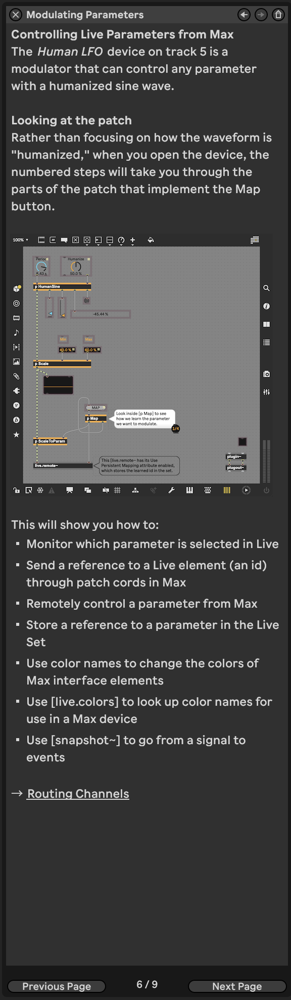
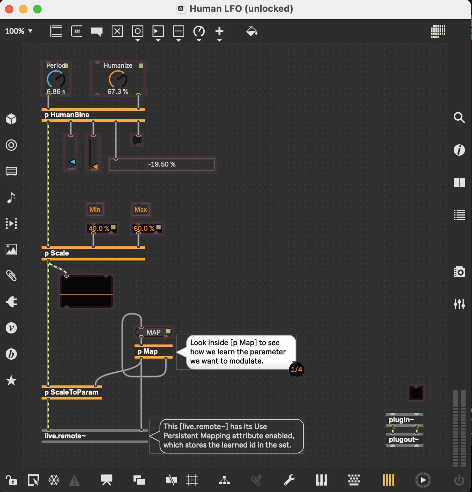
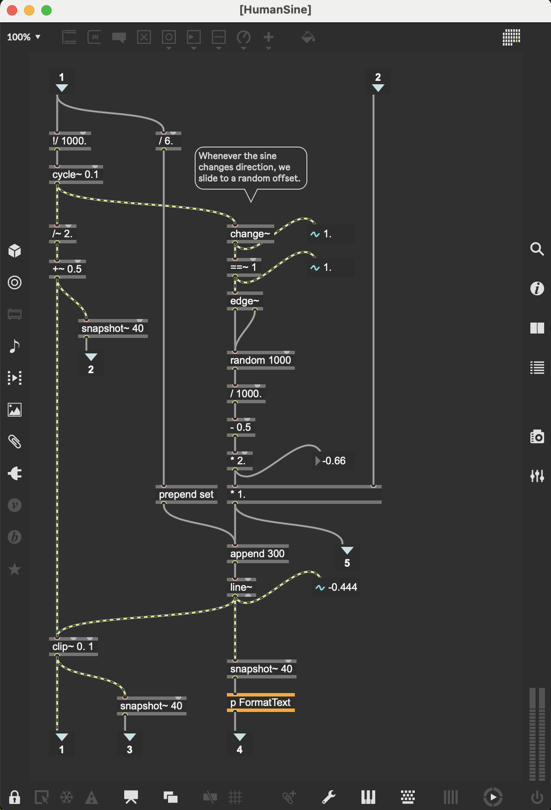

# [[Ableton/Max for Live/Audio Effect/Human LFO]] - Track 5 Modulating
	- ## Tutorial
		- ## Controlling Live Parameters from Max
			- **Device:** [[Ableton/Max for Live/Audio Effect/Human LFO]]
				- This Max for Live patch provides a "humanized" low-frequency oscillator to control parameters in Ableton Live.
			- **Patch Highlights:**
				- [[c74/M4L/obj/live.remote~]] is used to map and control parameters within Live dynamically.
					- The `@UsePersistentMapping 1` attribute ensures that parameter mappings are stored within the Live set.
				- [[c74/msp/obj/snapshot~]] converts signals into discrete events for modulation.
				- [[c74/M4L/obj/live.colors]] provides names for custom UI colors.
			- **Steps to Explore the Patch:**
				- Open the device and unlock the patcher.
				- Explore the numbered steps for implementing the "Map" button:
					- Inside `p Map`, learn how `live.remote~` interacts with selected parameters.
					- Notice how parameter references are sent as IDs through Max objects.
		- ## Key Max Objects in the Patch
			- [[c74/M4L/obj/live.remote~]] [live.remote~ Reference - Max Documentation](https://docs.cycling74.com/max8/refpages/live.remote~)
				- Remotely controls Live parameters and stores mappings in the session.
			- [[c74/msp/obj/snapshot~]] [snapshot~ Reference - Max Documentation](https://docs.cycling74.com/max8/refpages/snapshot~)
				- Converts audio-rate signals into discrete numbers.
			- [[c74/max/obj/dict]] [dict Reference - Max Documentation](https://docs.cycling74.com/max8/refpages/dict)
				- Stores structured data such as mappings for modulation.
			- [[c74/M4L/obj/live.colors]] [live.colors Reference - Max Documentation](https://docs.cycling74.com/max8/refpages/live.colors)
				- Provides consistent color definitions for Max interfaces.
		- ## Objects Used in This Device
			- Left
				- [[c74/max/obj/message]] sends parameter changes dynamically.
			- Right
				- [[c74/max/obj/pattr]] stores data persistently between sessions.
		- {:height 400, :width 700}
		- **Additional Reading:**
			- [[c74/M4L/docs/Live Audio Effects]] [Creating Audio Effect Devices](https://docs.cycling74.com/max8/vignettes/live_audiodevices)
	- ## Inside the HumanLFO Patch
		- 
		- ## Key Max Objects
			- inputs to `p HumanSine`
				- [[c74/M4L/obj/live.dial]] Period 6.86s
					- This defines the period of the sine wave for the LFO to be 6.86 seconds
				- [[c74/M4L/obj/live.dial]] Humanize 67.3%
					- This defines the "humanization" effect to be at 67.3%, probably sort of like 67.3 "wet" vs "dry" effect
			- `p HumanSine` patcher
				- 
				- ## Key Max objects
					- left inlet
						- [[c74/max/obj/rdiv]] `!/` [rdiv Reference - Max 8 Documentation](https://docs.cycling74.com/legacy/max8/refpages/rdiv) - convert ms to Hz
						  collapsed:: true
							- Description
							  Divides a number by the incoming value. Functions like the / object, but the inlets' functions are reversed.
							- ### Examples
								- 
								- / with the inputs swapped
							- DONE what happens after 6.86 seconds passes through `!/ 1000.`? it's `1000/6993=0.1458`
							  collapsed:: true
							  :LOGBOOK:
							  CLOCK: [2025-01-26 Sun 12:43:40]--[2025-01-26 Sun 12:51:30] =>  00:07:50
							  :END:
								-
								- whatever is passed in becomes the denominator, so it's 6.86/1000 = 0.00686 ??
									- ```calc
									  6.86/1000
									  ```
								- as it turns out, the [[c74/max/Parameter/Range]] here `500. 10000.` and [[c74/max/Parameter/Unit Style]] is `Time (ms)`, so the actual value for 6.86 seconds is 6860, which means that it's actually 0.146
									- ```calc
									  1000/6860
									  ```
						- [[c74/msp/cycle~]] generates the cosine with specified freq from -1 to 1
						  collapsed:: true
							- [cycle~ Reference - Max 8 Documentation](https://docs.cycling74.com/legacy/max8/refpages/cycle~)
								- Sinusoidal oscillator
								- ### Description
								- generate a periodic waveform
								- The default waveform is one cycle of a cosine wave.
								- You can also use the [wave~](/max8/refpages/wave~) object, which offers additional flexibility though slightly less optimization.
								- ### Examples
									- 
									- Repeated cosine or any other waveform
								- interpolating oscillator that reads repeatedly through one cycle of a waveform, using a wavetable. The wavetable can be changed using the 'set' message. This wavetable may be of any size, but historically was limited to 512 samples.
								- ### Arguments
									- #### frequency \[number\]
										- Optional
										- Units: `hz`
										- Oscillator frequency (initial) The initial frequency of the oscillator
									- #### buffer-name \[symbol\]
										- Optional
										- The name of a [[c74/msp/buffer~]] 
										   - [buffer~](https://docs.cycling74.com/legacy/max8/refpages/buffer~) object used to define the oscillator's wavetable. If a frequency argument is present, the `buffer~` name follows the frequency. If no `buffer~` name is given, `cycle~` uses an internal 64-bit 16K cosine wavetable.
								- ### Output
									- ### signal
										- A waveform (cosine by default) repeating at the specified frequency, with the specified phase.
						- left side
							- [[c74/msp/div~]] 2: make it so amplitude goes from -0.5 to 0.5
								- [div~ Reference - Max 8 Documentation](https://docs.cycling74.com/legacy/max8/refpages/div~)
								- divide the amplitude of the cycle by 2 (make it half as "loud")
							- [[c74/msp/plus~]] 0.5: make it so amplitude goes from 0 to 1
							-
					-
				-
	- ## My #Questions
	  collapsed:: true
		- DONE in my own words, what is this LFO doing?
		  :LOGBOOK:
		  CLOCK: [2025-01-26 Sun 12:07:26]--[2025-01-26 Sun 12:14:05] =>  00:06:39
		  :END:
			- The LFO is adjusting the filter cutoff [[Ableton/Macro]] parameter [[Ableton/Instrument/Rack/Bass/106 Bass]]
				- which adjusts [[Ableton/Instrument/Analog/106 Bass]]
					- it's mapped to [[Ableton/Instrument/Analog/Filter/1/Freq]]
						- #Learned that by clicking the Map button, I can see the mapping in Ableton from the macro button to the actual thing it's adjusting in the instrument.
						- it kind of looks like Filter Cutoff is somehow mapped twice to F1 Freq, with two different values for min and max ... ?
						- ok so there are actually two copies of the 106 bass in this instrument rack, each with their own filter 1 frequency cutoff
				- The LFO is going between 40% and 60% on the Filter Cutoff dial.
				- The bass 01 has -0 dB
					- osc 1 - detune 0.12
					- osc 2 - detune -0.03
				- the bass 02 has -3.0 dB
					- osc 1 - detune -0.04
					- osc 2 - detune 0.12
				- so the two copies have symmetrical detunes, which I guess is kind of a "unison" effect.
				- I wonder why they chose to do that rather than just using a unison effect.
				- also, i see that bass 01 has lp12 and bass 02 has lp24, and the max for one of them is 5.8k while themax for the other is 22.0k, ... but I can't really tell from the macro mappings detail which one is which. carefully designed, but it's a bit beyond me.
		- DONE what does it mean for an #LFO to be "humanized"
		  :LOGBOOK:
		  CLOCK: [2025-01-26 Sun 12:14:28]--[2025-01-26 Sun 12:16:14] =>  00:01:46
		  :END:
			- it's injecting some imperfections in the glide time. so it's not a perfect sine wave, but instead it's sorta smoothly jerking around.