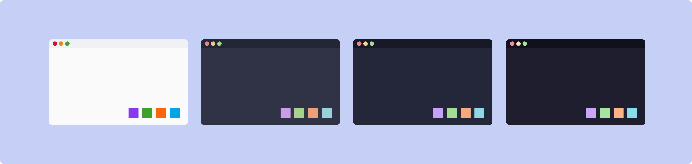

logseq-entity:: [[Logseq/Entity/color-theme]]
alias:: [[UI/Color/Theme/Catppuccin]]
date-created:: [[2021]]
see-also:: [[Ghostty]], [[Kitty]], [[WezTerm]], [[Zellij]]

- [Catppuccin](https://catppuccin.com/) — soothing pastel palette family for terminals, editors, and desktop tooling; upstream coordination lives in the [catppuccin](https://github.com/catppuccin) GitHub organization and the [palette specification](https://github.com/catppuccin/palette)
	-  [^1]
	- ## Flavors
		- [[Catppuccin/Latte]] — light
		- [[Catppuccin/Frappe]] — dark, softer contrast
		- [[Catppuccin/Macchiato]] — dark, medium contrast
		- [[Catppuccin/Mocha]] — dark, strongest contrast (common default in examples)
	- ## Palette reference
		- Canonical colors and naming: [catppuccin/palette](https://github.com/catppuccin/palette) and [Style guide](https://github.com/catppuccin/catppuccin/blob/main/docs/style-guide.md) — prefer linking here over duplicating hex tables in the garden unless you are tracking local overrides
		- Port directory: [github.com/catppuccin/catppuccin — ports](https://github.com/catppuccin/catppuccin#-ports)
	- ## Stack matrix (how to wire it)
		- **[[Ghostty]]** — built-in themes; set `theme = "catppuccin-<flavor>"` (e.g. [[Catppuccin/Mocha]] → `catppuccin-mocha`) in Ghostty config or `programs.ghostty.settings` in Nix/home-manager — see [[Ghostty]]
		- **[[nvim]]** — main port [catppuccin/nvim](https://github.com/catppuccin/nvim); enable colorscheme `catppuccin` and set `flavour` to `latte` / `frappe` / `macchiato` / `mocha` in plugin setup (see each [[Catppuccin/Latte]] … [[Catppuccin/Mocha]] for the keyword)
		- **[[tmux]]** — common pattern: [catppuccin/tmux](https://github.com/catppuccin/tmux) via TPM; set flavour variable (e.g. `@catppuccin_flavour`) to match the flavor name — detail on [[tmux/Config]] or [[tmux/oh-my-tmux]] as you maintain it
		- **[[yazi]]** — use a Catppuccin flavor pack (e.g. [catppuccin/yazi](https://github.com/catppuccin/yazi)) or equivalent `theme` / flavor configuration in `yazi.toml` per upstream instructions
	- ## Other terminals in this garden
		- [[Kitty]] — `theme = "Catppuccin-Mocha"` (and siblings) in Kitty / home-manager examples on the Kitty page
		- [[WezTerm]] — `color_scheme = "Catppuccin Mocha"` in Lua extraConfig on the WezTerm page
		- [[Zellij]] — `theme = "catppuccin-mocha"` in `programs.zellij.settings` on the Zellij page
	- ## Footnotes
		- [^1]: https://github.com/catppuccin/catppuccin/blob/main/assets/palette/demo.png