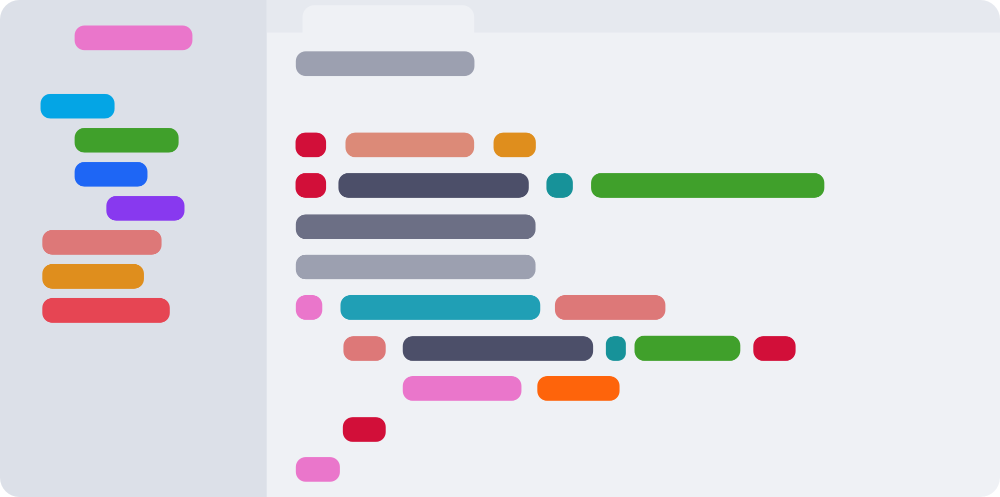

- # Latte
	- The **light** flavor of [[Catppuccin]] — warm off-white base with pastel accents. [^1]
	-  [^2]
	- ## Typical config ids
		- Short: `latte`
		- Ghostty / many terminals: `catppuccin-latte`
		- Neovim ([catppuccin/nvim](https://github.com/catppuccin/nvim)): `flavour = "latte"`
		- tmux ([catppuccin/tmux](https://github.com/catppuccin/tmux)): `@catppuccin_flavour 'latte'` (or upstream’s current variable name)
	- ## See also
		- Hub: [[Catppuccin]] — full stack matrix and palette links
	- ## Footnotes
		- [^1]: https://github.com/catppuccin/palette
		- [^2]: https://github.com/catppuccin/catppuccin/blob/main/assets/previews/latte.webp
