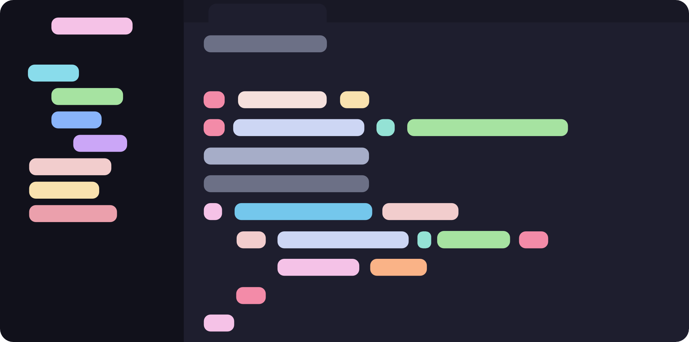

# Mocha
	- The **darkest** Catppuccin flavor — highest contrast; the usual default in snippets across this garden ([[Ghostty]], [[Zellij]], etc.). [^1]
	-  [^2]
	- ## Typical config ids
		- Short: `mocha`
		- Ghostty / many terminals: `catppuccin-mocha`
		- Neovim: `flavour = "mocha"`
		- Kitty / WezTerm built-in names often use title case, e.g. `Catppuccin Mocha` — see [[Kitty]] and [[WezTerm]]
		- tmux: `@catppuccin_flavour 'mocha'` (or upstream’s current variable name)
	- ## See also
		- Hub: [[Catppuccin]] — full stack matrix and palette links
	- ## Footnotes
		- [^1]: https://github.com/catppuccin/palette
		- [^2]: https://github.com/catppuccin/catppuccin/blob/main/assets/previews/mocha.webp{:height 59, :width 505}