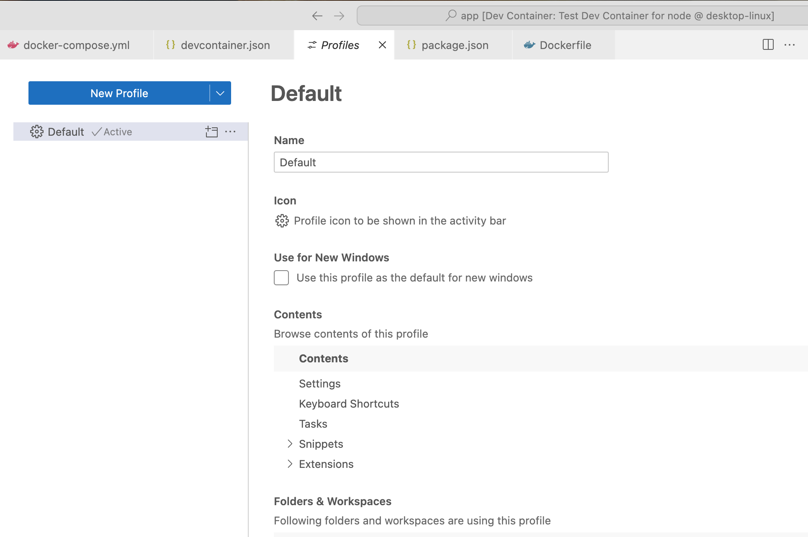

- [[GitHub/codekiln/dev-container-test]]
- [[VSCode/Extension/QuickStage]] not installed
- one of the reasons I created this test repo was to see if I could reproduce the issue I saw [[2025-02-08 Sat]] in [[GitHub/codekiln/alits]] where QuickStage wasn't installed, even though I had it in my [[VSCode/Dev Container/.devcontainer.json]] file. Sure enough, this minimal test repo does reproduce it.
	- ```
	  [6895 ms] Extensions cache, install extensions: dbaeumer.vscode-eslint, bs-code.git-quick-stage, ms-azuretools.vscode-docker, GitHub.vscode-pull-request-github
	  
	  [6895 ms] Extensions cache, install extensions: dbaeumer.vscode-eslint, bs-code.git-quick-stage, ms-azuretools.vscode-docker, GitHub.vscode-pull-request-github
	  [6895 ms] Start: Run in container: test -d /home/node/.cursor-server/extensionsCache && ls /home/node/.cursor-server/extensionsCache || true
	  [6896 ms] 
	  [6896 ms] 
	  [6896 ms] Start: Run in container: test -d /vscode/cursor-server/extensionsCache && ls /vscode/cursor-server/extensionsCache || true
	  [6896 ms] 
	  [6896 ms] 
	  [6896 ms] Extensions cache, link in container: None
	  [6897 ms] Start: Run in container: /home/node/.cursor-server/bin/f5f18731406b73244e0558ee7716d77c8096d150/bin/cursor-server --log debug --force-disable-user-env --server-data-dir /home/node/.cursor-server --use-host-proxy --telemetry-level all --accept-server-license-terms --host 127.0.0.1 --port 0 --connection-token-file /home/node/.cursor-server/data/Machine/.connection-token-f5f18731406b73244e0558ee7716d77c8096d150 --extensions-download-dir /home/node/.cursor-server/extensionsCache --install-extension dbaeumer.vscode-eslint --install-extension bs-code.git-quick-stage --install-extension ms-azuretools.vscode-docker --install-extension GitHub.vscode-pull-request-github --start-server --disable-websocket-compression --skip-requirements-check
	  [6963 ms] userEnvProbe PATHs:
	  Probe:     '/usr/local/share/nvm/current/bin:/usr/local/share/npm-global/bin:/pnpm:/usr/local/share/nvm/current/bin:/usr/local/share/npm-global/bin:/usr/local/sbin:/usr/local/bin:/usr/sbin:/usr/bin:/sbin:/bin:/home/node/.local/bin'
	  Container: '/pnpm:/usr/local/share/nvm/current/bin:/usr/local/share/npm-global/bin:/usr/local/sbin:/usr/local/bin:/usr/sbin:/usr/bin:/sbin:/bin'
	  
	  [7980 ms] [09:19:18] Extension 'bs-code.git-quick-stage' not found.
	  Make sure you use the full extension ID, including the publisher, e.g.: ms-dotnettools.csharp
	  
	  
	  
	  [15991 ms] [09:19:26] Extension 'dbaeumer.vscode-eslint' v3.0.10 was successfully installed.
	  [09:19:26] Extension 'github.vscode-pull-request-github' v0.102.0 was successfully installed.
	  [09:19:26] Extension 'ms-azuretools.vscode-docker' v1.29.4 was successfully installed.
	  [15992 ms] [09:19:26] Error: Failed Installing Extensions: bs-code.git-quick-stage
	      at Kc.installExtensions (file:///vscode/cursor-server/bin/linux-arm64/f5f18731406b73244e0558ee7716d77c8096d150/out/server-main.js:71:35452)
	  ```
- I pushed up the repo to [codekiln/dev-container-test: testing a simple dev container](https://github.com/codekiln/dev-container-test/tree/main), now I'd like to contact the QuickStage plugin author, [[GitHub/Bluesteel-Software]]
	- I looked through [git-stage-file/extension.js at main · Bluesteel-Software/git-stage-file](https://github.com/Bluesteel-Software/git-stage-file/blob/main/extension.js) and it looks remarkably easy to create a [[VSCode/Extension]]; I'll have to do that sometime.
- Unrelated issues in VSCode (it's actually a cursor issue)
	- [Extensions defined in devcontainer.json are not installing · Issue #8097 · microsoft/vscode-remote-release](https://github.com/microsoft/vscode-remote-release/issues/8097) closed [[2023/03]]
	  collapsed:: true
		- > What I observe ([@orolega](https://github.com/orolega) please confirm): When open a dev container, switch to a non-default profile and then rebuild that container with extensions listed in the devcontainer.json to be installed at server startup, I end up in the non-default profile without the extensions (that seems unexpected). If I then switch to the default profile, the extensions are there.
		- that sounds related to the behavior I'm observing
			- what happens if I switch [[VSCode/Profiles]]?
				- [Profiles in Visual Studio Code](https://code.visualstudio.com/docs/editor/profiles) [[VSCode/Docs/Editor/Profiles]]
					- > From the **Code** > **Settings** > **Profiles** menu item
					- 
					-
					- *I'm actually using the default profile*
				- 
				-
	- [Unable to install extensions in devcontainer · Issue #9494 · microsoft/vscode-remote-release](https://github.com/microsoft/vscode-remote-release/issues/9494)  
	  collapsed:: true
		- Observed: installation hangs at "installing" (left for several hours, installation never completes)
		- that's not my issue exactly
- Found [[CursorAI/Forum]] posts mentioning items very similar to this
	- [Dev Containers does not work in 0.45.0 - Bug Report - Cursor - Community Forum](https://forum.cursor.com/t/dev-containers-does-not-work-in-0-45-0/42968) [[2025/01]]
		- I didn't see this warning (yet, thankfully), but I would hate to see it!
		- > The Dev Containers extension is supported only in Microsoft versions of VS Code
		- ```
		  [7 ms] Dev Containers 0.394.0 in VS Code 1.96.2 (f06cc5e62b757b2bf61ec052a8701fb2da9ded20).
		  [7 ms] The Dev Containers extension is supported only in Microsoft versions of VS Code
		  ```
	- [Extension Marketplace Bug - Bug Report - Cursor - Community Forum](https://forum.cursor.com/t/extension-marketplace-bug/7465/13) original date [[2024/08]],
		- OP - [Summary - Elliot - Cursor - Community Forum](https://forum.cursor.com/u/Elliot/summary)
			- I’m having a really odd bug with the extensions marketplace. For my work I’m supposed to get the Dev-Containers extension, however, this never shows up (along with lots of other extensions). It’s like I have an entirely different marketplace then my coworkers (I’ve cleared filters and reinstalled Cursor already). I tested this out with Dev Containers specifically. The only way I was able to get the Dev Containers was by downloading it from the Microsoft Store and then uploading it to Cursor. However, once it installed, the Dev-Containers extension did not work properly. I installed the newest version (since it was the only available option) of Dev Containers (v0.381.0). I tested marketplace on a different PC and account and I was able to find Dev Containers (however, it was v0.327.0) and it worked as expected. Couldn’t find a download for that version anywhere so I decided to just address this bug.
			- The issue with Dev Containers v0.381.0 is the VS Code Server not installing properly on Cursor (everything works fine on VS Code on v0.381.0).
			- This is using:
			  Version: 0.39.3
			  VSCode Version: 1.91.1
			  Commit: 5c6f02b83b0bbdce7811fb295219e9668f58ac90
			  Date: 2024-08-09T01:17:07.954Z
			  Electron: 29.4.0
			  ElectronBuildId: undefined
			  Chromium: 122.0.6261.156
			  Node.js: 20.9.0
			  V8: 12.2.281.27-electron.0
			  OS: Darwin arm64 23.5.0
		- [[Person/Terry Li]] recent update [[2025/01]]
			- ## Step 1. Install this safer compatible version
			- `0.327.0` will help download the compatible VS Code Server version:
			- [https://marketplace.visualstudio.com/_apis/public/gallery/publishers/ms-vscode-remote/vsextensions/remote-containers/0.327.0/vspackage](https://marketplace.visualstudio.com/_apis/public/gallery/publishers/ms-vscode-remote/vsextensions/remote-containers/0.327.0/vspackage)
			- Step 2. Latest compatible version for Cursor + MacOS:
			- After Step 1, we can download and install `0.386.0`, which is tested to be still working as of January 15, 2025
			-  Directly installing it on Cursor won’t work because it’ll still download the incompatible version of the VS Code Server.
			- [https://marketplace.visualstudio.com/_apis/public/gallery/publishers/ms-vscode-remote/vsextensions/remote-containers/0.386.0/vspackage](https://marketplace.visualstudio.com/_apis/public/gallery/publishers/ms-vscode-remote/vsextensions/remote-containers/0.386.0/vspackage)
			- Version: 0.44.11
			  VSCode Version: 1.93.1
			  Commit: fe574d0820377383143b2ea26aa6ae28b3425220
			  Date: 2025-01-03T07:59:06.361Z
			  Electron: 30.5.1
			  Chromium: 124.0.6367.243
			  Node.js: 20.16.0
			  V8: 12.4.254.20-electron.0
			  OS: Darwin arm64 24.3.0
	- I ended up posting [Dev Containers not installing valid VS Code Extension - Minimal Reproduction - Bug Report - Cursor - Community Forum](https://forum.cursor.com/t/dev-containers-not-installing-valid-vs-code-extension-minimal-reproduction/49294) [[Forum/post]] [[2025-02-09 Sun]]
	-
	-