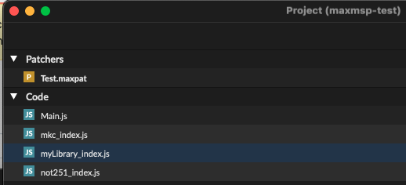

- Work Log
	- [[2025-02-09 Sun]]
		- DONE test if I'm able to utilize the library in [[c74/max/js]]
			- DONE try using the built-in test functions from [[GitHub/aptrn/maxmsp-ts-library-template]] using [[GitHub/aptrn/maxmsp-ts-example]]
			  collapsed:: true
				- There is already a greet function in `packages/my-library/src/index.ts` and `apps/maxmsp-test/src/Main.ts` contains a test [[c74/max/js]] object which is likely referenced in `apps/maxmsp-test/Patchers/Test.maxpat`
					- ```ts
					  import * as mylib from "@my-username/my-library";
					  
					  inlets = 1;
					  outlets = 1;
					  autowatch = 1;
					  
					  function bang() {
					    post(mylib.greet() + "\n");
					  }
					  
					  bang();
					  
					  // .ts files with this at the end become a script usable in a [js] or [jsui] object
					  // If you are going to require your module instead of import it then you should comment
					  // these two lines out of this script
					  let module = {};
					  export = {};
					  
					  ```
				- I'm downloading [[c74/max/v/9]] to try it out. should be free for 30 days, so, until [[2025-03-11 Tue]] or so.
					- it doesn't currently compile the required javascript files into the same directory as the example patcher. `apps/maxmsp-test/Patchers/Test.maxpat` is in a different directory than `apps/maxmsp-test/Code/Main.js`, so max doesn't find it
					- OH WAIT I have the wrong thing open ... I needed to open `apps/maxmsp-test/maxmsp-test.maxproj`, now that's working!
						- ```
						  js: Hello! Writing from typescript! 
						  ```
				- Key insight: I needed to use `apps/maxmsp-test/maxmsp-test.maxproj` to open it up.
					- It turns out that [[c74/File Extension/.maxproj]] is just [[json]], and when I open it, I can see references to other JS assets:
						- ```
						  		"code" : 		{
						  			"Main.js" : 			{
						  				"kind" : "javascript",
						  				"local" : 1
						  			}
						  ,
						  			"mkc_index.js" : 			{
						  				"kind" : "javascript",
						  				"local" : 1
						  			}
						  ,
						  			"myLibrary_index.js" : 			{
						  				"kind" : "javascript",
						  				"local" : 1
						  			}
						  ,
						  			"not251_index.js" : 			{
						  				"kind" : "javascript",
						  				"local" : 1
						  			}
						  
						  		}
						  
						  ```
					- I can also see these in the Project view
						- 
					- but if I were to create a new [[c74/M4L]] project in Ableton, I don't think that I'd know how to associate these. Are they automatically detected from the imports? in the inspector, upon selecting the [[c74/max/js]] `js Main` object, I see
						- ```json
						  {
						  "attributes" : 	{
						  "filepath" : [ "Macintosh HD:/Users/Me/Documents/GitHub/alits/apps/maxmsp-test/Patchers/Test.maxpat" ]
						  }
						  ```
					- I see [Projects | Cycling '74 Documentation](https://docs.cycling74.com/userguide/projects/) [[c74/max/Ref/Projects]]
						- 
						- I see that number 4 above allows you to add dependencies to the project:
							- > Add files to Project: To add files to a project, they can be created from scratch, patchers can
							  be created from templates, and existing files can be added to projects.
						- That is greyed out for me, though, perhaps because I didn't start my trial?
						- #Discovered
							- [Node for Max - Working with Projects, Devices and Standalones - Max 8 Documentation](https://docs.cycling74.com/legacy/max8/vignettes/03_n4m_projects_devices)
								- In the Project Inspector disable the option "Keep Project Folder Organized":
								- 
								- You can now close the Project Inspector. We will now use the `+` Button in the bottom left corner in order to add our main patcher to the project by choosing "Add New File…" and creating a Max Patcher called `n4m-bundler.main.maxpat`
								- #Observation when I open the gear icon for [[c74/max/Project/Window]] I'm given the ability to choose between Project Inspector, Search Paths, Open Actions. When I do Search Paths, I can see a `project default` with path that includes has the `subfolders` checked. **I wonder if I could do this for max for live?**
								  id:: 67a89ce8-b922-4e9e-9f02-43cab5a93eb1
				- I see that the README from [[GitHub/aptrn/maxmsp-ts-example]] has a [Bundle Dependencies for Max](https://github.com/aptrn/maxmsp-ts-example?tab=readme-ov-file#bundle-dependencies-for-max) section
					- > You can install dependencies using `pnpm i -D <package-name>`. If you're sure the dependency is [**compatible with Max**](https://github.com/aptrn/maxmsp-ts-example?tab=readme-ov-file#dependencies), you can add it to the config file.
					- > The configuration file `maxmsp.config.json` determines which dependencies are included in the compiled output. The default `output_path` is `lib`, placed as a subdirectory of the `outDir` found in the `tsconfig.json` file.
					-
		- DOING try creating a kebricide package within the apps dir of [[GitHub/aptrn/maxmsp-ts-library-template]]
		  :LOGBOOK:
		  CLOCK: [2025-02-09 Sun 09:04:55]
		  :END:
			- DONE would the [[GitHub/aptrn/maxmsp-ts]] #CLI be useful here? ANS: probably not
			  collapsed:: true
				- I think that is mostly on the library side, for adding dependencies, not on the application side.
			- theoretically, [[GitHub/Barnard-PL-Labs/MaxPy]] could be used to dynamically generate the patch ...
			- #Discovered that at least some people have a way to open [[c74/max/Project]] files in [[Ableton/Max for Live]]
			  collapsed:: true
				- [Convert a .maxproj file into a .amxd file | AudioSEX - Professional Audio Forum](https://audiosex.pro/threads/convert-a-maxproj-file-into-a-amxd-file.74689/)
					- Basically what I would like to do is convert this .maxproj or .maxpatch into a .axmd file to use it as a Max Instrument in Ableton.
					- so far i know you need to open the project file in Max4Live.
					- Okay open Ableton, drag in an empty M4L device, click on the "old school chip" icon on the right of the device, opens M4L edit panel.
					- Now you need to open the project file and then you can save it. Only in that mode, you have to option save it as amxd file for use in Ableton.
					- [Is there a special trick to exporting patches or saving as M4L devices? - MaxMSP Forum | Cycling '74](https://cycling74.com/forums/is-there-a-special-trick-to-exporting-patches-or-saving-as-m4l-devices)
						- Hi Jeremy, for me, "Export Max for Live Device..." is greyed out, both when opening the amxd from Max or from Live. I did find a workflow using "freeze device" and "save as", that seems to do the trick. Are these equivalent?
						- This is after I read through all doc pages that seem to be related to building and distributing M4L devices from the long list at [https://docs.cycling74.com/max8/vignettes/max\_for\_live\_topic](https://docs.cycling74.com/max8/vignettes/max_for_live_topic), but I couldn't find a page that groups these related topics, so I'm not sure if I missed something.
					- [Max/MSP, Max4Live, & RNBO (the thread) - Equipment - lines](https://llllllll.co/t/max-msp-max4live-rnbo-the-thread/18366/188?page=10) #Cool [[Forum/post]] [[llllllll/Forum]]
						- EDIT: I saved it as an M4L object with presentation mode if you want to hack it from there: [Dropbox - ManuallyClockedSeq.amxd - Simplify your life](https://www.dropbox.com/s/hhrty53a7iztbcu/ManuallyClockedSeq.amxd?dl=0)
						- DOUBLE EDIT: I highly, highly recommend buying this book, which is all about hacking the live.step object for more advanced behaviors: [Books About Max | Cycling '74](https://cycling74.com/products/books) [[Books/Max Cookbook]] is there
			- ## Breakthrough - creating a new [[Ableton/Max for Live/MIDI Effect]] and then opening `.maxproj` DOES work in Ableton Live
				- I even get the `js: Hello! Writing from typescript! ` in the console! so, we're in business possibly ...
				- DONE verify I can save this in the Ableton project file and open it again: ANS - not if I just opened it
				  collapsed:: true
				  :LOGBOOK:
				  CLOCK: [2025-02-09 Sun 09:07:37]--[2025-02-09 Sun 09:09:34] =>  00:01:57
				  :END:
					- Ok, so maybe this isn't working just yet. when I re-open the ableton project file after having opened the `.maxproj`, it doesn't open [[c74/max/Project]] by default; I don't see the console logging.
				- DONE is there some way to do something similar to what is done in [[GitHub/aptrn/maxmsp-ts-library-template/apps/maxmsp-test/maxmsp-test.maxproj]] with a [[c74/max/Project/Window]], but in [[c74/M4L]],  [[Ableton/Max for Live]]?
				  collapsed:: true
				  :LOGBOOK:
				  CLOCK: [2025-02-09 Sun 09:10:53]--[2025-02-09 Sun 09:33:42] =>  00:22:49
				  :END:
					- is there something equivalent to the project window?
					- When I was working with the [[c74/max/Project/Window]] before, I was in [[c74/max/v/9]], and the built-in version for [[Ableton/Max for Live]] is [[c74/max/v/8]], so it might be in a different spot, but I can't seem to find it in the UI. Alternatively, it could be that they removed support for Max Projects from Max for Live deliberately.
						- ((67a89ce8-b922-4e9e-9f02-43cab5a93eb1))
						- Max 8 documentation for [[c74/max/Project/Window]] is here [Anatomy of the Project Window - Max 8 Documentation](https://docs.cycling74.com/legacy/max8/vignettes/projects_anatomy?utm_source=chatgpt.com)
							- see also [Working With Projects - Max 8 Documentation](https://docs.cycling74.com/legacy/max8/vignettes/projects_topic)
							- see also [Project Settings - Max 8 Documentation](https://docs.cycling74.com/legacy/max8/vignettes/projects_settings)
							- see also [Project Search Paths - Max 8 Documentation](https://docs.cycling74.com/legacy/max8/vignettes/projects_searchpath)
								- Previous versions of Max used a single global search path for locating files used by the application. For instance, the "patches" folder inside the Max application folder was typically used to store patchers, media files, 3rd party externals and help files, and so on. Projects provide new means for controlling how Max searches for files.
								- Projects also maintain a list of additional folders to be searched when locating project assets. This list works similarly to the list found in Max's [[c74/max/Menu/Options/File Preferences]]  window, but is used only by the project.
									- #Insight #Observation *ok, so it sounds like [[c74/max/Project]]s are the only way to have project-specific paths added. So I either need to change the compilation directory for [[GitHub/aptrn/maxmsp-ts-library-template/apps/maxmsp-test]] so that the compiled assets are in the same directory as the patcher, similar to the way [[GitHub/zsteinkamp/m4l-typescript-base]] does it, or instruct users to add a folder manually to the search path using the File Preferences menu. The latter is not as ergonomic, because it will likely require additional set-up and reminders for users. However, it may be the fastest way for me to get going. Of course, it's at least POSSIBLE that if I save my [[c74/M4L/.amxd]] file in the parent directory of the generated typescript assets, I may be able to access the items via a relative path...*
					- #Conclusion no, there's no way to do something similar to [[c74/max/Project]]s in [[Ableton/Max for Live]]; I need to explore other approaches such as
						- 1 - using a relative path to a sub-directory
						- 2 - changing the [[Typescript/tsconfig]] compilation setting so that it compiles to the same directory as the [[c74/M4L/.amxd]] file
						- 3 - instruct [[Ableton/Max for Live]] users to manually add a directory to [[c74/max/Menu/Options/File Preferences]]
					-
					-
				- DONE is there some way a relative path can work? ANS: probably not?
				  collapsed:: true
				  :LOGBOOK:
				  CLOCK: [2025-02-09 Sun 09:36:49]--[2025-02-09 Sun 09:57:41] =>  00:20:52
				  :END:
					- I tried creating `apps/maxmsp-test/maxmsp-test.amxd` with a [[c74/max/obj/js]] as `js ./Code/Main.js`, and got `js: can't find file ./Code/Main.js`, even though `apps/maxmsp-test/Code/Main.js` exists
						- I also tried `js Code/Main.js` which also did not work
					- I wish there was a way to open [[c74/M4L/.amxd]] files ... there probably is because [[Person/Zack Steinkamp/blog/posts/2022-02-15-git-diff-amxd-max]] says ((67a8be1a-780f-4c61-82e5-c04cfae63cc6))
						- I imagine it might be able to adjust the paths if I was able to adjust the .amxd directly ...
					- #Discovered that if I go to [[c74/max/Menu/File/Show File Browser]] I'm taken to [[c74/max/File Browser]] window, which lets one create [[c74/max/Collections]] of files. interesting. I tried adding `apps/maxmsp-test/Code/Main.js` to the file paths, but got "no new files have been added to the search path" because the extension is invalid. So that probably won't work.
				- DONE is there some way that the [[c74/M4L/.amxd]] could be extracted into [[json]], and then we could add the multiple file paths into the .amxd directly? see [[c74/M4L/.amxd/How To/Decompile .amxd into json]]
				  collapsed:: true
					- #Conclusion - while it **is** feasible to "decompile" the `.amxd` into `.json`, and this could conceivably help in actually versioning `.amxd` in git as `json` and treating `.amxd` as a compiled artifact using git hooks, I don't yet see a way that would help me add additional paths to the available search paths for the [[c74/max/obj/js]] obj.
				- DOING try 2 - changing the [[Typescript/tsconfig]] compilation setting so that it compiles to the same directory as the [[c74/M4L/.amxd]] file, following the hint of [[GitHub/zsteinkamp/m4l-typescript-base]]
				  :LOGBOOK:
				  CLOCK: [2025-02-09 Sun 09:58:14]
				  :END:
					- DOING try just moving the .amxd file to be adjacent to the .js file, the way it's done in typescript base
					  :LOGBOOK:
					  CLOCK: [2025-02-09 Sun 10:32:23]
					  :END:
						- if I do that, I'm able to load the first javascript file
							- ```js
							  "use strict";
							  var mylib = require("lib/@my-username-my-library/myLibrary_index.js");
							  inlets = 1;
							  outlets = 1;
							  autowatch = 1;
							  function bang() {
							      post(mylib.greet() + "\n");
							  }
							  bang();
							  // .ts files with this at the end become a script usable in a [js] or [jsui] object
							  // If you are going to require your module instead of import it then you should comment
							  // these two lines out of this script
							  var module = {};
							  module.exports = {};
							  
							  ```
								- but I get an #Error when it tries to load this line 7 - `mylib.greet()` is not found.
									- `js: Main.js: Javascript TypeError: mylib.greet is not a function, line 7`
							- DONE How do relative imports work in [[GitHub/zsteinkamp/m4l-typescript-base]]? we're importing from utils there ... let me look at the compiled js artifacts #Question
							  :LOGBOOK:
							  CLOCK: [2025-02-09 Sun 10:34:42]--[2025-02-09 Sun 10:35:25] =>  00:00:43
							  :END:
								- it's doing `var utils_1 = require("./utils");`, where `utils.js` is in the same folder
								- so they are both using `require` - I see [[c74/js/Ref/jsrequire]] has the docs for that.
							- DOING it does NOT work **by default** to use require to access a file from another nested folder by default, for example, `var mylib = require("lib/@my-username-my-library/myLibrary_index.js");` even if that path is adjacent to [[c74/M4L/.amxd]] - is there a way to get around this with [[c74/max/Menu/Options/File Preferences]]? ANS: **YES**
							  :LOGBOOK:
							  CLOCK: [2025-02-09 Sun 10:51:21]
							  :END:
								- Yes, if I manually add the folder `apps/maxmsp-test/Code/lib/@my-username-my-library/`in file preferences, then I get the `Hello! Writing from typescript!` message. But that also means that any included libraries would also need to be manually added. That is less than ideal. But ... it works.
								-
							-
							-
					- ok, let's look carefully at how it's done there ...
	- [[2025-02-08 Sat]]
		- tried to get [[VSCode/Dev Container]] spec from [[GitHub/zsteinkamp/m4l-typescript-base]] working with [[GitHub/codekiln/alits]], which was created from [[GitHub/aptrn/maxmsp-ts-library-template]]
			- #Error
				- Error from inside the dv container
					- ```
					  [1259 ms] Keep-alive process ended.
					  [1261 ms] Shell server terminated (code: 137, signal: null)
					  
					  
					  [1324 ms] Error reading shell environment.
					  [1324 ms] Shell server terminated (code: 1, signal: null)
					  
					  Error response from daemon: container ba8901b9aeafaad738f91e3d681c309c73504967e32d4b42669ca7fea8d2c4d3 is not running
					  
					  [1324 ms] Start: Run in container: mkdir -p '/tmp/devcontainers-e15077b4-5822-42d3-a12f-87f095e1973f1739007908030' && cat > '/tmp/devcontainers-e15077b4-5822-42d3-a12f-87f095e1973f1739007908030/env-loginInteractiveShell.json' << 'envJSON'
					  [1324 ms] Stdin closed!
					  [1324 ms] Failed to cache user env: Shell server terminated (code: 137, signal: null)
					  ```
				- `Error: An error occurred setting up the container.`
					- ```
					  
					  Shell server terminated (code: 126, signal: null)
					  OCI runtime exec failed: exec failed: cannot exec in a stopped container: unknown
					  Start: Run in container:  (command -v getent >/dev/null 2>&1 && getent passwd 'root' || grep -E '^root|^[^:]*:[^:]*:root:' /etc/passwd || true)
					  Stdin closed!
					  Error: An error occurred setting up the container.
					      at htA (/Users/me/.cursor/extensions/ms-vscode-remote.remote-containers-0.394.0/dist/spec-node/devContainersSpecCLI.js:410:3955)
					      at process.processTicksAndRejections (node:internal/process/task_queues:95:5)
					      at async TtA (/Users/me/.cursor/extensions/ms-vscode-remote.remote-containers-0.394.0/dist/spec-node/devContainersSpecCLI.js:482:4021)
					      at async iB (/Users/me/.cursor/extensions/ms-vscode-remote.remote-containers-0.394.0/dist/spec-node/devContainersSpecCLI.js:482:4963)
					      at async wrA (/Users/me/.cursor/extensions/ms-vscode-remote.remote-containers-0.394.0/dist/spec-node/devContainersSpecCLI.js:663:203)
					      at async DrA (/Users/me/.cursor/extensions/ms-vscode-remote.remote-containers-0.394.0/dist/spec-node/devContainersSpecCLI.js:662:14830)
					      at async /Users/me/.cursor/extensions/ms-vscode-remote.remote-containers-0.394.0/dist/spec-node/devContainersSpecCLI.js:482:1190
					  Stop (552 ms): Run: /Applications/Cursor.app/Contents/Frameworks/Cursor Helper (Plugin).app/Contents/MacOS/Cursor Helper (Plugin) /Users/me/.cursor/extensions/ms-vscode-remote.remote-containers-0.394.0/dist/spec-node/devContainersSpecCLI.js up --user-data-folder /Users/me/Library/Application Support/Cursor/User/globalStorage/ms-vscode-remote.remote-containers/data --container-session-data-folder /tmp/devcontainers-a68b82b6-a332-4932-8764-912b26f5e8b11739007283189 --workspace-folder /Users/me/Documents/GitHub/alits --workspace-mount-consistency cached --gpu-availability detect --id-label devcontainer.local_folder=/Users/me/Documents/GitHub/alits --id-label devcontainer.config_file=/Users/me/Documents/GitHub/alits/.devcontainer/devcontainer.json --log-level debug --log-format json --config /Users/me/Documents/GitHub/alits/.devcontainer/devcontainer.json --default-user-env-probe loginInteractiveShell --mount type=volume,source=vscode,target=/vscode,external=true --skip-post-create --update-remote-user-uid-default on --mount-workspace-git-root --include-configuration --include-merged-configuration
					  Exit code 1
					  Command failed: /Applications/Cursor.app/Contents/Frameworks/Cursor Helper (Plugin).app/Contents/MacOS/Cursor Helper (Plugin) /Users/me/.cursor/extensions/ms-vscode-remote.remote-containers-0.394.0/dist/spec-node/devContainersSpecCLI.js up --user-data-folder /Users/me/Library/Application Support/Cursor/User/globalStorage/ms-vscode-remote.remote-containers/data --container-session-data-folder /tmp/devcontainers-a68b82b6-a332-4932-8764-912b26f5e8b11739007283189 --workspace-folder /Users/me/Documents/GitHub/alits --workspace-mount-consistency cached --gpu-availability detect --id-label devcontainer.local_folder=/Users/me/Documents/GitHub/alits --id-label devcontainer.config_file=/Users/me/Documents/GitHub/alits/.devcontainer/devcontainer.json --log-level debug --log-format json --config /Users/me/Documents/GitHub/alits/.devcontainer/devcontainer.json --default-user-env-probe loginInteractiveShell --mount type=volume,source=vscode,target=/vscode,external=true --skip-post-create --update-remote-user-uid-default on --mount-workspace-git-root --include-configuration --include-merged-configuration
					  Exit code 1
					  ```
			- [[Docker/CLI/ps/-a]]
				- ```
				  $> docker ps -a
				  CONTAINER ID   IMAGE                COMMAND                  CREATED          STATUS                            PORTS     NAMES
				  ba8901b9aeaf   alits-node           "/bin/sh -c 'echo Co…"   18 minutes ago   Exited (127) About a minute ago             alits-node-1
				  ```
			- [[Docker/CLI/logs]]
				- ```
				  ocker logs ba8901b9aeaf
				  Container started
				  
				  > dev
				  > turbo dev
				  
				  sh: 1: turbo: not found
				  Container started
				  
				  > dev
				  > turbo dev
				  
				  sh: 1: turbo: not found
				  Container started
				  
				  > dev
				  > turbo dev
				  
				  sh: 1: turbo: not found
				  Container started
				  
				  > dev
				  > turbo dev
				  
				  sh: 1: turbo: not found
				  ```
			- Ok, so the problem is that `turbo` - that is, [[turborepo]] - is not found inside the container.
				- I see that the [[Docker/Dockerfile]] has `CMD ["npm", "run", "dev"]`,
					- [[GitHub/aptrn/maxmsp-ts-library-template]] mentions `pnpm`, but npm should work just as good
					- it's calling `turbo build`. we don't yet have turborepo installed
				- [[GitHub/zsteinkamp/m4l-typescript-base]] has this in the package.json/scripts/dev:
					- `yarn install --frozen-lockfile && yarn tsc --watch`
					- so we could probably do something similar, installing inside of the dev command. but that seems a bit wasteful, since docker build could do the installation for us.
				- #Discovered [[StackOverflow/How do I make pnpm work as intended in a vscode dev container?]] from [[2023/09]] which has significant debugging work needed to get [[pnpm]] working with [[VSCode/Dev Container]]s.
					- Conclusion: it's more trouble than it's worth. I was just trying to use pnpm because it was already baked into the template.
			- Struggled with this for a few more hours.
				- [[Reddit/node/PNPM devcontainer multiple project setup]]
					- see also [PNPM devcontainer multiple project setup](https://gist.github.com/PatrickChoDev/81d36159aca4dc687b8c89983e64da2e) [[GitHub/Gist]]
			- tried this
				- https://github.com/npm/cli/issues/8075#issuecomment-2627424610
					- Relevant/related issues:
					- [Newly published versions of package managers distributed from npm cannot be installed due to key id mismatch nodejs/corepack#612](https://github.com/nodejs/corepack/issues/612)
					- [Installing pnpm 10.1.0 on windows fails with `cannot find matching keyid` pnpm/pnpm#9014](https://github.com/pnpm/pnpm/issues/9014)
					  
					  See also this [nodejs/corepack#616 (comment)](https://github.com/nodejs/corepack/issues/616#issuecomment-2622079955) for the rundown. In particular:
					  
					  > The workarounds are to set the environment variable `COREPACK_INTEGRITY_KEYS=0`, to manually update to `corepack@0.31.0` or to install it using knowledge of the release's hash.
					  
					  You can manually update corepack by running `npm install -g corepack@latest`.
					  
					  (If you'd rather "install it using knowledge of the release's hash", see his other comment here: [nodejs/corepack#612 (comment)](https://github.com/nodejs/corepack/issues/612#issuecomment-2622669686) : run `npm view npm@11.1.0 dist.shasum` to get the hash.)
					- [Newly published versions of package managers distributed from npm cannot be installed due to key id mismatch nodejs/corepack#612](https://github.com/nodejs/corepack/issues/612)
					-
				- https://github.com/pnpm/pnpm/issues/7727#issuecomment-2377433810
			- I keep getting `node-1  | ? The modules directories will be removed and reinstalled from scratch. Proceed? (Y/n) ‣ • Packages in scope: @my-username/my-library, maxmsp-test` when I try to do docker-compose up
			- [Non-Interactive pnpm install --no-optional hangs without --config.confirmModulesPurge=false · Issue #6778 · pnpm/pnpm](https://github.com/pnpm/pnpm/issues/6778)
-