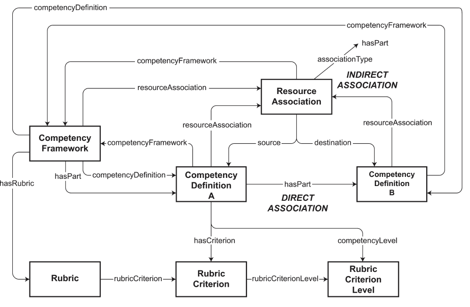

created-by:: [[IEEE/Committee/LTSC]]
date-created:: [[2023/07]] 
tags:: [[EdTech]], [[US/Gov/ADL/TLA]]

- # IEEE Standard for Learning Technology--Data Model for Shareable Competency Definitions
	- > Defined in this standard are a data model for describing, referencing, and sharing **competency definitions**, and **frameworks of competency definitions** and **rubrics** in the context of **online and distributed learning** and in employment and work.
	- > This standard provides a way to **formally represent the key characteristics of a competency definition**, independently of its use in any particular context. It enables **interoperability among learning systems** that deal with competency information by **providing a means for them to refer to common definitions with common meanings**.
	- 