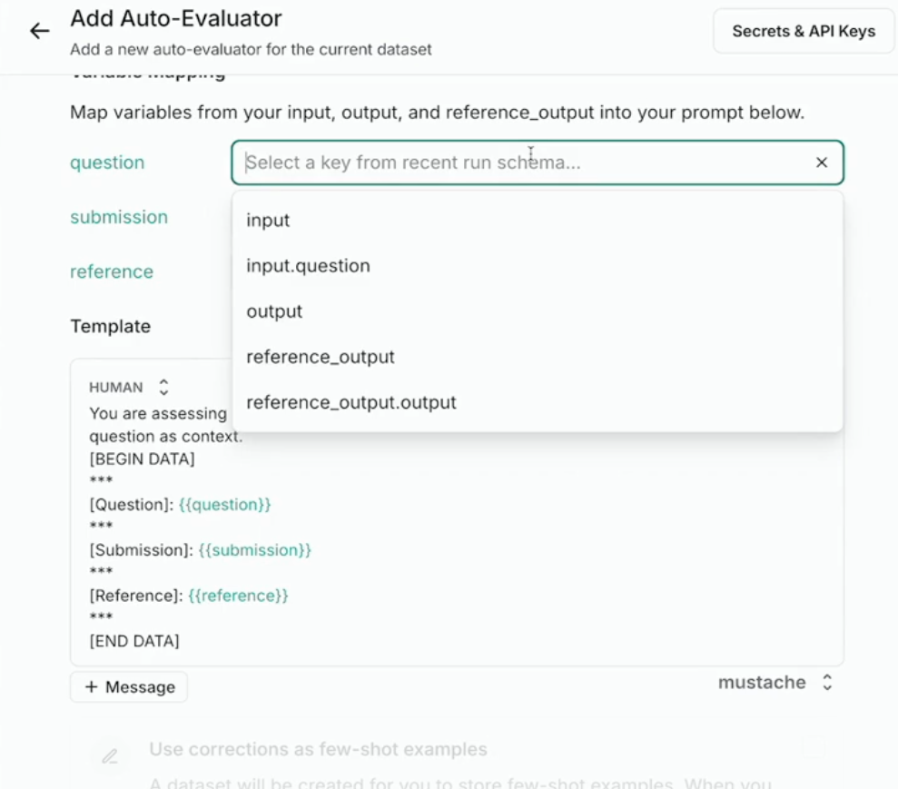

# [Introduction to LangSmith Lesson 2 - Evaluators](https://academy.langchain.com/courses/take/intro-to-langsmith/lessons/60775108-lesson-2-evaluators)
	- [[LangChain/GitHub/intro-to-langsmith/notebooks/module_2/evaluators.ipynb]]
		- [[LangSmith/Evaluator]]
			- 
			  id:: 67eebcfb-1b9b-471e-b62a-fb30be68e868
				- [[Key Idea]]: a specific input (`Input=x1`) is shared between a [[LangSmith/Dataset/Example]] and a [[langsmith/Run]], and that run is over a specific version of your application (`v1`). The input is tied to a [[LangSmith Reference Output]]. The Input, Reference Output, and output from the Run over a specific version are the input to a specific Evaluator, whose job it is to calculate metrics.
			- a very simple custom code evaluator that depends on `label`
				- ```python
				  from langsmith.schemas import Example, Run
				  
				  def correct_label(inputs: dict, reference_outputs: dict, outputs: dict) -> dict:
				    score = outputs.get("output") == reference_outputs.get("label")
				    return {"score": int(score), "key": "correct_label"}
				  ```
		- [[AI/Eval/LLM as Judge]]
			- #Example
				- comparing semantic similarity of LLM output and the reference input
					- ```python
					  class Similarity_Score(BaseModel):
					      similarity_score: int = Field(description="Semantic similarity score between 1 and 10, where 1 means unrelated and 10 means identical.")
					  ```
					- this will be the [[Structured Output]] for the llm that's evaluating
				- custom [[LangSmith/Evaluator/Offline]]
					- system prompt
						- You are a semantic similarity evaluator. Compare the meanings of two responses to a question, Reference Response and New Response, where the reference is the correct answer, and we are trying to judge if the new response is similar. Provide a score between 1 and 10, where 1 means completely unrelated, and 10 means identical in meaning.
					- ```python
					  # NOTE: This is our evaluator
					  def compare_semantic_similarity(inputs: dict, reference_outputs: dict, outputs: dict):
					      input_question = inputs["question"]
					      reference_response = reference_outputs["output"]
					      run_response = outputs["output"]
					      
					      completion = client.beta.chat.completions.parse(
					          model="gpt-4o",
					          messages=[
					              {   
					                  "role": "system",
					                  "content": (
					                      "You are a semantic similarity evaluator. Compare the meanings of two responses to a question, "
					                      "Reference Response and New Response, where the reference is the correct answer, and we are trying to judge if the new response is similar. "
					                      "Provide a score between 1 and 10, where 1 means completely unrelated, and 10 means identical in meaning."
					                  ),
					              },
					              {"role": "user", "content": f"Question: {input_question}\n Reference Response: {reference_response}\n Run Response: {run_response}"}
					          ],
					          response_format=Similarity_Score,
					      )
					  
					      similarity_score = completion.choices[0].message.parsed
					      return {"score": similarity_score.similarity_score, "key": "similarity"}
					  ```
					- example run
						- ```python
						  # From Dataset typed dict
						  inputs = {
						    "question": "Is LangSmith natively integrated with LangChain?"
						  }
						  reference_outputs = {
						    "output": "Yes, LangSmith is natively integrated with LangChain, as well as LangGraph."
						  }
						  
						  
						  # From Run typed dict... 
						  # PURPOSELY incorrect answer
						  outputs = {
						    "output": "No, LangSmith is NOT integrated with LangChain."
						  }
						  
						  similarity_score = compare_semantic_similarity(inputs, reference_outputs, outputs)
						  print(f"Semantic similarity score: {similarity_score}")
						  # should be low, i.e. 0, 1
						  ```
					- so this should produce
			- #Example 2 - this is an "older" method that you still see in docs, they DO NOT recommend this but instead recommend using the above
				- ```python
				  from langsmith.schemas import Run, Example
				  
				  def compare_semantic_similarity_v2(root_run: Run, example: Example):
				      input_question = example["inputs"]["question"]
				      reference_response = example["outputs"]["output"]
				      run_response = root_run["outputs"]["output"]
				      
				      completion = client.beta.chat.completions.parse(
				          model="gpt-4o",
				          messages=[
				              {   
				                  "role": "system",
				                  "content": (
				                      "You are a semantic similarity evaluator. Compare the meanings of two responses to a question, "
				                      "Reference Response and New Response, where the reference is the correct answer, and we are trying to judge if the new response is similar. "
				                      "Provide a score between 1 and 10, where 1 means completely unrelated, and 10 means identical in meaning."
				                  ),
				              },
				              {"role": "user", "content": f"Question: {input_question}\n Reference Response: {reference_response}\n Run Response: {run_response}"}
				          ],
				          response_format=Similarity_Score,
				      )
				  
				      similarity_score = completion.choices[0].message.parsed
				      return {"score": similarity_score.similarity_score, "key": "similarity"}
				    
				    sample_run = {
				    "name": "Sample Run",
				    "inputs": {
				      "question": "Is LangSmith natively integrated with LangChain?"
				    },
				    "outputs": {
				      "output": "No, LangSmith is NOT integrated with LangChain."
				    },
				    "is_root": True,
				    "status": "success",
				    "extra": {
				      "metadata": {
				        "key": "value"
				      }
				    }
				  }
				  
				  sample_example = {
				    "inputs": {
				      "question": "Is LangSmith natively integrated with LangChain?"
				    },
				    "outputs": {
				      "output": "Yes, LangSmith is natively integrated with LangChain, as well as LangGraph."
				    },
				    "metadata": {
				      "dataset_split": [
				        "AI generated",
				        "base"
				      ]
				    }
				  }
				  
				  similarity_score = compare_semantic_similarity_v2(sample_run, sample_example)
				  print(f"Semantic similarity score: {similarity_score}")
				  ```
	- 08:00 langsmith UI
		- 09:00 adding an evaluator to a [[LangSmith/Dataset]]
			- defining an [[LangSmith/Evaluator/Online/LLM as a Judge]]
				- You can configure model temperature here
				- they have a few [[Off-the-Shelf]] [[LangSmith/Evaluator/Auto]]
				- we have to put in the prompt here that's similar to the one we made above ... they are grading for similarity between the reference and submission
				- filling in the variables
					- 
						- `question` - `input.question`
						- `submission` - `output.output`
						- `reference` - `reference_output.output`
							- we don't know the shape of our outputs
				- output schema
					- we're again redefining the same `similarity_score` as above
		- 12:54 [[LangSmith/Evaluator/Custom Code]] using [[Py]]
			- this only has basic libraries
			- but you can test directly in the UI
				- ## Function
					- ~~~python
					  def perform_eval(run, example):
					    # run is a Run object
					    # example is an Example object
					  
					    # Example usages:
					    equals_str = run['outputs']['output'] == example['outputs']['output']
					  
					    # contains_str = 'expected_to_contain' in run['outputs']['my_key']
					  
					    # decoded_json = json.loads(run['outputs']['stringified_json_key'])
					  
					    score = 1
					    return { "feedback_key": equals_str }
					  ~~~
				- ## Input Run
					- 13:54 it's a bit confusing here if you don't quite know what's going on - the input here is bogus, but you can edit it and apparently you can get a result back right there in the UI
					- ~~~python
					  {
					    "name": "Sample Run",
					    "inputs": {
					        "input": "value"
					    },
					    "outputs": {
					        "output": "value"
					    },
					    "is_root": true,
					    "status": "success",
					    "extra": {
					        "metadata": {}
					    }
					  }
					  ~~~
				- ## Input Example
					- ~~~python
					  {
					    "inputs": {
					        "question": "What is LangSmith used for in three sentences?"
					    },
					    "outputs": {
					        "output": "LangSmith is a platform designed for the development, monitoring, and testing of LLM applications. It enables users to collect and analyze unstructured data, debug issues, and create datasets for testing and evaluation. The tool supports various workflows throughout the"
					    }
					  }
					  ~~~
				- ## Result
					- ~~~python
					  {
					    "feedback_key": False
					  }
					  ~~~
		- 14:05 [[Take-Away]]s
			- ## Takeaways
				- Evaluators calculate metrics based on a Run and an Example
					- Specifically, from the Input, Reference output, and Run Output
				- You can define Evaluators directly in your local code
				- You can ALSO define Evaluators in the LangSmith UI
					- LLM-as-judge evaluators
					- Custom code evaluators