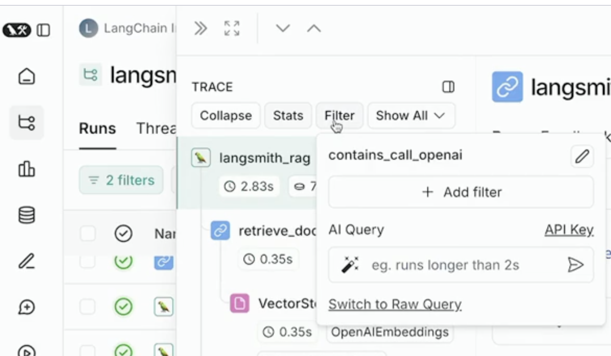

date-completed:: [[2025-02-19 Wed]]

- https://academy.langchain.com/courses/take/intro-to-langsmith/lessons/60775137-lesson-1-filtering
	- 8:17 You can filter within an individual [[LangSmith/Trace]]
		- 
	- [intro-to-langsmith/notebooks/module_5/filtering.ipynb at main · langchain-ai/intro-to-langsmith](https://github.com/langchain-ai/intro-to-langsmith/blob/main/notebooks/module_5/filtering.ipynb)
	- common [[LangSmith/Filter]]s
		- status = error (all runs with errors)
		- feedback score < x  (received bad feedback)
		- run_type = "LLM" and latency > X (slow LLM runs)
		- Metadata["ls_model_name"] = X (create a filter for metadata field)