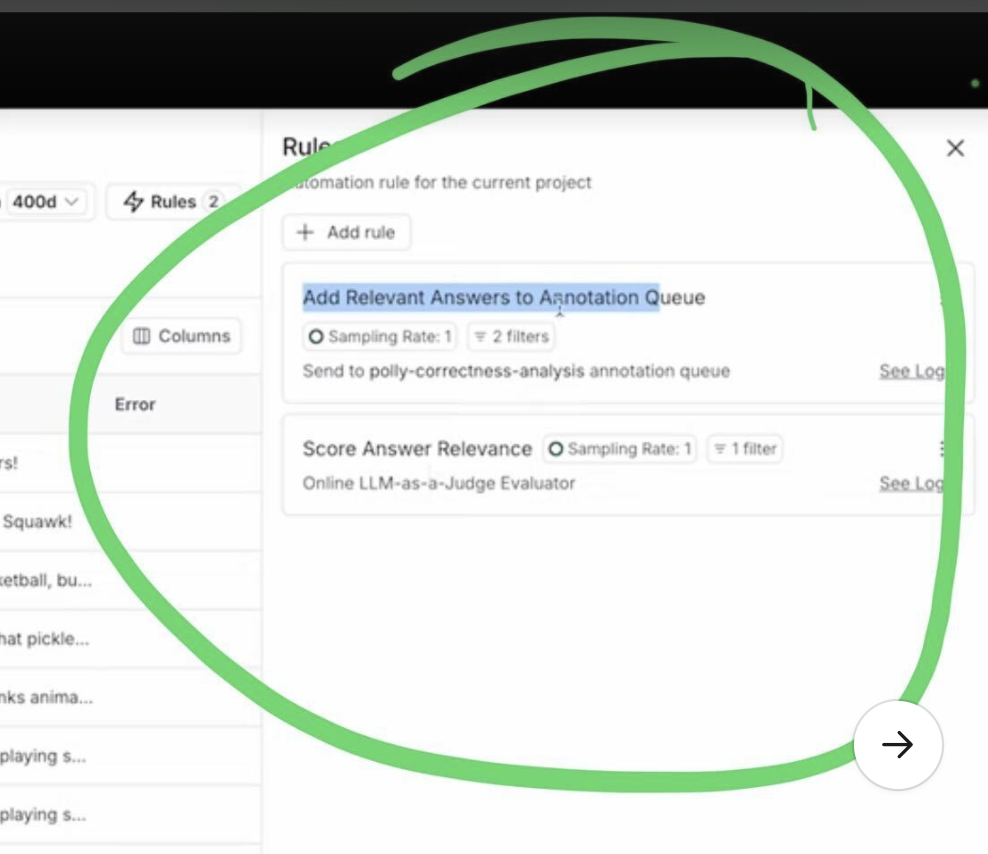

# DONE [Getting Started with LangSmith (6/7): Automations & Online Evaluation - YouTube](https://www.youtube.com/watch?v=xj2R3lBgihs)
	- notes
		- Contains examples of chaining automation rules with online evaluation
			- 
			- 
		- Example of you using structured output with LLM as a judge
			- 
		-
	- vid
		- {{video https://www.youtube.com/watch?v=xj2R3lBgihs}}
			- {{youtube-timestamp 0}} in this video we're going to talk about setting up automations in link Smith automations are executed live on traces as they come in from your application today we'll take a look at the different types of automations that we can set up
			- {{youtube-timestamp 14}} uh one of which is onlo evaluations cool first let's take a look at these two traces which I ran recently there are two questions that I asked to our parent named paully and we can see that for this one paully does a pretty
			- {{youtube-timestamp 29}} good job she likes playing soccer this was in her list of facts however for this one I asked do you like animals and paully actually says that she likes animal crackers this was kind of a tricky one on purpose paully has a fact
			- {{youtube-timestamp 41}} that says that she likes animal crackers and we can see in this case that she kind of uh hallucinates and doesn't really answer the right question Cool let's take a look at automations uh to do that we'll click on this rules
			- {{youtube-timestamp 56}} button in the upper right hand side and we can see two existing automations that I've already set up uh but let's go ahead and click add Rule and sort of walk through the different kinds of automations we can set up and how we can set them
			- {{youtube-timestamp 70}} up so first we can name our new automation rule then we want to set a series of run filters and the Run filters are applied to determine which runs in this table are actually applicable for this automation you can filter on a lot of different things uh a
			- {{youtube-timestamp 87}} common one might be status and maybe you only care about traces where status is Success uh so you can filter on that and the fact that it's a root run there's also this uh sliding bar that allows you to set the sampling rate
			- {{youtube-timestamp 102}} so for some automations you'll want to sample every time but for other more expensive ones such as L as a judge you might only want to sample for some subset of the automations and this basically just allows you to tweak
			- {{youtube-timestamp 115}} that we also have this button that allows you to apply this new rule onto past runs and so if I do toggle this on I just need to select a date to backfill from and it will start this rule automation at that date and uh apply it
			- {{youtube-timestamp 131}} there cool let's walk through our actions uh there are a few basic ones like we can automatically push a trace to an annotation queue and similarly we can automatically push a run to a data set we can also specify LM as a judge
			- {{youtube-timestamp 148}} evaluators or custom Cod evaluators to conduct online evaluation online evaluation uh like these automations is applied to your run at runtime live as it comes in and so this is a really great way to get feedback on your application immediately
			- {{youtube-timestamp 165}} uh whether through an llm or through a code evaluator setting up the evaluator looks very similar to what we did for offline evaluation we can uh use an off-the-shelf evaluator or we can create a prop from scratch and we just wire up
			- {{youtube-timestamp 179}} various components from our application to the actual prompt that we pass the llm the same thing goes for the custom code evaluator except in this case we only have access to the Run object uh and we can do different things like
			- {{youtube-timestamp 194}} check that particular part of your run matches and expected value cool you can also trigger web hooks from uh these automations a pretty common flow might be if you get a certain type of error you might want to trigger a web hook that will create a
			- {{youtube-timestamp 213}} Duro ticket or uh ping someone to take a closer look this is a great way uh to do that through automations cool we're not actually going to add a new automation here let's take a closer look at these two automations that I have set up one is
			- {{youtube-timestamp 231}} called score answer relevance and the other one is called add relevant answers to annotation que so the first uh evaluator here uses an llm as a judge online to score the relevance of the answer that we provided for the user's
			- ### examples of chaining automation rules with online evaluation
				- 
					- Score Answer Relevance adds relevance, then Add Relevant Answers to Annotation Queue adds only the highly scored Relevance traces to the queue
			- {{youtube-timestamp 248}} question the second one takes this feedback score and if it is high enough it will automatically push that run into an annotation CU for a human to look at this is pretty neat because these two evaluators are chained in a sense first
			- {{youtube-timestamp 263}} we need this online LM as a judge to give us a feedback score and then based on this feedback score we might add it to an annotation CU there's nothing special that we did here to allow them to be chained in this sense for our
			- {{youtube-timestamp 276}} evaluators that generate feedback Those runs with the new feedback are then run through these rules again to make sure that any uh rules that are triggered off of those SC pieces of feedback will fire cool let's take a closer look at
			- {{youtube-timestamp 292}} score answer relevance uh if I go into this rule edit it I can see it's an LM as judge evaluator and if I click into the pro I can see all that I've done is I've mapped in my input and output and I've asked the llm to return me a
			- {{youtube-timestamp 307}} structured output score of relevance uh this is going to be a number from 1 to 10 and so all of my answers are being scored uh from 1 to 10 on relevance as my sampling right here is one I can then take a look uh at my logs
			- {{youtube-timestamp 326}} for this particular Automation and I can see it recently ran on these two traces right here so for my question of do you like soccer the answer was quite relevant if I take a look at the Run um once again we can immediately see uh
			- {{youtube-timestamp 342}} that yes I like soccer is is pretty relevant however uh this other run here which we also just took a look at where we ask if it likes animals and paully says that she likes animal crackers is not super relevant and so this got a
			- {{youtube-timestamp 356}} feedback score of three note that this feedback that we get is available under the auto evaluator source and the key here is provided as well as the score in this feedback pain in the trace so you can always go back to the trace to see this
			- {{youtube-timestamp 372}} feedback cool now let's make sure that our Auto evaluate ref fired as our final step here if we navigate over to our annotation queue poly correctness analysis and we wait for it to load we can see that we did in fact get this do you like soccer
			- {{youtube-timestamp 390}} uh question here and now a human can come in evaluate it potentially edit it and then potentially add it to a data set thanks for following along