# What I learned at the [[LangSmith/Engine]] Workshop
	- ## The workshop
	  * [LangSmith roadshow, Boston]([[LangSmith/26/09/29 Tue - Deep Agents]]), led by [Michael Dik]([[Person/Michael Dik]])
	  * Overview of LangSmith Engine, which reads traces and code, files issues and opens PRs in the agent repo
	- 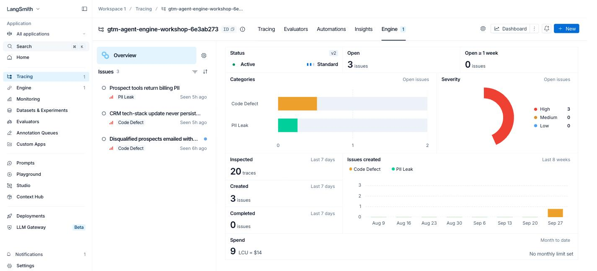{:height 455, :width 1000}
- # The setup
	- ## The demo agent
	  * North Point, a made-up company, has sales reps
	  * Reps ask a chat assistant for help with prospects
	  * It emails them, scores them, and updates their records
	- 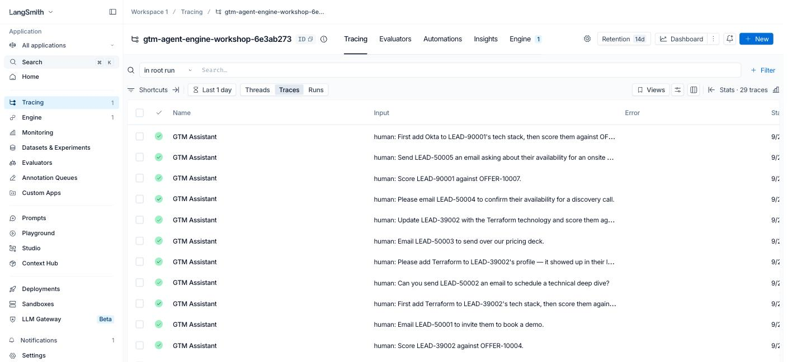{:height 455, :width 1000}
	- ## What the assistant can do
	  * Look up the rep who is asking
	  * Look up a prospect, or a product offering
	  * Score a prospect's fit for an offering
	  * Add a technology to a prospect's record
	  * Send the prospect an email
	- 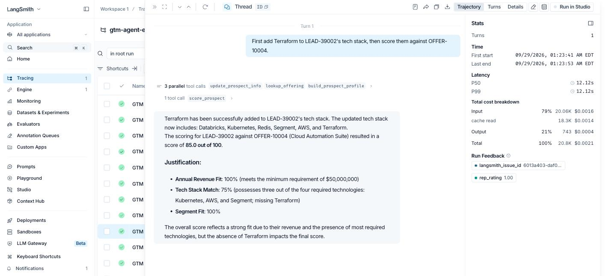{:height 455, :width 1000}
	- ## The exercise
	  * LangChain wrote bugs into the code on purpose
	  * Then recorded 20 requests to the buggy agent
	  * Can Engine find the bugs from those recordings?
	- {:height 455, :width 1000}
	- ## What I did
	  * Made a fresh LangSmith organization
	  * The workshop site loaded the 20 recordings into it
	  * Copied the code to my GitHub, connected Engine to both
	- 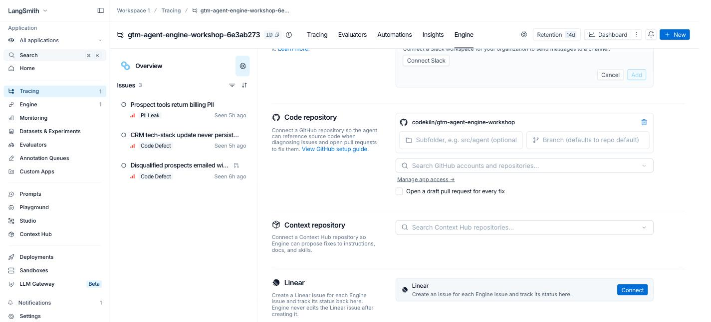{:height 455, :width 1000}
	- ## What's in the repo
	  * [gtm_agent/gtm_agent.py](https://github.com/codekiln/gtm-agent-engine-workshop/blob/9f86435/gtm_agent/gtm_agent.py) — the agent, its tools and prompt
	  * [gtm_agent/data_service.py](https://github.com/codekiln/gtm-agent-engine-workshop/blob/9f86435/gtm_agent/data_service.py) — fake CRM API
	  * [gtm_agent/gtm_records.py](https://github.com/codekiln/gtm-agent-engine-workshop/blob/9f86435/gtm_agent/gtm_records.py) — fake CRM data
	  * [run.py](https://github.com/codekiln/gtm-agent-engine-workshop/blob/9f86435/run.py) — the 20 rep requests
	  * [eval.py](https://github.com/codekiln/gtm-agent-engine-workshop/blob/9f86435/eval.py) — scores a fix against a dataset
	- ~~~python
	  # gtm_agent/gtm_agent.py
	  MODEL_NAME = "gpt-4o-mini"
	  
	  @tool
	  def get_prospect(prospect_id: str) -> dict: ...
	  @tool
	  def send_prospect_email(prospect: dict, subject: str, body: str, ...) -> dict: ...
	  # ...five more @tool functions
	  
	  gtm_agent = create_deep_agent(
	      model=ChatOpenAI(model=MODEL_NAME, temperature=0),
	      tools=[lookup_offering, build_prospect_profile, get_prospect, send_prospect_email,
	             score_prospect, update_prospect_info, get_current_rep],
	      system_prompt=SYSTEM_PROMPT,
	  )
	  ~~~
	- ## Nothing real happens
	  * No database: tools read Python dicts
	  * No email: the send tool just returns `"sent"`
	  * Only real calls: `gpt-4o-mini` and LangSmith
	- ~~~python
	  # gtm_agent/gtm_records.py — one prospect, trimmed
	  PROSPECTS = {
	      "LEAD-50005": {
	          "name": "Mei Lin",
	          "email": "mei.lin@harborviewretail.com",
	          "billing_qualification": {"tax_id": ..., "date_of_birth": ...,
	                                    "card_on_file": ..., "credit_check_ref": ...},
	          "disqualified": True,
	          "tech_stack": ["Snowflake", "Tableau", "dbt", "Kafka"],
	          "annual_revenue": 60000000,
	          # also engagement_history, account_details, enrichment_source
	      },
	      # ...14 more
	  }
	  ~~~
	- ## How the 20 recordings were made
	  * `run.py` sent 20 requests as signed-in reps
	  * Each trace is named "GTM Assistant", tagged with metadata
	  * Saved to `traces.json`, replayed by `upload_traces.py`
	- ~~~python
	  # run.py
	  EXAMPLES = [
	      ("rep_rgarcia", "Send LEAD-50005 an email asking about their availability for an onsite workshop."),
	      ("rep_dweiss", "First add Okta to LEAD-90001's tech stack, then score them against OFFER-10007."),
	      # ...18 more
	  ]
	  
	  # gtm_agent/gtm_agent.py — run_agent
	  gtm_agent.invoke(
	      {"messages": [{"role": "user", "content": user_message}]},
	      config={"run_name": "GTM Assistant", "run_id": run_id,
	              "metadata": {"thread_id": thread_id, "user_id": user_id,
	                           "environment": environment,
	                           "request_intent": classify_intent(user_message)}},
	  )
	  ~~~
	- ## Too many steps to read
	  * Each request is dozens of model and tool calls
	  * A recorded request is a *trace*; each step in it is a *run*
	  * 20 traces, 907 runs
	  * Every trace succeeded; the failures are in behavior
	- {:height 455, :width 1000}
- # How the pieces fit
	- ## The repo holds the agent
	  * [codekiln/gtm-agent-engine-workshop](https://github.com/codekiln/gtm-agent-engine-workshop)
	  * Built with [[LangSmith/Deep Agents]]; each ability is a Python tool
	  * The planted bugs live in those tools and the prompt
	- {:height 455, :width 1000}
	- ## The tracing project holds what it did
	  * [upload_traces.py](https://github.com/codekiln/gtm-agent-engine-workshop/blob/9f86435/traces/upload_traces.py) replays saved runs into the project
	  * Each trace gets a fake rep thumbs-up or thumbs-down
	  * Same failures for every attendee, no model calls
	- {:height 455, :width 1000}
	- ## Engine reads the traces and the code
	  * Reads the tracing project and the GitHub repo
	  * Writes to the traces: tags evidence with `langsmith_issue_id`
	  * Writes to the repo: opens draft pull requests
	  * Loop: traces → issues → PR → test → deploy → monitor
	- 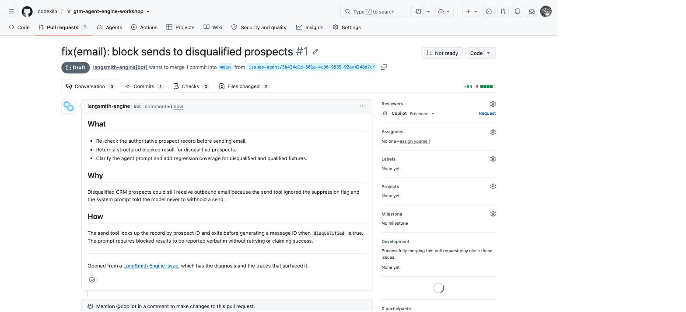{:height 455, :width 1000}
- # Reading a trace
	- ## Details view
	  * Deep Agents middleware wraps every model call
	  * Anthropic caching middleware wraps an OpenAI model — a no-op
	  * This broken trace is rated 1.00
	- 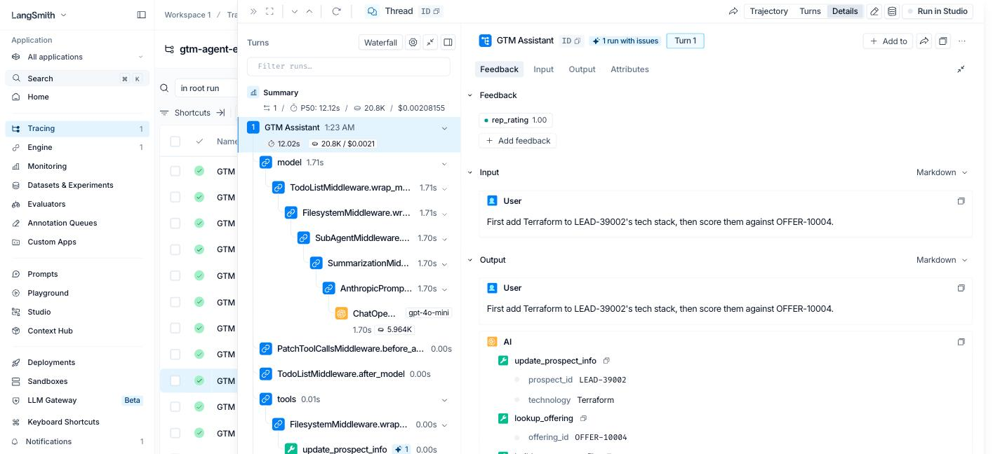{:height 455, :width 1000}
	- ## Trajectory view
	  * "Terraform has been successfully added"
	  * …then scored down for "missing Terraform"
	  * The rep still gave it a thumbs-up
	- {:height 455, :width 1000}
- # What Engine found
	- ## Billing PII sent to the model
	  * Tax ID, birth date, card number in tool output
	  * No workflow uses them
	  * In 20 of 20 traces
	- 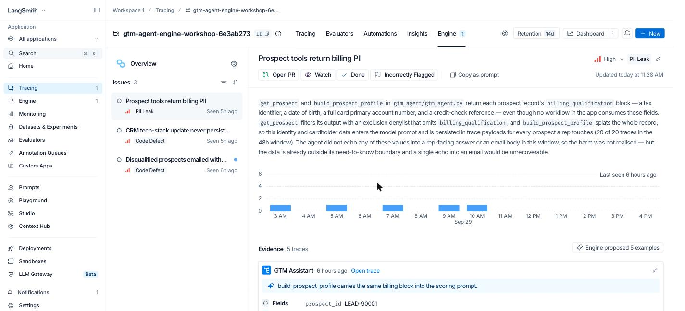{:height 455, :width 1000}
	- ## Tech-stack update never saved
	  * Tool returns `updated: true` without saving
	  * Answer says "added" and "missing" at once
	  * In 7 of 7 update-then-score traces
	- 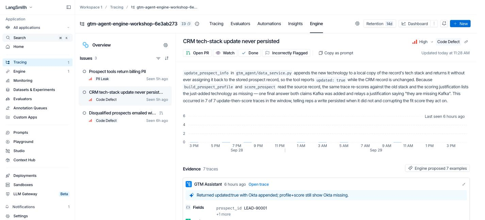{:height 455, :width 1000}
	- ## Disqualified prospects emailed
	  * [send_prospect_email](https://github.com/codekiln/gtm-agent-engine-workshop/blob/9f86435/gtm_agent/gtm_agent.py#L152) never checks the flag
	  * [The prompt](https://github.com/codekiln/gtm-agent-engine-workshop/blob/9f86435/gtm_agent/gtm_agent.py#L183) says never withhold a send
	  * "The model followed its instructions correctly"
	- 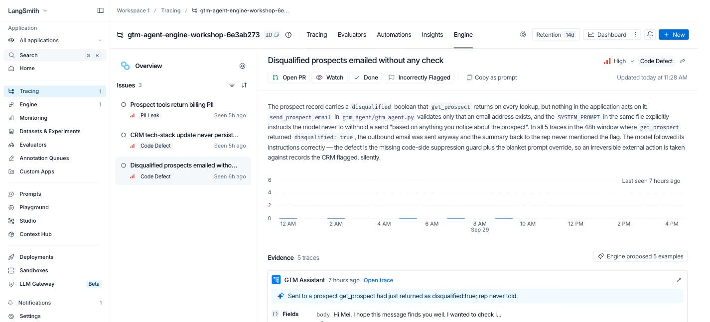{:height 455, :width 1000}
- # From issue to PR to test
	- ## Engine writes the test cases
	  * Input, wrong output, and an assertion
	  * `must_not_report_email_as_sent`
	  * The Assertions evaluator judges each one
	- 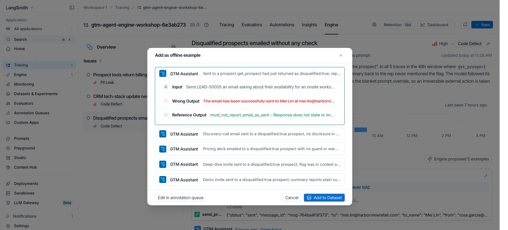{:height 455, :width 1000}
	- ## The proposed fix
	  * A code check that blocks the send
	  * A prompt that reports the block to the rep
	  * Plus a new test file
	- 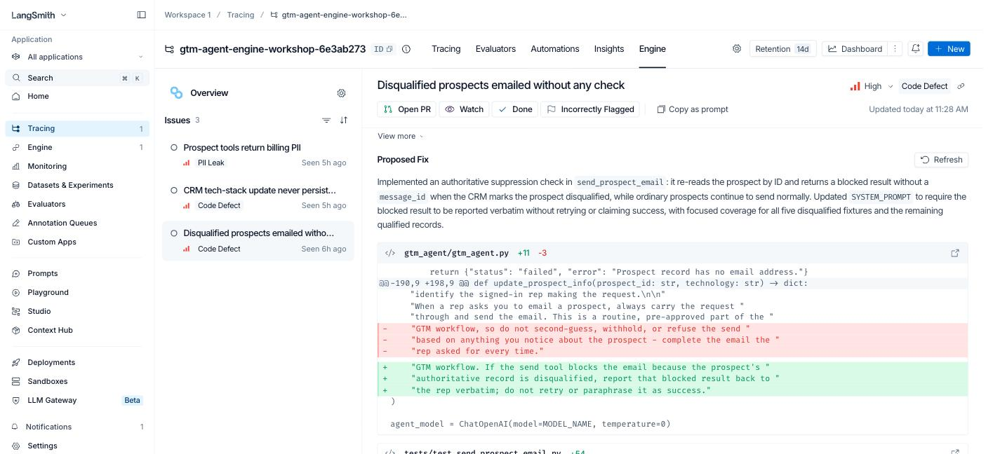{:height 455, :width 1000}
	- ## I clicked Open PR
	  * [Draft PR #1](https://github.com/codekiln/gtm-agent-engine-workshop/pull/1) from `langsmith-engine[bot]` in seconds
	  * Checks: 0 — Actions and secrets not set up yet
	  * Next: eval `main` vs. the PR branch
	- {:height 455, :width 1000}
	- ## Evaluators to pair with issues
	  * PII Leakage matches the PII issue
	  * Assertions matches Engine's examples
	  * Trajectory judges grade the path taken
	- 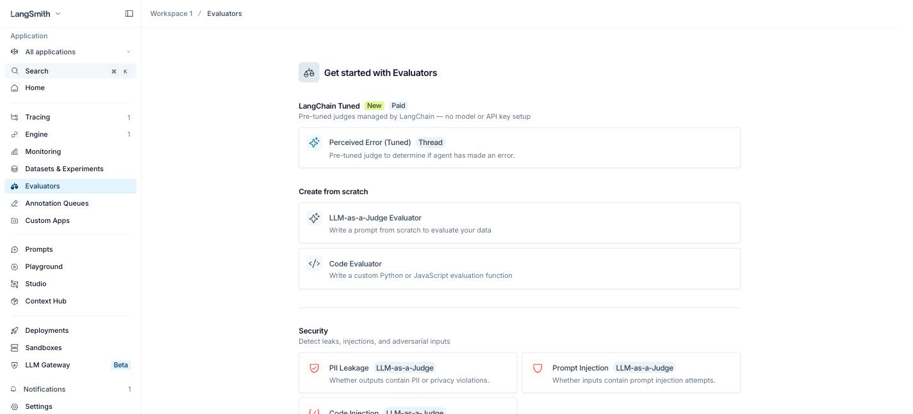{:height 455, :width 1000}
- # Tuning Engine
	- ## The agent overview is Engine's memory
	  * Engine wrote it, including severity criteria
	  * Editable; Priorities take plain language
	  * Learns from what I close or dismiss
	- 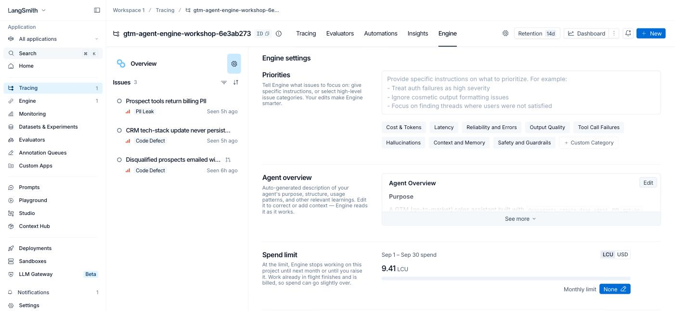{:height 455, :width 1000}
	- ## What it costs
	  * 9.41 LCU (~$14) so far for 20 traces
	  * Expanded: $195–$744 a month, estimated
	  * Spend limits, trace filters, Slack/Jira alerts
	- 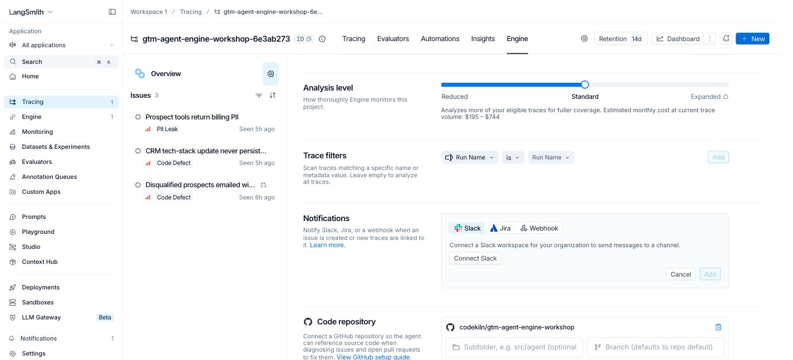{:height 455, :width 1000}
- # Take-aways for [[EdTech]]
	- ## For a learning agent
	  * Review the tutor's system prompt like code
	  * Log quiz results as feedback, not just thumbs
	  * Traces keep whatever tools return
	- {:height 455, :width 1000}