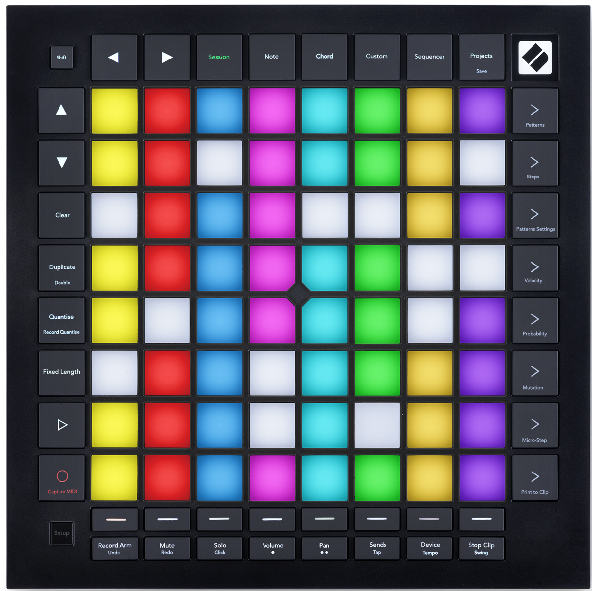
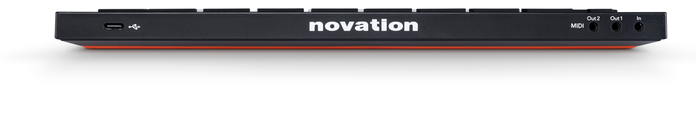

logseq-entity:: [[Logseq/Entity/Book/Section/Level 1]]
up:: [[Launchpad/Pro Mk3 User Guide]]
prev:: [[Launchpad/Pro Mk3 User Guide/02 Getting Up and Running]]
next:: [[Launchpad/Pro Mk3 User Guide/04 Launchpad Pro Interface]]
- # 3. Hardware Overview
	- **Top controls**
		- Shift opens the secondary functions printed on buttons.
		- Navigation buttons move through views.
		- Session, Note, Chord, Custom, and Sequencer choose operating modes; Projects opens saved sequencer projects.
	- **Performance controls**
		- The 8×8 pad grid plays notes, launches clips, and edits sequences according to the active mode.
		- Scene Launch and Sequencer buttons line the grid's right edge; track select and Ableton track controls sit below the grid.
		- Play and Record/Capture MIDI sit to the left; Setup opens device settings.
	- **Connections**
		- USB-C supplies power and connects a computer.
		- TRS minijacks provide MIDI In, Out 1, and Out 2/Thru.
	- Launchpad Pro top panel
		- 
	- Launchpad Pro rear connections
		- 
