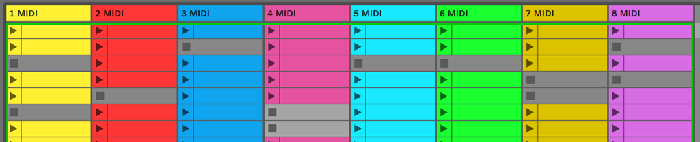
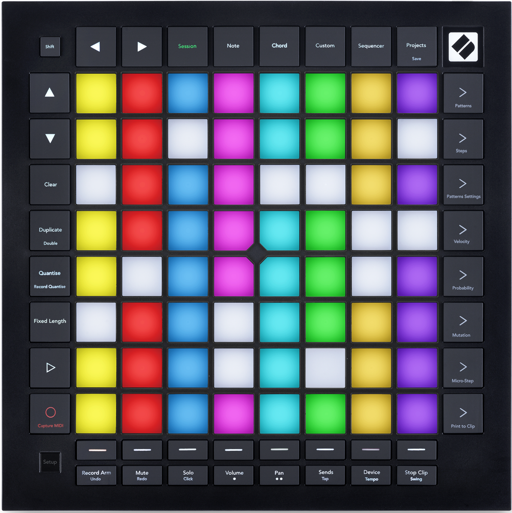

logseq-entity:: [[Logseq/Entity/Book/Section/Level 2]]
up:: [[Launchpad/Pro Mk3 User Guide/05 Session Mode]]
next:: [[Launchpad/Pro Mk3 User Guide/05 Session Mode/02 Session Overview]]
- # 5.1 Ableton Live’s Session View
	- Session View arranges clips in tracks (columns) and scenes (rows). A clip usually contains looping MIDI or audio. A track hosts an instrument or audio, and a scene launches the clips across its row.
	- Use the arrow buttons to move the visible 8 × 8 window through the Live set. Live outlines the window currently shown on Launchpad Pro.
	- Press a clip pad to launch it. Its color matches Live. A queued clip flashes green; a playing clip pulses green. Each track plays one clip at a time, and launching an empty slot stops its playing clip. Use the scene launch buttons at the right to launch a row.
	- 5.1.B — Session View in Live and on the Launchpad grid
		- 
		- 
	- For an armed track, Session Record overdubs the playing clip. Shift + Session Record calls Capture MIDI, which retrieves recently played notes from armed or input-monitored tracks into a new clip or overdubs the playing clip.
	- Play starts the active clips; pressing Play during playback stops playback.
