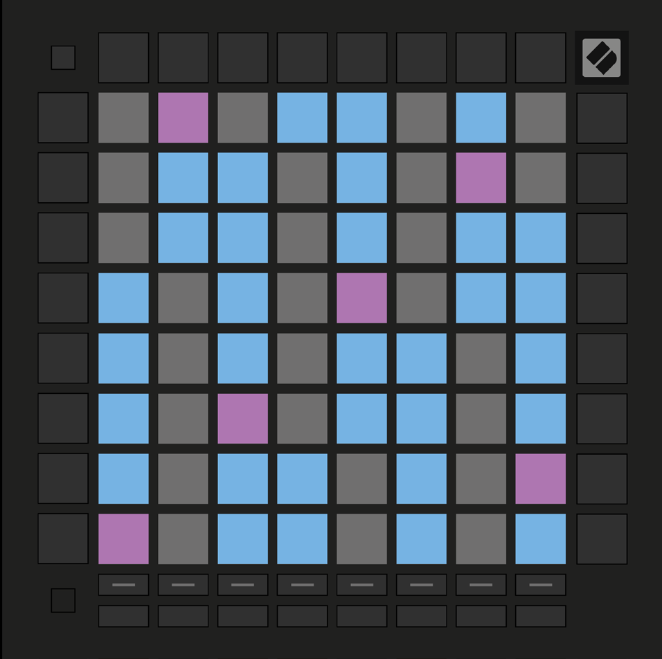

logseq-entity:: [[Logseq/Entity/Book/Section/Level 2]]
up:: [[Launchpad/Pro Mk3 User Guide/06 Note Mode]]
prev:: [[Launchpad/Pro Mk3 User Guide/06 Note Mode/01 Overview]]
next:: [[Launchpad/Pro Mk3 User Guide/06 Note Mode/03 Scale Mode]]
- # 6.2 Chromatic Mode
	- Chromatic Mode is the default melodic layout and makes every semitone playable. Blue pads are notes in the chosen scale, purple pads are roots, and unlit pads are outside the scale.
	- With the default five-finger overlap, an octave lies two pads up and two pads right. The sixth column repeats the first column of the row above, allowing guitar-like shapes.
	- 6.2.A — Chromatic layout with five-finger overlap
		- 
	- Change the layout in [[Launchpad/Pro Mk3 User Guide/06 Note Mode/04 Note Mode Settings]].
