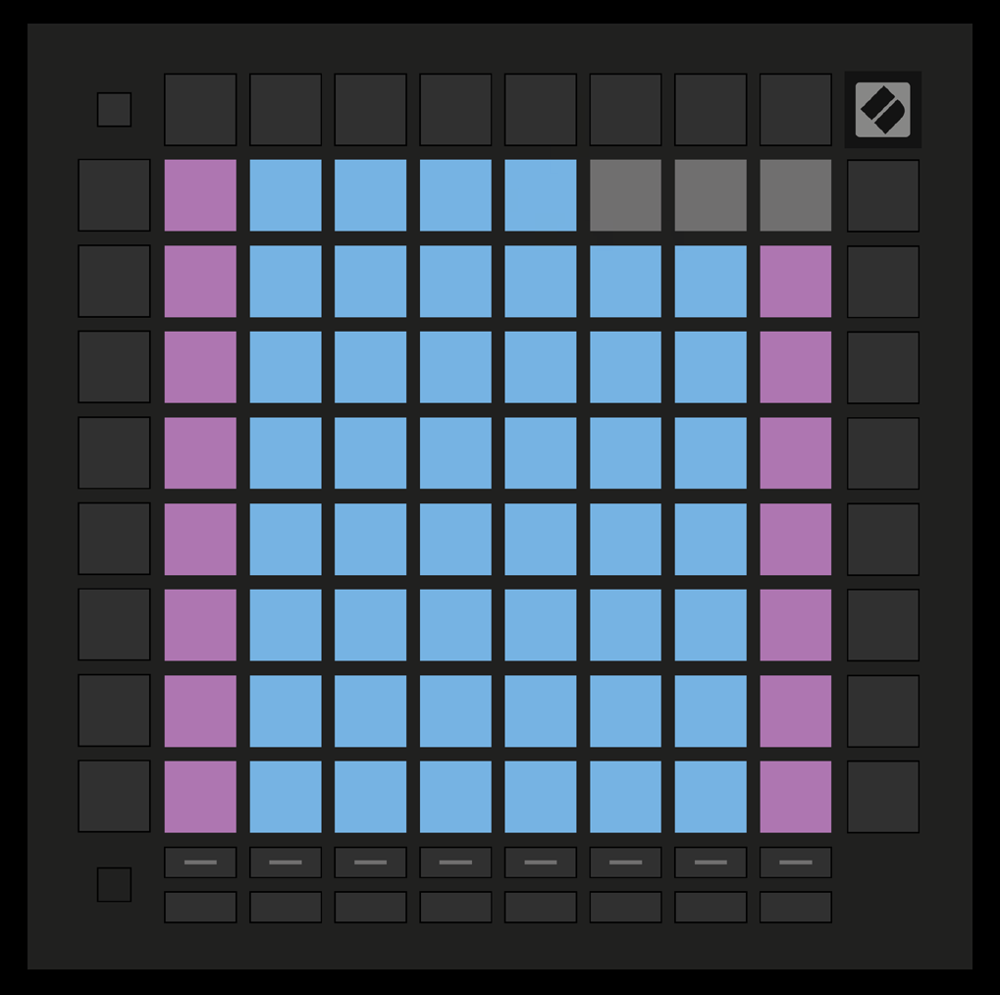

logseq-entity:: [[Logseq/Entity/Book/Section/Level 2]]
up:: [[Launchpad/Pro Mk3 User Guide/06 Note Mode]]
prev:: [[Launchpad/Pro Mk3 User Guide/06 Note Mode/02 Chromatic Mode]]
next:: [[Launchpad/Pro Mk3 User Guide/06 Note Mode/04 Note Mode Settings]]
- # 6.3 Scale Mode
	- Only notes in the chosen scale appear as playable pads. Blue pads mark scale notes, purple marks the root, and unlit pads are beyond the playable range.
	- 6.3.A — Scale layout with sequential overlap
		- 
	- Change the layout in [[Launchpad/Pro Mk3 User Guide/06 Note Mode/04 Note Mode Settings]].
