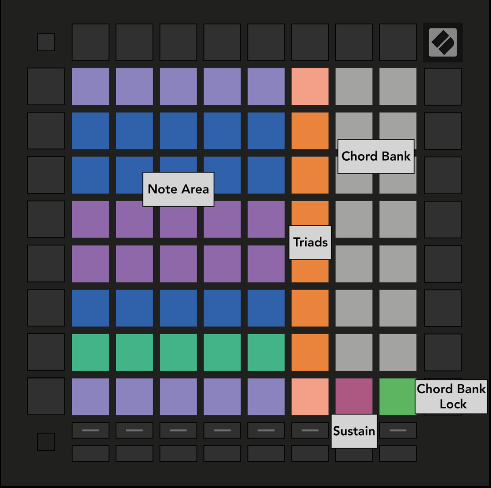

logseq-entity:: [[Logseq/Entity/Book/Section/Level 2]]
up:: [[Launchpad/Pro Mk3 User Guide/07 Chord Mode]]
next:: [[Launchpad/Pro Mk3 User Guide/07 Chord Mode/02 Triads]]
- # 7.1 Overview
	- The Chord layout divides the grid into a Note Area, an orange triad column, and a white Chord Bank. Sustain and Chord Bank Lock sit along the lower edge.
	- 7.1.A — Chord Mode layout
		- 
