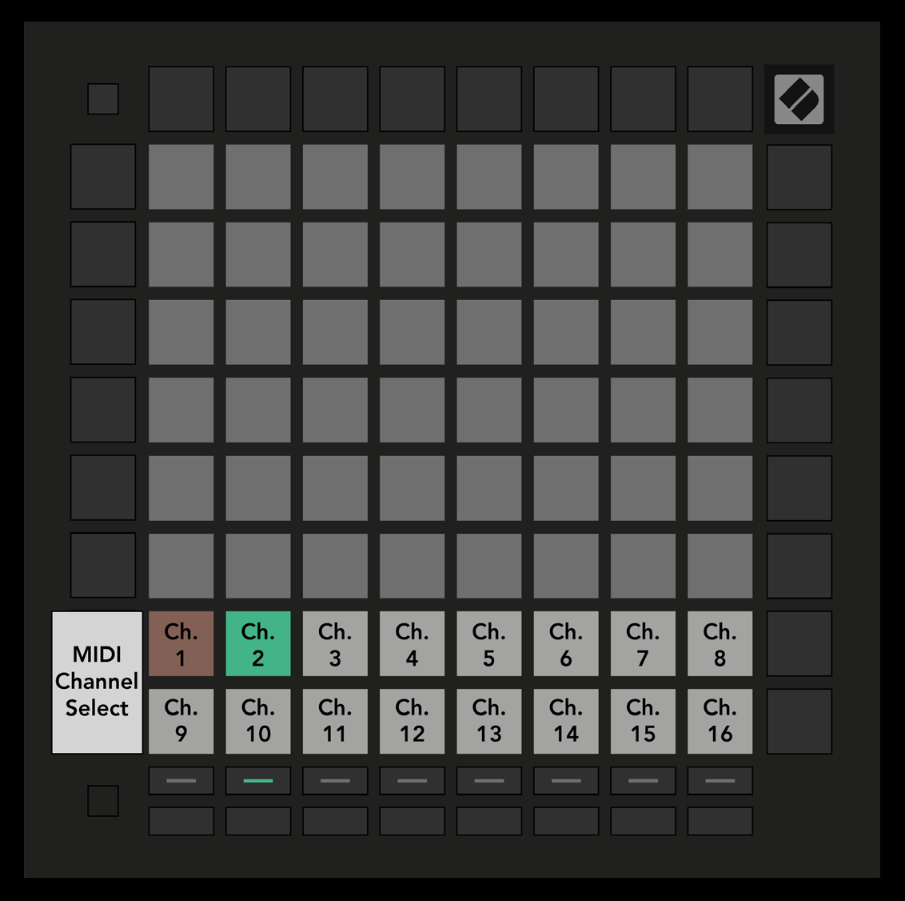

logseq-entity:: [[Logseq/Entity/Book/Section/Level 2]]
up:: [[Launchpad/Pro Mk3 User Guide/08 Custom Modes]]
prev:: [[Launchpad/Pro Mk3 User Guide/08 Custom Modes/02 Default Custom Modes]]
next:: [[Launchpad/Pro Mk3 User Guide/08 Custom Modes/04 Set Up a Custom Mode]]
- # 8.3 Custom Mode Master MIDI Channel
	- Hold Shift and press Custom. The bottom two rows show MIDI channels 1–16 for the selected mode. Each Custom Mode has its own Master Channel.
	- Select a mode with Track Select, then press its desired channel pad. The active mode and its channel glow green; channels stored for inactive modes show dim red.
	- 8.3.A — Selecting a Custom Mode Master Channel
		- 
