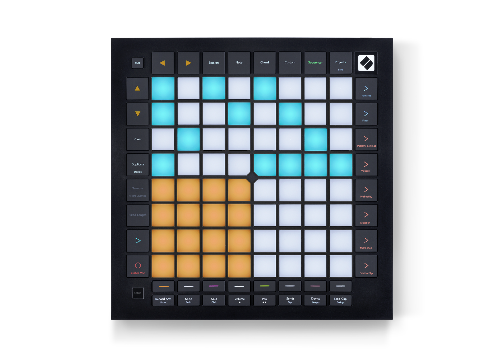

logseq-entity:: [[Logseq/Entity/Book/Section/Level 2]]
up:: [[Launchpad/Pro Mk3 User Guide/09 Sequencer]]
prev:: [[Launchpad/Pro Mk3 User Guide/09 Sequencer/01 Overview]]
next:: [[Launchpad/Pro Mk3 User Guide/09 Sequencer/03 Patterns View]]
- # 9.2 Steps View
	- The top half of the grid shows a pattern’s 32 steps. Press Play to start the white playhead at the beginning; press Play again to stop it.
	- The bottom half is the Play Area, where pads play notes.
	- Steps View layout
		- 
	- {{embed [[Launchpad/Pro Mk3 User Guide/09 Sequencer/02 Steps View/01 Play Area]]}}
	- {{embed [[Launchpad/Pro Mk3 User Guide/09 Sequencer/02 Steps View/02 Assign Notes]]}}
	- {{embed [[Launchpad/Pro Mk3 User Guide/09 Sequencer/02 Steps View/03 Clear Steps]]}}
	- {{embed [[Launchpad/Pro Mk3 User Guide/09 Sequencer/02 Steps View/04 Duplicate Steps]]}}
	- {{embed [[Launchpad/Pro Mk3 User Guide/09 Sequencer/02 Steps View/05 Playback]]}}
	- {{embed [[Launchpad/Pro Mk3 User Guide/09 Sequencer/02 Steps View/06 Record]]}}
	- {{embed [[Launchpad/Pro Mk3 User Guide/09 Sequencer/02 Steps View/07 Gate Length]]}}
	- {{embed [[Launchpad/Pro Mk3 User Guide/09 Sequencer/02 Steps View/08 Tracks]]}}
	- {{embed [[Launchpad/Pro Mk3 User Guide/09 Sequencer/02 Steps View/09 Ableton Live]]}}
