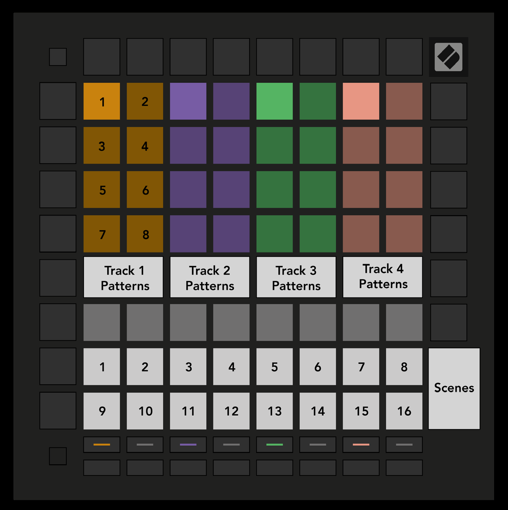

logseq-entity:: [[Logseq/Entity/Book/Section/Level 2]]
up:: [[Launchpad/Pro Mk3 User Guide/09 Sequencer]]
prev:: [[Launchpad/Pro Mk3 User Guide/09 Sequencer/02 Steps View]]
next:: [[Launchpad/Pro Mk3 User Guide/09 Sequencer/04 Scenes]]
- # 9.3 Patterns View
	- A Pattern is a 32-step sequence. Each track has eight Patterns per project. Open Patterns View to see them; the playing Pattern pulses and is the one displayed in Steps View.
	- Patterns View
		- 
	- {{embed [[Launchpad/Pro Mk3 User Guide/09 Sequencer/03 Patterns View/01 Chain]]}}
	- {{embed [[Launchpad/Pro Mk3 User Guide/09 Sequencer/03 Patterns View/02 Queue]]}}
	- {{embed [[Launchpad/Pro Mk3 User Guide/09 Sequencer/03 Patterns View/03 Clear]]}}
	- {{embed [[Launchpad/Pro Mk3 User Guide/09 Sequencer/03 Patterns View/04 Duplicate]]}}
	- {{embed [[Launchpad/Pro Mk3 User Guide/09 Sequencer/03 Patterns View/05 Instant Change]]}}
