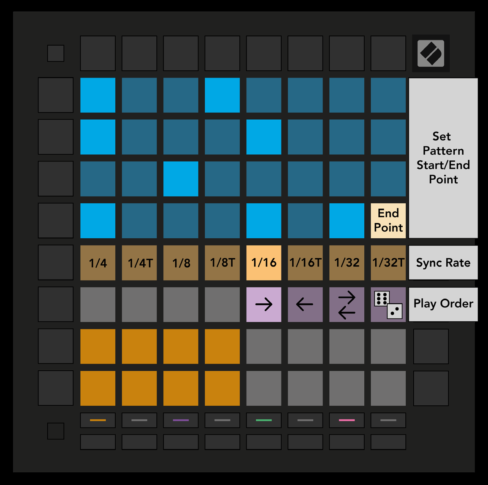

logseq-entity:: [[Logseq/Entity/Book/Section/Level 2]]
up:: [[Launchpad/Pro Mk3 User Guide/09 Sequencer]]
prev:: [[Launchpad/Pro Mk3 User Guide/09 Sequencer/04 Scenes]]
- # 9.5 Pattern Settings
	- Pattern Settings changes how steps play in the current Pattern. The top half of the Play Area becomes playback settings while this view is selected.
	- Pattern Settings view
		- 
	- {{embed [[Launchpad/Pro Mk3 User Guide/09 Sequencer/05 Pattern Settings/01 Sync Rate]]}}
	- {{embed [[Launchpad/Pro Mk3 User Guide/09 Sequencer/05 Pattern Settings/02 Direction]]}}
	- {{embed [[Launchpad/Pro Mk3 User Guide/09 Sequencer/05 Pattern Settings/03 Start End]]}}
