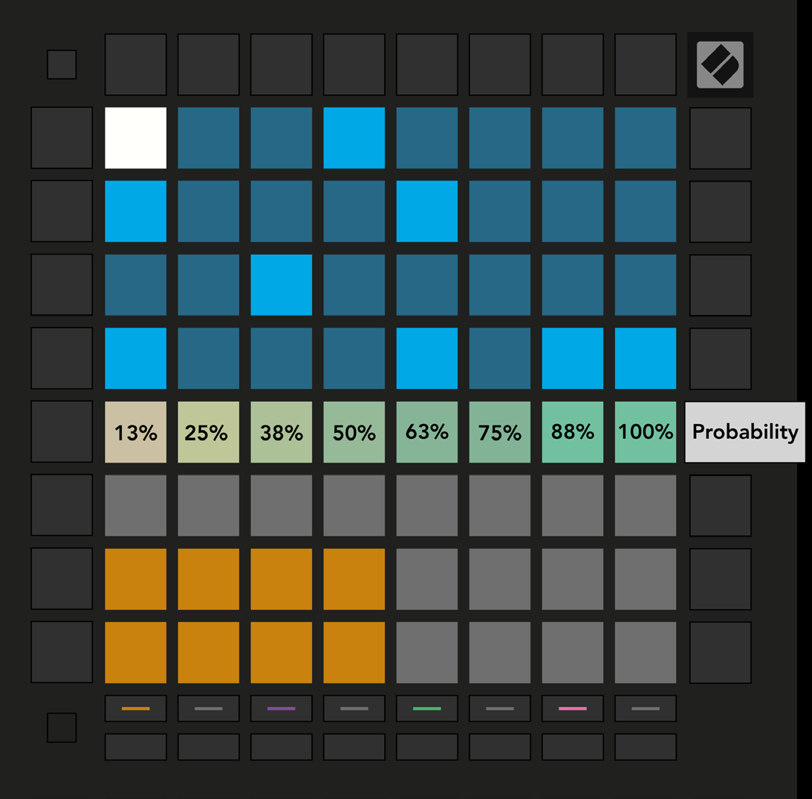

logseq-entity:: [[Logseq/Entity/Book/Section/Level 3]]
up:: [[Launchpad/Pro Mk3 User Guide/09 Sequencer/07 Probability]]
next:: [[Launchpad/Pro Mk3 User Guide/09 Sequencer/07 Probability/02 Print]]
- # 9.7.1 Editing Step Probability
	- Press Probability, then select a step in the top half of the grid. The top row of the Play Area shows the selected step’s probability on an eight-pad slider.
	- The pads, from left to right, set the chance of a note playing to 13%, 25%, 38%, 50%, 63%, 75%, 88%, or 100%.
	- Every note on a step shares one probability setting, but each note is evaluated independently. At 50%, a two-note step may play both notes, one note, or neither.
	- Assigned or recorded notes default to 100%. Clearing a step, Pattern, or Project also resets its probability to 100%.
	- Probability view
		- 
