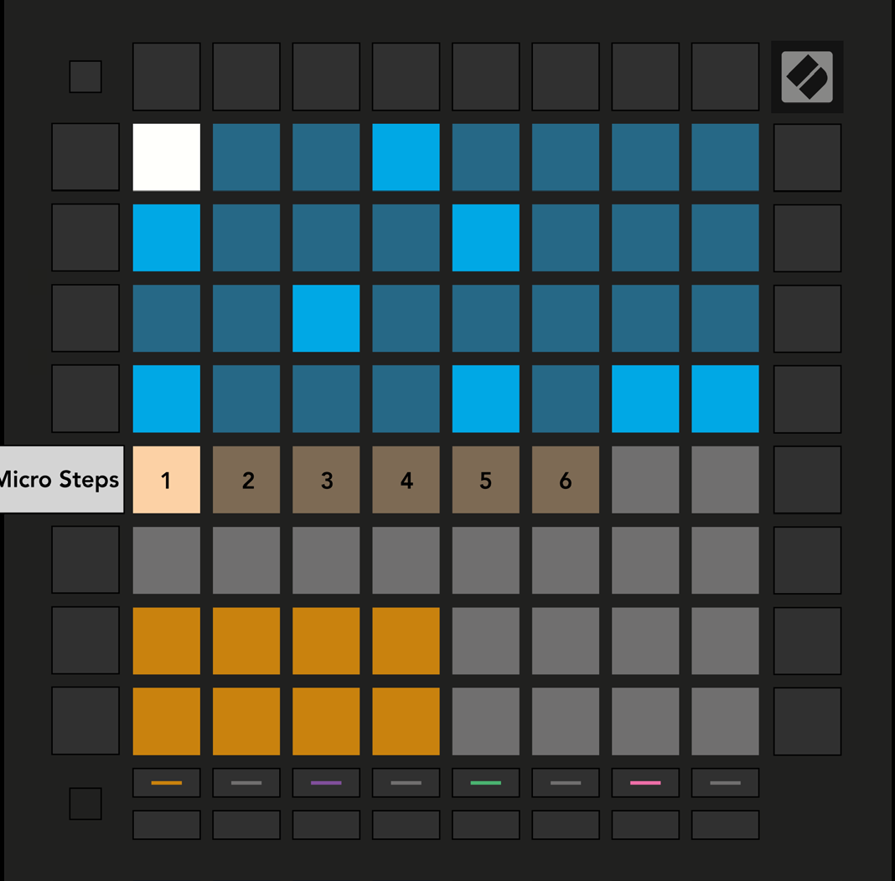

logseq-entity:: [[Logseq/Entity/Book/Section/Level 3]]
up:: [[Launchpad/Pro Mk3 User Guide/09 Sequencer/09 Micro Steps]]
next:: [[Launchpad/Pro Mk3 User Guide/09 Sequencer/09 Micro Steps/02 Clear]]
- # 9.9.1 Editing Micro Steps
	- Press Micro Steps and select a step in the top half of the grid. The six leftmost pads of the Play Area’s top row represent that step’s Micro Steps.
	- Hold a note in the Play Area and press a Micro Step to assign it. To remove a note, hold its Micro Step and press the assigned red note in the Play Area.
	- Micro Step editing view
		- 
