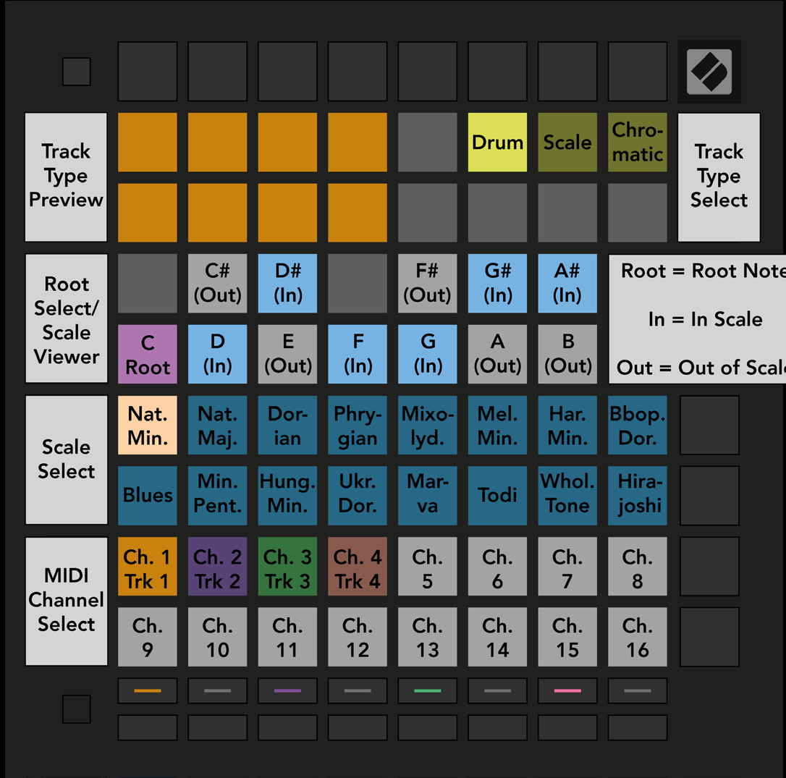

logseq-entity:: [[Logseq/Entity/Book/Section/Level 3]]
up:: [[Launchpad/Pro Mk3 User Guide/09 Sequencer/13 Settings]]
next:: [[Launchpad/Pro Mk3 User Guide/09 Sequencer/13 Settings/02 Track Types]]
- # 9.13.1 Accessing Sequencer Settings
	- Hold Shift and press Sequencer to open Sequencer Settings.
	- Sequencer Settings view
		- 
