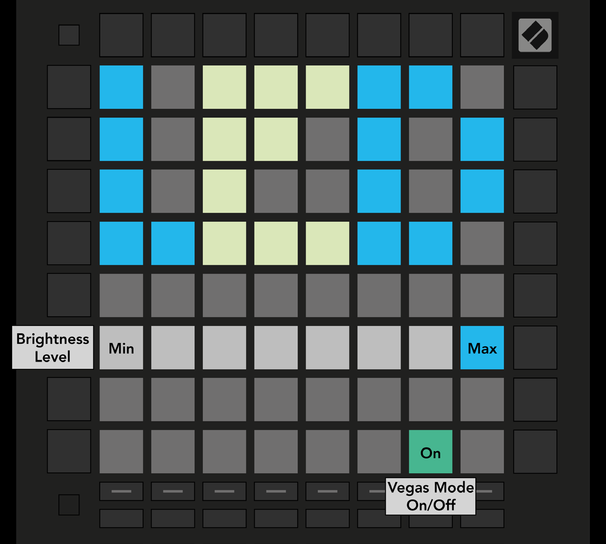

logseq-entity:: [[Logseq/Entity/Book/Section/Level 2]]
up:: [[Launchpad/Pro Mk3 User Guide/10 Setup]]
prev:: [[Launchpad/Pro Mk3 User Guide/10 Setup/01 Setup Menu]]
next:: [[Launchpad/Pro Mk3 User Guide/10 Setup/03 Velocity Settings]]
- # 10.2 LED Settings
	- Press the first Track Select button. Choose among eight brightness levels; the bright white pad marks the active level.
	- Vegas Mode starts after five minutes without activity. Its toggle is green when enabled and red when disabled.
	- 10.2.A — LED Settings view
		- 
