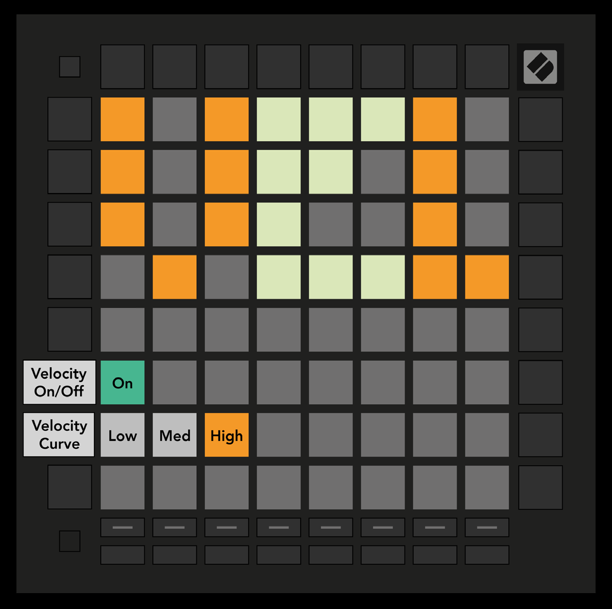

logseq-entity:: [[Logseq/Entity/Book/Section/Level 2]]
up:: [[Launchpad/Pro Mk3 User Guide/10 Setup]]
prev:: [[Launchpad/Pro Mk3 User Guide/10 Setup/02 LED Settings]]
next:: [[Launchpad/Pro Mk3 User Guide/10 Setup/04 Aftertouch Settings]]
- # 10.3 Velocity Settings
	- Press the second Track Select button for VEL settings. Toggle pad velocity globally: bright green is enabled and dim red is disabled.
	- Choose Low, Medium, or High velocity response. Low needs more force for a high value; High needs less. The selected curve glows bright orange; the others are dim white.
	- 10.3.A — Velocity Settings view
		- 
