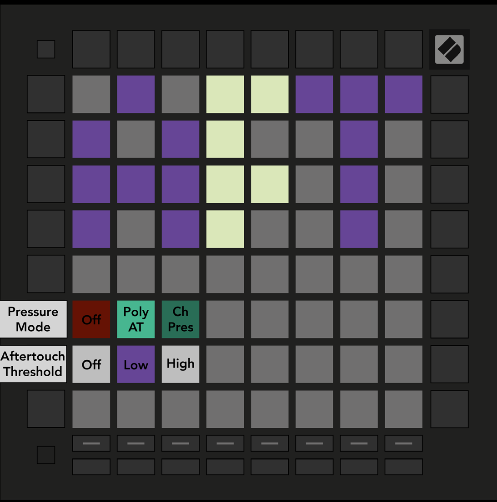

logseq-entity:: [[Logseq/Entity/Book/Section/Level 2]]
up:: [[Launchpad/Pro Mk3 User Guide/10 Setup]]
prev:: [[Launchpad/Pro Mk3 User Guide/10 Setup/03 Velocity Settings]]
next:: [[Launchpad/Pro Mk3 User Guide/10 Setup/05 MIDI Settings]]
- # 10.4 Aftertouch Settings
	- Press the third Track Select button for AFT settings. Choose disabled pressure, Polyphonic Aftertouch, or Channel Pressure. The active choice is bright.
	- Channel Pressure sends one value for all pads, using the greatest pressure on the grid. Polyphonic Aftertouch sends a separate value for each pad. The guide recommends Channel Pressure with Ableton Live, which does not support polyphonic aftertouch in the version it describes.
	- Set the Aftertouch Threshold to Off, Low, or High. Off sends pressure from the start of a press; Low and High require increasing pressure before messages begin. This helps avoid engaging an assigned effect as soon as a pad is touched.
	- 10.4.A — Aftertouch Settings view
		- 
