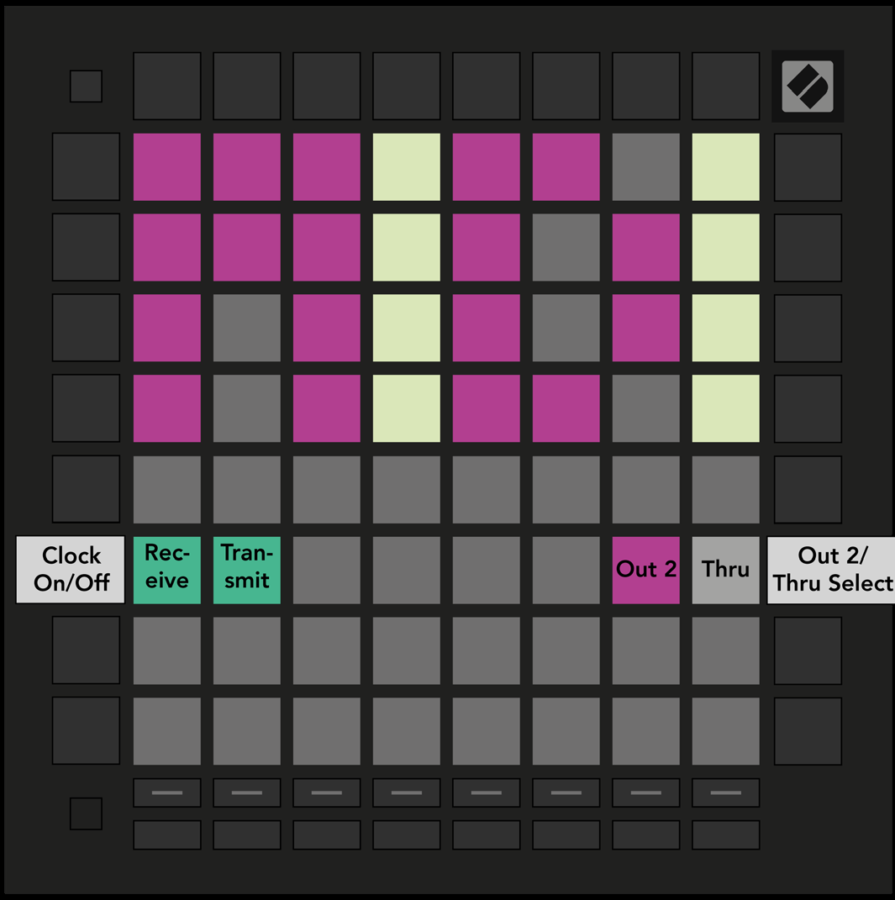

logseq-entity:: [[Logseq/Entity/Book/Section/Level 2]]
up:: [[Launchpad/Pro Mk3 User Guide/10 Setup]]
prev:: [[Launchpad/Pro Mk3 User Guide/10 Setup/04 Aftertouch Settings]]
next:: [[Launchpad/Pro Mk3 User Guide/10 Setup/06 Fader Settings]]
- # 10.5 MIDI Settings
	- Press the fourth Track Select button. Receive Clock controls whether incoming MIDI clock is followed; Transmit Clock controls whether Launchpad Pro sends clock. Both default to On.
	- Set the second MIDI output to Out 2 to duplicate Out 1, or Thru to forward messages arriving at MIDI In.
	- 10.5.A — MIDI Settings view
		- 
