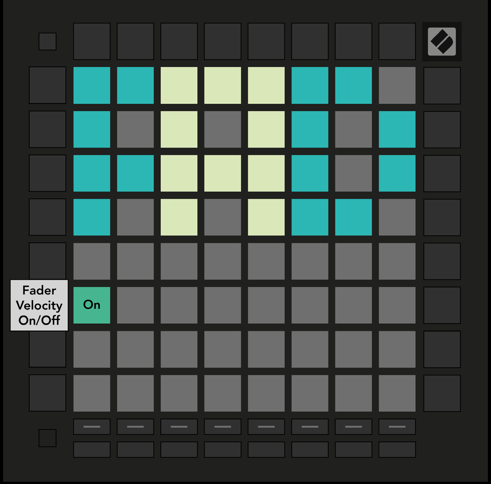

logseq-entity:: [[Logseq/Entity/Book/Section/Level 2]]
up:: [[Launchpad/Pro Mk3 User Guide/10 Setup]]
prev:: [[Launchpad/Pro Mk3 User Guide/10 Setup/05 MIDI Settings]]
next:: [[Launchpad/Pro Mk3 User Guide/10 Setup/07 Live and Programmer Mode]]
- # 10.6 Fader Settings
	- Press the fifth Track Select button for FAD settings. Fader velocity can be enabled separately from the global pad velocity setting. The toggle is bright green when enabled and dim red when disabled.
	- 10.6.A — Fader Settings view
		- 
