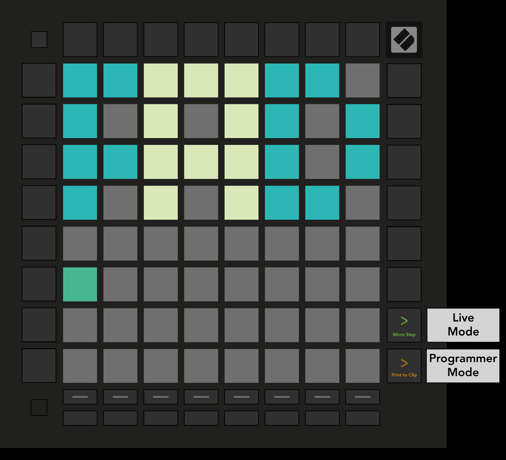

logseq-entity:: [[Logseq/Entity/Book/Section/Level 2]]
up:: [[Launchpad/Pro Mk3 User Guide/10 Setup]]
prev:: [[Launchpad/Pro Mk3 User Guide/10 Setup/06 Fader Settings]]
next:: [[Launchpad/Pro Mk3 User Guide/10 Setup/08 Bootloader Menu]]
- # 10.7 Live and Programmer Mode
	- Live Mode gives access to Session, Note, Chord, Custom, and Sequencer modes. It is the default at power-on.
	- Programmer Mode lets external MIDI software control the surface. Each pad and button sends and responds to its assigned MIDI message; the other device modes are unavailable while Programmer Mode is active.
	- Hold Setup and press the green Scene Launch button for Live Mode or the orange Scene Launch button for Programmer Mode. Release Setup to enter the selected mode.
	- The [Programmer’s Reference Guide](https://customer.novationmusic.com/support/downloads) describes the MIDI messages that light pads and buttons.
	- 10.7.A — Live and Programmer Mode selection
		- 
