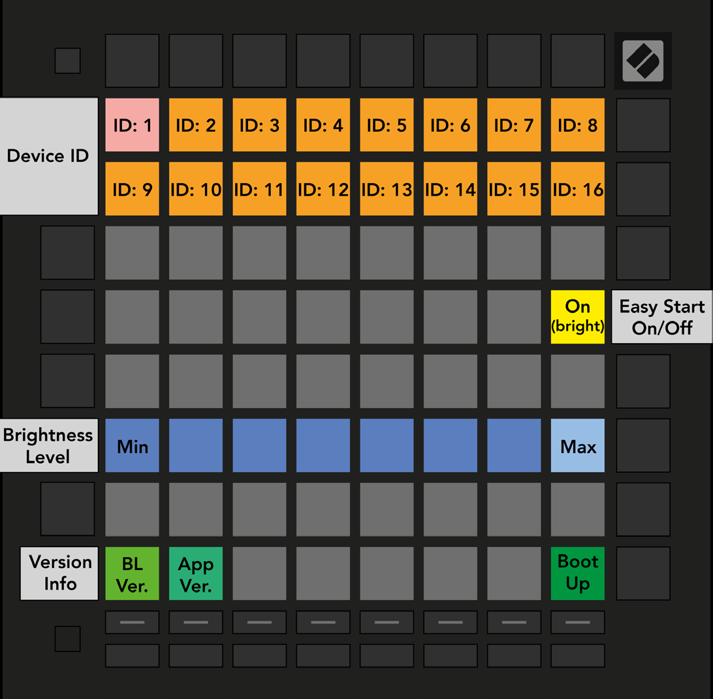

logseq-entity:: [[Logseq/Entity/Book/Section/Level 2]]
up:: [[Launchpad/Pro Mk3 User Guide/10 Setup]]
prev:: [[Launchpad/Pro Mk3 User Guide/10 Setup/07 Live and Programmer Mode]]
- # 10.8 Bootloader Menu
	- Hold Setup while plugging in Launchpad Pro to open the bootloader menu.
	- The eight-level brightness slider can lower power use when a USB host cannot supply enough power for a full-brightness startup. The bright white pad marks the active level.
	- Bootloader Version and App Version show installed versions. Boot Up exits the menu and starts the controller normally.
	- Set a different Device ID on each Launchpad Pro when using several with Live. Each unit then has an independent Session View outline.
	- MSD Mode controls whether the device appears as a mass storage drive. It is on by default; the bright pad means enabled and the dim pad means disabled. The LAUNCHPAD drive contains a link to the Easy Start Tool.
	- 10.8.A — Bootloader menu
		- 
