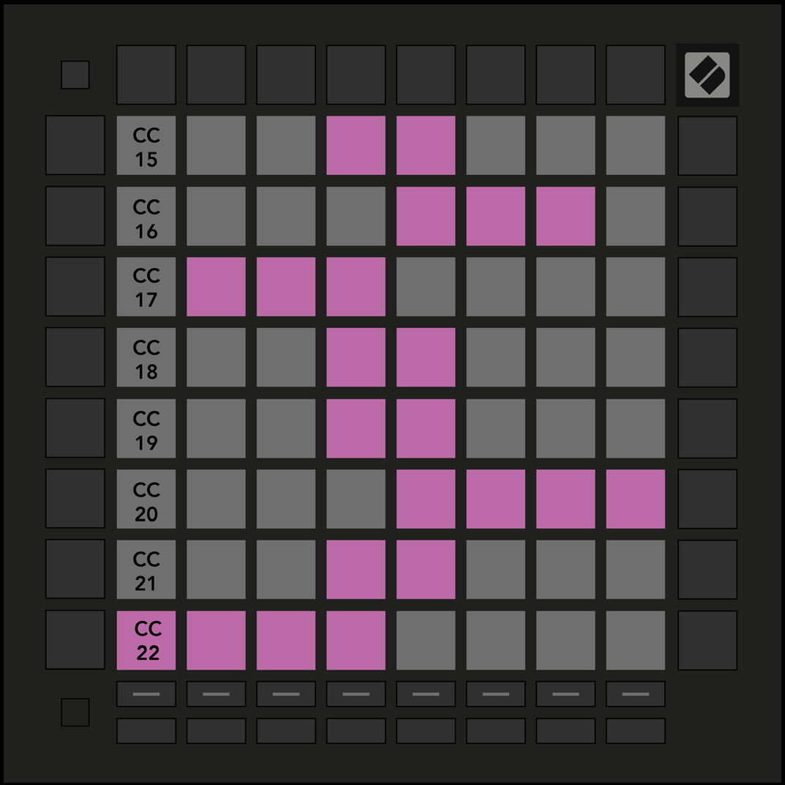

logseq-entity:: [[Logseq/Entity/Book/Section/Level 3]]
up:: [[Launchpad/Pro Mk3 User Guide/11 Appendix/01 Default MIDI Mappings]]
prev:: [[Launchpad/Pro Mk3 User Guide/11 Appendix/01 Default MIDI Mappings/01 Custom 1]]
next:: [[Launchpad/Pro Mk3 User Guide/11 Appendix/01 Default MIDI Mappings/03 Custom 3]]
- # A.1.2 Custom 2
	- Eight horizontal bipolar faders send CC 15–22.
	- A.1.2 — Custom 2 default mapping
		- 
