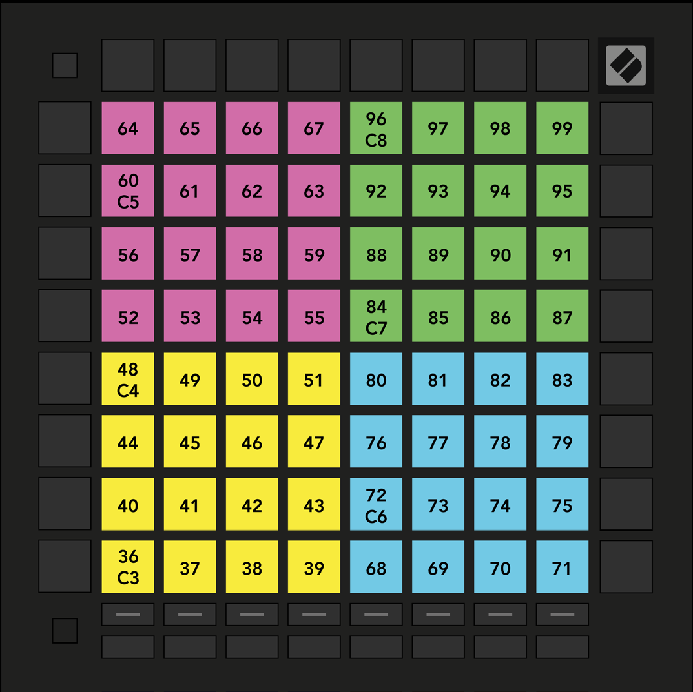

logseq-entity:: [[Logseq/Entity/Book/Section/Level 3]]
up:: [[Launchpad/Pro Mk3 User Guide/11 Appendix/01 Default MIDI Mappings]]
prev:: [[Launchpad/Pro Mk3 User Guide/11 Appendix/01 Default MIDI Mappings/02 Custom 2]]
next:: [[Launchpad/Pro Mk3 User Guide/11 Appendix/01 Default MIDI Mappings/04 Custom 4]]
- # A.1.3 Custom 3
	- The 8 × 8 grid sends momentary notes in four 4 × 4 drum areas.
	- A.1.3 — Custom 3 default mapping
		- 
