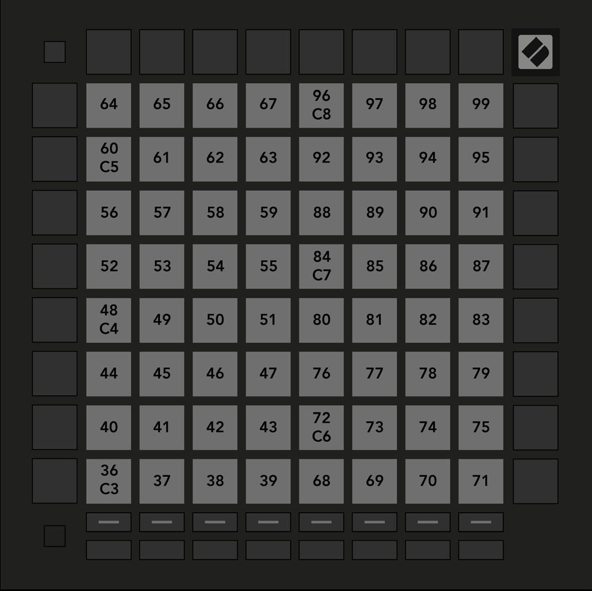

logseq-entity:: [[Logseq/Entity/Book/Section/Level 3]]
up:: [[Launchpad/Pro Mk3 User Guide/11 Appendix/01 Default MIDI Mappings]]
prev:: [[Launchpad/Pro Mk3 User Guide/11 Appendix/01 Default MIDI Mappings/06 Custom 6]]
next:: [[Launchpad/Pro Mk3 User Guide/11 Appendix/01 Default MIDI Mappings/08 Custom 8]]
- # A.1.7 Custom 7
	- The 8 × 8 grid sends momentary notes in the drum-style map.
	- A.1.7 — Custom 7 default mapping
		- 
