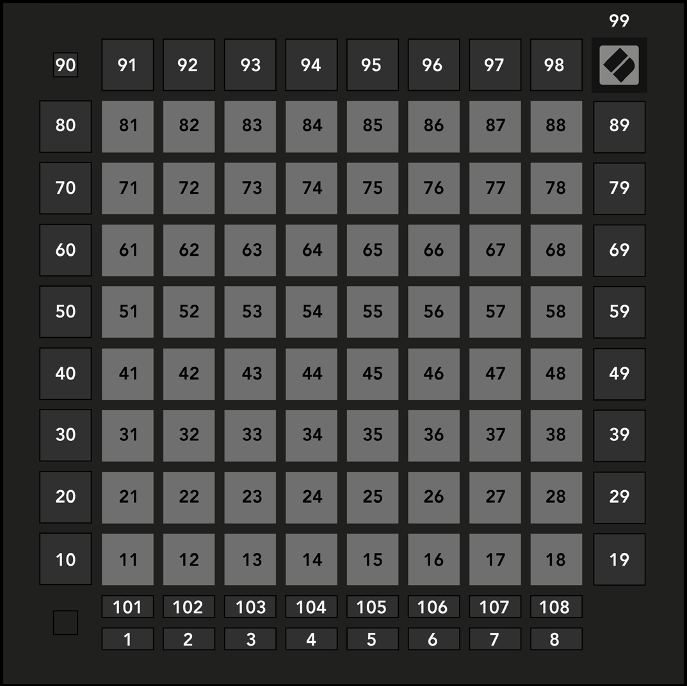

logseq-entity:: [[Logseq/Entity/Book/Section/Level 3]]
up:: [[Launchpad/Pro Mk3 User Guide/11 Appendix/01 Default MIDI Mappings]]
prev:: [[Launchpad/Pro Mk3 User Guide/11 Appendix/01 Default MIDI Mappings/08 Custom 8]]
- # A.1.9 Programmer Mode
	- The full surface, including outer buttons and logo LED, has MIDI note addresses.
	- The [Programmer’s Reference Guide](https://customer.novationmusic.com/support/downloads) has the full MIDI implementation.
	- A.1.9 — Programmer Mode default mapping
		- 
