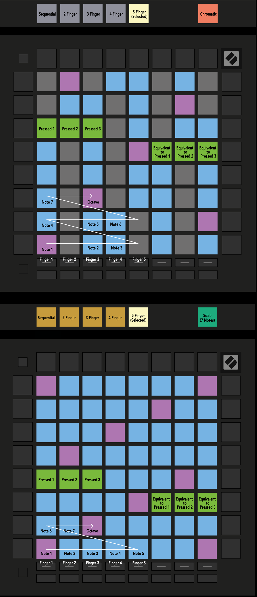

logseq-entity:: [[Logseq/Entity/Book/Section/Level 3]]
up:: [[Launchpad/Pro Mk3 User Guide/11 Appendix/02 Overlap Layouts]]
next:: [[Launchpad/Pro Mk3 User Guide/11 Appendix/02 Overlap Layouts/02 Four Finger]]
- # A.2.1 Overlap – Five Finger
	- Five-finger overlap repeats the leftmost notes of an upper row toward the right of the row below.
	- A.2.1 — Five Finger overlap in Chromatic and Scale Modes
		- 
